#### rasteraztion光栅化--shading着色--geometry几何

- perspective 视角，透视
- CG computer graphics
- projection 投影，预测
- curves 曲线
- mesh 网格,曲面
- vertex 顶点
- edge 边
- rasterization 光栅化--把几何图形投影到屏幕上(把3D投影到2D上，然后显示在屏幕上)
- raytracing 光线追踪
- geometry 几何
- primitive 图元，最小图形单元
- fragment 碎片，片段，片元--pixel
- syntex 语法结构
- algebra 代数
- swift 快速的
- brutal 直接的
- scalar 标量
- determine 确定，影响
- graphic 图形
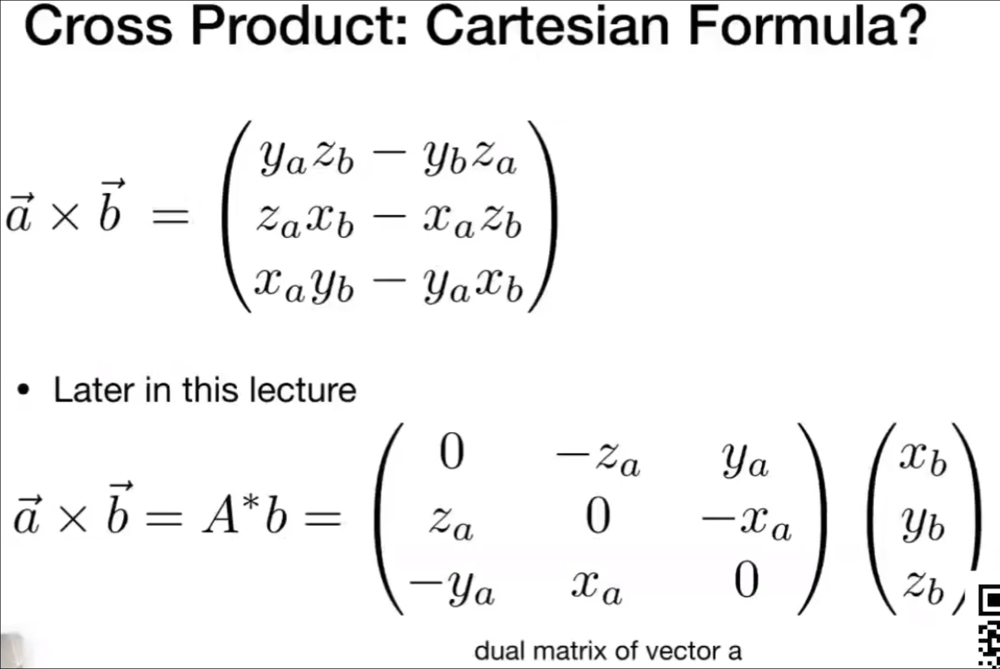

- 点积判断夹角，计算投影；叉积判断左右，内外。

- orthonormal 标准正交的，即单位向量，又正交
- ortho 正交
- coordinate frame 坐标系
- matrics 矩阵
- pervasive 普遍的
- homogeneous 齐次的
- scale 缩放
- shear 剪切
- composing transforms 组合变换

##### process
- transform (MVP:modeling_transform -> view_transform -> projection_transform )
  - modeling transform 模型变换，把物体都由模型坐标系变换到世界坐标系下
  - viewing transform 观测变换
    - view/camera transform (视图变换)看的位置
      - position
      - look-at diretion 
      - up direction 
      - 相机永远固定在the origin, up at Y, look-at -Z 
      
    - projection transform 看的方式
      - orthographic projection 正交投影
      - perspective projection 透视投影
- rasterization
- occlusion and visibility 遮挡和可见性

- transition 过渡，转变
- translation 平移

- affine map 仿射变换 = 线性变换 + 平移 / 齐次坐标系

- point (x,y,1)
- vector (x,y,0)

- 绕任意轴旋转的罗德里德斯公式:

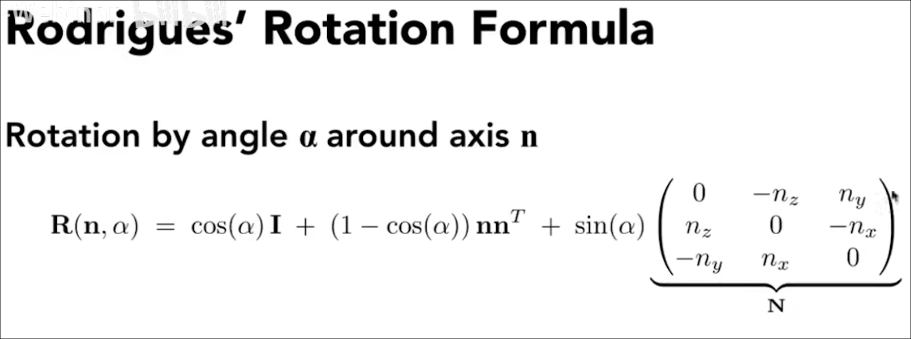

- 旋转矩阵不适合做插值，所以引入了四元数

- 相机移动时，M_cam = T_cam * R_cam; 世界移动时，M_view = R_view * T_view.
- 旋转矩阵是正交矩阵，逆就是转置
- canonical 标准的
- slightly 稍微地
- 正交投影：把物体投影到标准立方体canonical cube(或者说把z轴的深度忽略(不是把z丢掉，而是x_prime,y_prime的计算没用到z))
- rotate scalar 都是默认绕原点的，所以正交投影需要先translate再scalar
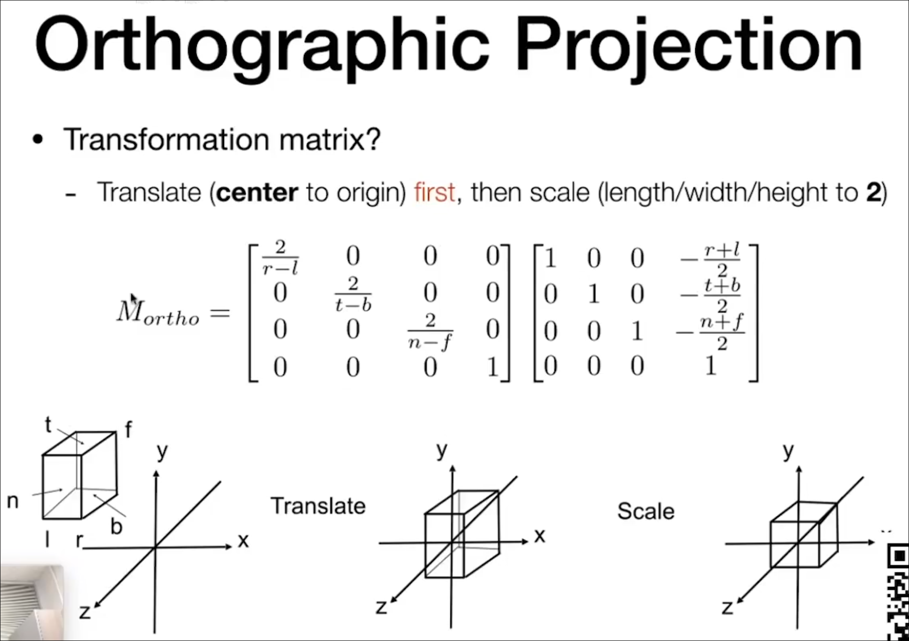

- squish 挤压
- frustum 截头锥体
- cuboid 长方体
- cube 立方体
- 近平面上的点坐标永远不变; 远平面上的点的z不变；远平面的中心不变
- 透视投影：先把截头椎体frustum挤压squish成长方体cuboid,然后对cuboid进行正交投影
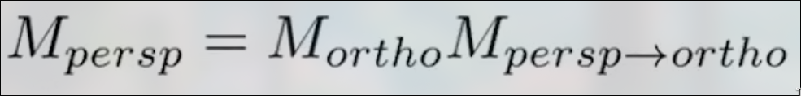
- agar 800
- cornix 750
- neo ergo 950
- resolution 分辨率
- raster = screen(德语中)
- rasterization = draw onto the screen
- rasterization光栅化就是把三维空间中的几何图形显示在屏幕上的像素的过程
- 屏幕是一种典型的光栅化成像设备
- pixel 像素

##### canonical cube to screen
- Irrelevant z(先不管z);
- transform x,y plane :[-1,1] to screen :[0,width]*[0,height] (视口变换)
- 视口变换矩阵：
$$
M_{viewport} = 
\begin{bmatrix}
width/2 & 0 & 0 & width/2\\
0 & height/2 & 0 & height/2\\
0 & 0 & 1 & 0\\
0 & 0 & 0 & 1\\
\end{bmatrix}
$$

- model->view->projection->viewport->rasterization

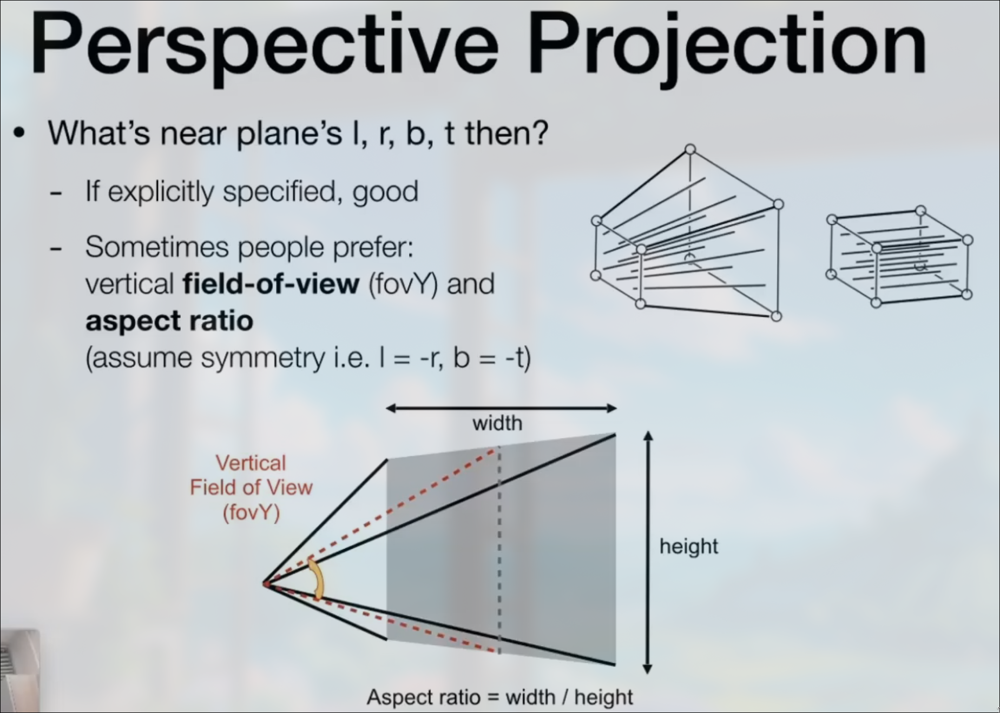

- vertical field-of-view (fovY)
- aspect ratio
- 通过aspect ratio(宽高比)和可视角度fovY来定义一个frustum截头椎体

- 判断像素与三角形的位置关系(像素中心是否在三角形内(使用三次向量的叉积来判断))
- rasterizaing triangles 光栅化显示三角形
- discretize 离散化
- 包围盒(轴向 axis aligned bouding box)(aabb)
- incremental 增量的 
- traversal 遍历,横穿（名词）
- 人眼对绿色最敏感
- jaggies 锯齿
- aliasing 别名，走样
- Z-Buffering 深度缓冲(visibility and occlusion可见性与遮挡)
- artifact 人工制品，伪影，假象
  - jaggies 锯齿 -- sampling in space
  - Moire 摩尔纹 -- undersampling sampling image
  - Wagon wheel effect 马车轮效应 -- simpling in time
  - signals changing is too fast but sampling is too slow 
- blur 模糊
- antialiasing idea: 在采样之前进行模糊（滤波）pre-filtering

##### frequency domain
 - fourier transform 傅里叶变换
 - decompose 分解
 - filtering = get rid of certain frequency content 滤波 = 去掉特定频率的内容
 - sampling = repeating frequency contents 采样就是在重复一个信号的频谱
 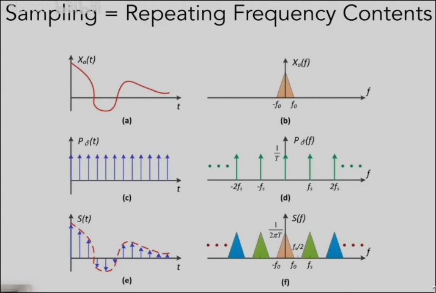

- 时域上的相乘是频域上的卷积
- dense 稠密的，密集的
- sparse 稀疏的
- 时域上采样的间隔越大，频域上的频谱越密集
- convolve 卷积 
- filtering = convolving = averaging

- MultiSample AntiAliasing (MSAA) 多重采样抗锯齿
- temporal 与时间相关的

- 可见性和遮挡的解决办法：Z-Buffering 深度缓存
- 计算机中，两个浮点数永远不会相等
- implement 执行

#### Shading(illumination光照，shading着色 ,Graphics pipeline, texture mapping)

- shading :对不同物体应用不同的材质

- shading model - 布林冯反射模型
- oerceptual observation 感性的
  - specular highlight 镜面高光
  - diffuse reflection 漫反射
  - ambient lighting 间接光照，环境光照

- shading point
- shading回答了“shading point应该有多量”
- shadow回答了“shading point是否能看到光源”
- shading的计算忽略了场景中其他物体，只依赖于当前shading point的
  - 表面法线
  - 观察者方向
  - 光线方向
  - 表面材质
- scatter 散布，播撒

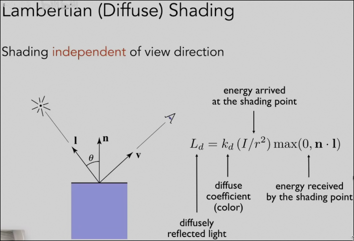

- coefficient 系数

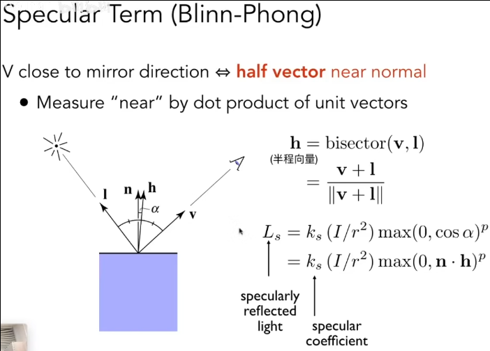
- 半程向量比反射向量方便计算
- 经验公式,简化掉了能量接受部分，不用计算n和l的点乘

- 假设永远场景中每个shading point都存在一个光照（环境光是个constant）

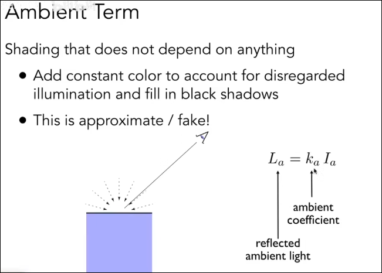

- 着色频率
  - flat shaing 平面着色  face 
  - Gouraud shading 顶点着色 vertex
    - interpolate 插值
  - Pong shading 像素着色（冯着色）pixel 

<leader>+f+
    - 想打开一个已知名字的文件：用 f 或 F。
    - 想切回刚才看的文件：用 b 或 r。
    - 想在整个项目里搜索代码内容（而不是文件名）：这通常在另一个快捷键<leader>s 下，比如 <leader>sg (live_grep)。
    - 想换个项目工作：用 p。
    - 想修改配置：用 c。
    - 想快速浏览当前文件夹：用 e 或 E。
    - 想运行个命令：用 t 或 T。
<leader>+s+
    - 找代码内容：用 g, G, w, W
    - 找错误：用 d, D
    - 找命令/快捷键：用 k, C, c
    - 找位置：用 j, m, l, q
    - 找笔记(TODO)：用 t, T
    - 忘了刚才在干嘛：用 R（恢复搜索） 和 n（查看消息）

- vertex normal = average of surrounding face normal 
- pixel normal = barycentric interplote of vertex normal 重心插值 

#### Graphics pipeline/ Real-time rendering pipeline
- pipeline 一系列的操作

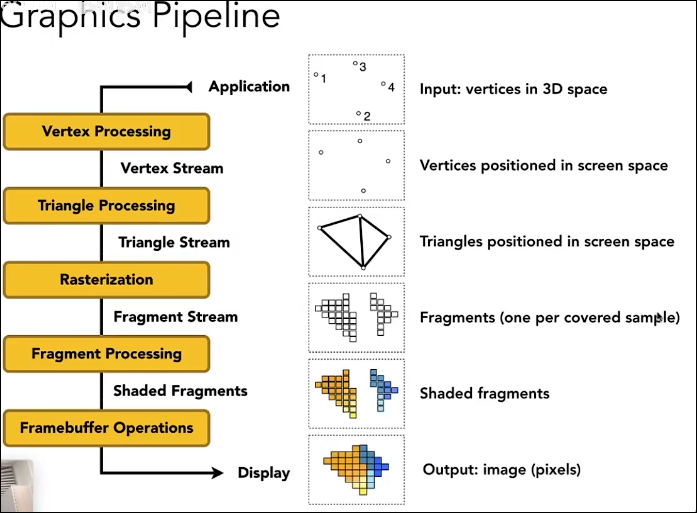

- mvpvp->采样，深度->着色

- shader
- shader program 着色器程序
  - vertex shader (输出值是顶点的颜色)
  - fragment/pixel shader

- heterogeneous 各种各样的

- texture mapping
- texture coordinate (u,v) 纹理坐标系 [0,1]*[0,1]
- (u,v)是纹理坐标
- 每个三角形的每个vertex都有一个对应的(u,v)
- 通过barycentric coordinates 重心坐标插值，由三角形每个顶点的纹理坐标(u,v)可以得到内部每个点的纹理坐标(u,v) （做平滑过渡）

- 重心坐标($\alpha$, $\beta$, $\gamma$), $ \alpha + \beta + \gamma = 1$ ,全非负点在三角形内，有负在三角形外,projection投影后重心坐标会改变

- proportional 成比例的

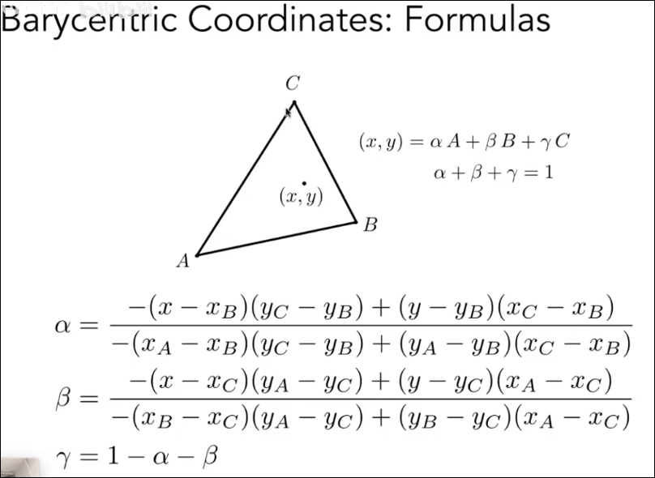

- texture magnifaction 纹理放大
- sufficient 足够的
- pixel of texture = texel 纹理像素
- 非整数的(u,v) 如何得到纹理的值,双线性插值bilinear(bi-linear)
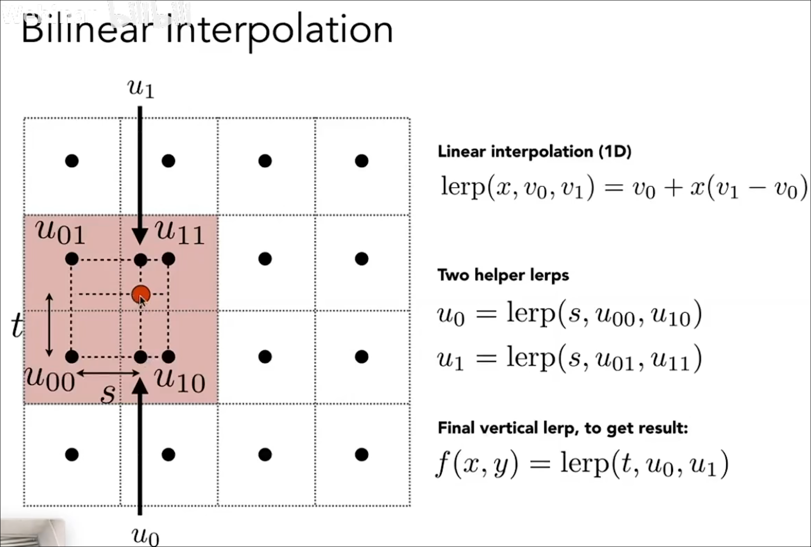
- 纹理小了，用插值
- 单词间跳转用b,e

- 纹理大了，会怎么样？会导致近处jaggies锯齿,远处moire摩尔纹,使用supersampling is high quality, but costly.
- minified 被压缩的，被精简的

- 解决纹理过大（细节丰富）（像素低的相机拍细节丰富的场景）导致aliasing的方法：先对纹理进行模糊/滤波。
- 点查询point query和范围查询range query:
  - 给定一个坐标，返回对应的值
  - 给定一个范围，返回这个范围的聚合信息（如：平均值，最大值等）
  - 这两种都有对应的数据结构

- 同一个纹理，远近都要用，引入Mipmap(多级渐远纹理)（allowing fast,approximate,square range query)只能做快速的，近似的，$\color{red}{正方形}$的范围查询
- 降分辨率就是在一块范围内求平均值
- multitude 大量，众多
- 当D不是整数时，要在两级各做双线性插值后，对两个结果再做一次线性插值
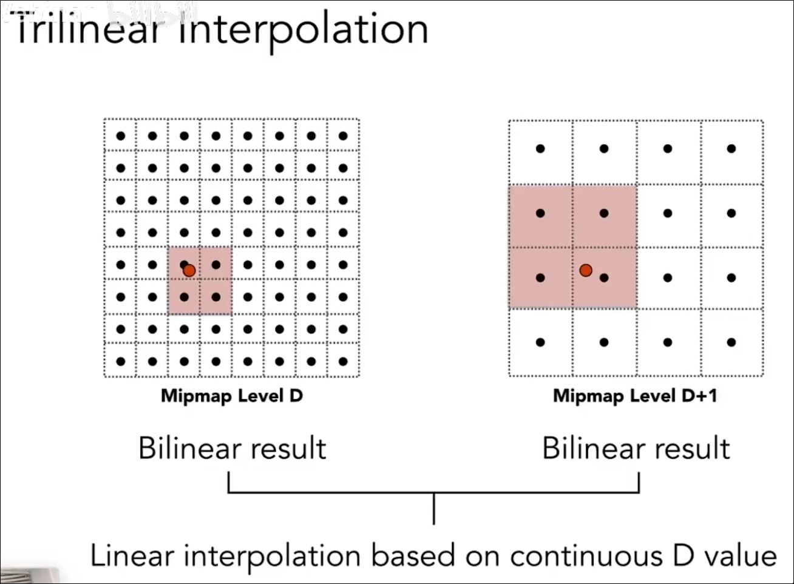

- overblur 过分模糊
- anisotropic 各向异性的 ripmap
- isotropic 各向同性的 mipmap
- rectangular 矩形
- in modern GPU, texture = memory + range query(filtering)
- procedural 程序上的
- texture's application:
  - environment lighting/map 环境光照/环境贴图
    - spherical map
    - cube map
    - displacement map 位移贴图
- environment lighting 不记录光线的深度（假设无限远），只记录光线的方向
- spherical 球形的
- prone to 易于
- distortion 扭曲
- texture可以定义这一位置上的不同属性，不仅仅是color,可以是height(比如凹凸贴图),normal...
- bump 碰撞，凸起
- perturb 扰动

#### geometry
- implicit representations of geometry 几何的隐式表达
- exlicit 显式, all points are given directly or via parameter mapping 参数映射（每个点），判断一个点在不在表面上就变难了。
- poly 多
- constructive solid geometry 构造实体几何,简单几何体进行布尔运算boolean operation得到复杂的几何体
- combine 结合
- blend surfaces together via distance functions 通过距离函数融合表面
- boundary 边界
- fractal 分形 = 递归
- compact 紧凑 的，简洁的
- polygon mesh 多边形面

###### curves 曲线
- bezier curves 用一系列控制点定义一个曲线
- 给定一系列任意多的控制点，怎么画出一条贝塞尔曲线来 -- de Castelijau algorithm
- evaluate 评估，分析
- lerp 线性插值的缩写
- affine transformation 仿射变换 = 线性变换 + 平移
- property 特性，财产
- convex 凸多边形
- hull 外壳
- convex hull 凸包
- piecewise 逐段的，分段的
- 一阶导数连续：C1连续 （共线且等距）
- spline 样条曲线

###### mesh 网格
- Mesh Operations
  - mesh subdivision
    - Loop(人名) subdivision (triangle mesh)
    - Catmull-Clark subdivision
  - mesh simplification
    - edge collapse 边塌缩
      - quadric error metrics 二次误差度量
  - mesh regularization

- weights 权重
- assign 分配，指定
- geometry的层级很难找到

- 过于自由的指针可能会造成内存泄漏，野指针等，引用提供了更安全，更直观的内存间接访问机制

- nvim-suround keymap：
  - yss{ 整行包裹
  - ysiw{ 单词包裹
  - 选中后，gS{
  - ds 
  - cs
- <leader>fb

##### shadow mapping 
- 光栅化着色时只能知道当前的shading point是否被光源照亮，不知道当前点是否在其他物体的阴影里（这就是“shading只与当前point有关，与其他物体无关”）
- 所以怎么在光栅化时绘制阴影？shadow mapping(raytracing之前的方法)
- 一种 image-space algorithm: no knowledge of scene's geometry during shadow's computation, but maybe aliasing
- 不在阴影里的点必须是同时被摄像机和光源同时看到
- shadow mapping只能处理点光源/方向光源
- 硬阴影，这个点要么在阴影里，要么在阴影外（点光源）
- 第一步：从光源看向场景（假设相机在光源处），记录看到的任何点的深度,生成shadow map
- 第二步：从相机看向场景，将看到的点投影回第一步假设相机的位置，对比深度，小的就在阴影中，相等的就不在阴影中
- 使用shadow mapping生成shadow map，用shadow map产生阴影
- involve 包含，涉及 
- equality 相等，平等

新建标签页	Ctrl + T
关闭当前标签页	Ctrl + W
或 Ctrl + F4
切换到下一个标签页	Ctrl + Tab
切换到上一个标签页	Ctrl + Shift + Tab
切换到特定序号标签页	Ctrl + 1 到 Ctrl + 8
切换到最后一个标签页	Ctrl + 9

#### raytracing (whitted-style raytracing)

- bounce 反弹，反射
- rasteraztion is fast but quality is low (real-time)
- raytracing is slow but accurate (offline)
- light rays 假设 
  - 光沿直线传播
  - 光线交叉不会碰撞
  - 光路可逆
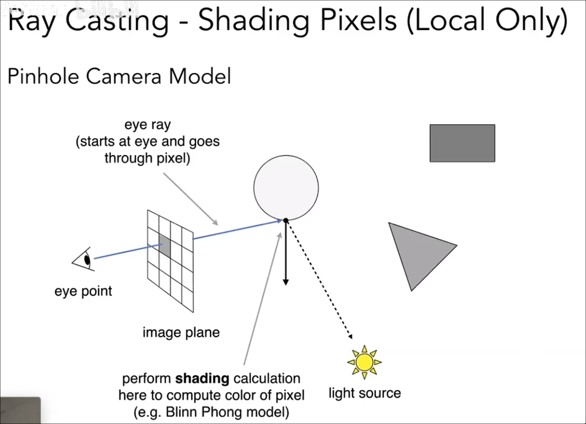

- eye ray 
- shadow ray
- 同一个像素上发出的光路计算出的着色值相加
- 递归性：一条从摄像机发出的光线，可以与场景多次交互，产生一条树形的光线路径
- intersection 交点
- 光线方程ray equation: $\mathbf{r}(t) = \mathbf{o} + t\mathbf{d}$ 
- ray与triangle求交点
  - 间接法
    - ray-plane of triangle intersection
    - hit point is inside of triangle or not
  - 直接法 
    - $\mathbf{o} + t\mathbf{d} = (1 - b_1 - b_2)\mathbf{P_0} + b_1\mathbf{P_1} + b_2\mathbf{P_2}$

$\mathbf{ABC}$    % 粗体
$\mathrm{ABC}$    % 罗马正体 (Roman)
$\mathit{ABC}$    % 斜体 (Italic)  
$\mathcal{ABC}$   % 花体 (Calligraphi)
$\mathbb{ABC}$    % 黑板粗体 (Blackboard) - 用于数集：ℝ, ℂ

- exhaustive 全面的
- naive 不切实际的，天真的
- slab 平面
- 挨个计算三角形是否与ray相交过慢，accelrate ray-surface intersection
  - bounding volume 包围盒
    - offen use Axis-Aligned Bounding Box (AABB) 轴对齐包围盒
    - iff当且仅当$t_{enter} < t_{exit} \ \text{and}\  t_{exit} >= 0$时，ray与AABB有交点
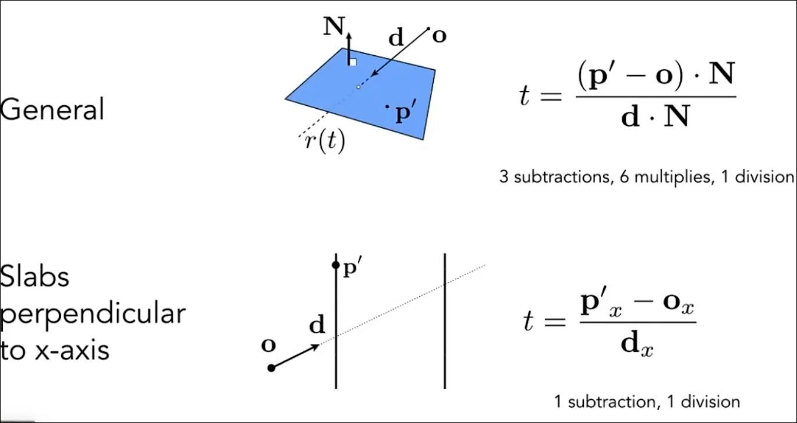

- 使用AABB加速ray-tracing
  - 均匀网格uniform grids 
  - 空间划分spactial partitions
    - oct-tree 八叉树
    - kd-tree 
      - 循环交替分割轴，选择分割点，由分割轴和分割点确定分割面（过分割点，垂直于分割轴）
      - 物体只存在于叶子节点上，不存在于中间节点上
      - 一层一层的AABB
  - 物体划分 object partitions
    - 为了解决kd-tree空间划分时，难以判断当前AABB里有哪些物体，一个物体存在在多个AABB中的问题
    - Bounding Volume Hierarchy (BVH)一个物体只能存在于一个AABB中
    - termination criteria 终止准则
- internal 内部的
- hierarchy 等级，层级
- heuristic 启发式的
- primitive 早期的，原始物体
- subset 子集
- overlap 交叉，重合

##### radiometry 辐射度量学
- scarcely 几乎不
- intensity 强度
- spatical 空间的
- manner 方式
- radiometry: 精确的计算光照的空间属性，以一种符合物理的方式来进行光照计算
- 物理概念: radiant flux, intensity, irradiance, radiance 
  - radiant energy: 能量,符号: $ Q[J = Joule] $
  - radiant flux(power): 功率，符号：$ \phi \equiv \frac{dQ}{dt} \quad [W = \text{Watt}] $ ,或者流明lm
  - 
  - <leader>p 粘贴图片
  - radiant intensity: power per unit solid angle(每单位立体角的能量)，$ I(\omega) \equiv \frac{d\phi}{d\omega} \ \ [\frac{lm}{sr} = cd = candela] $
    - $ d\omega = \sin\theta \, d\theta \, d\phi $
    - 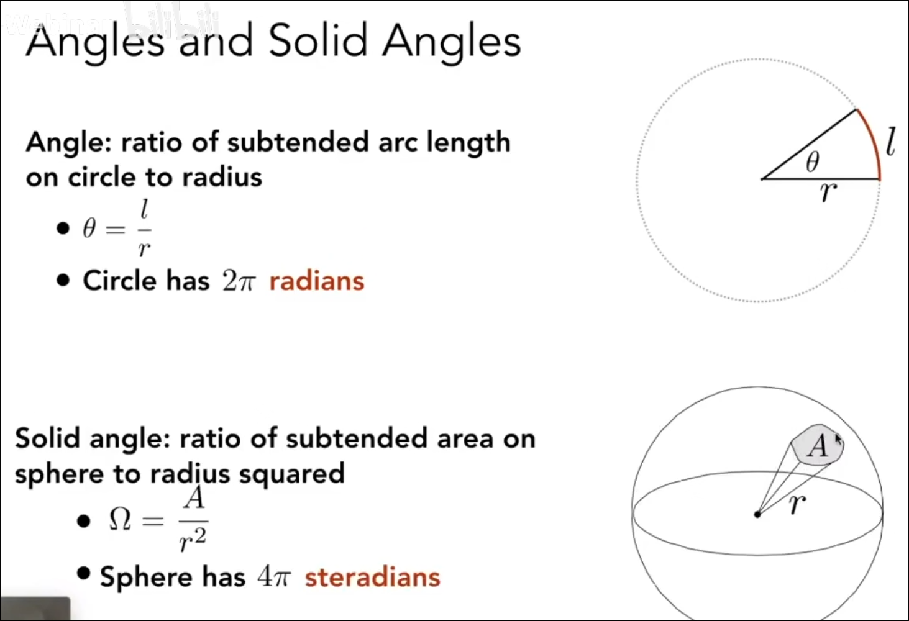
    - 各向同性点光源：
      -  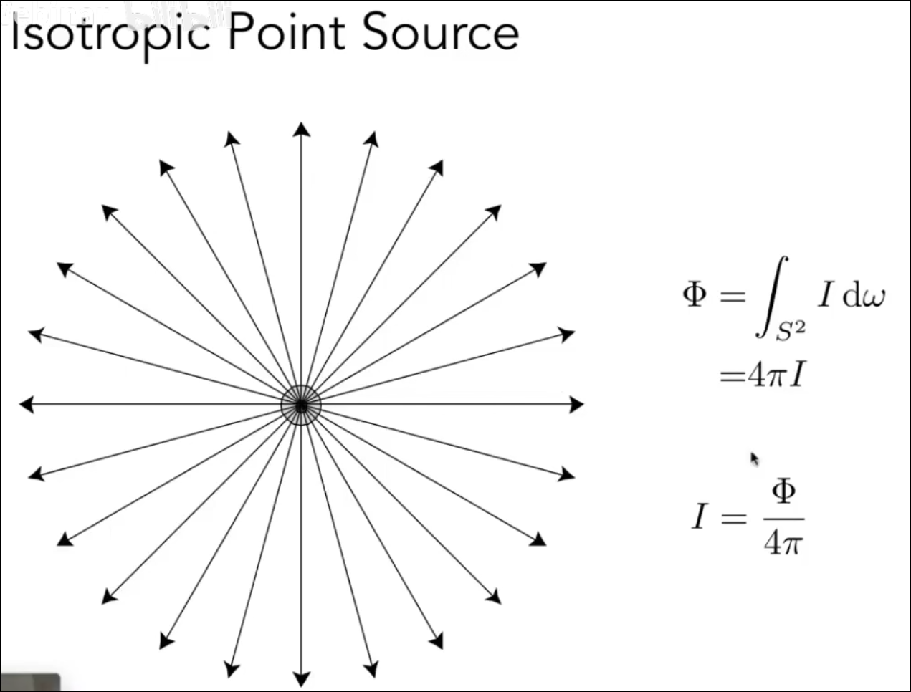
  - irradiance
    - incident on 入射到...上
    - $ E(\mathbf{x}) $ , $ [\frac{W}{m^2}] $, $[\frac{lm}{m^2} = lux] $
    - 一个很小面积dA接收到的能量: E
  - radiance 
    - 是一个描述光线的物理量(quantity)
    - 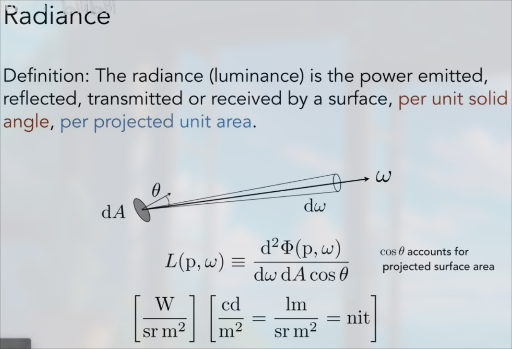
    - 一个很小面积dA,来自一个很小的方向dw接受到的能量: L
    - incident radiance
    - exiting radiance 

#### Ray-Tracing(light transport & global illumination)   
- barely 仅仅
- Bidirectional Reflection Distribution Function 双向反射分布函数(BRDF): 告诉我们能量在不同反射方向的分布
- 反射：吸收+发射
- reflection equation 反射方程
  - 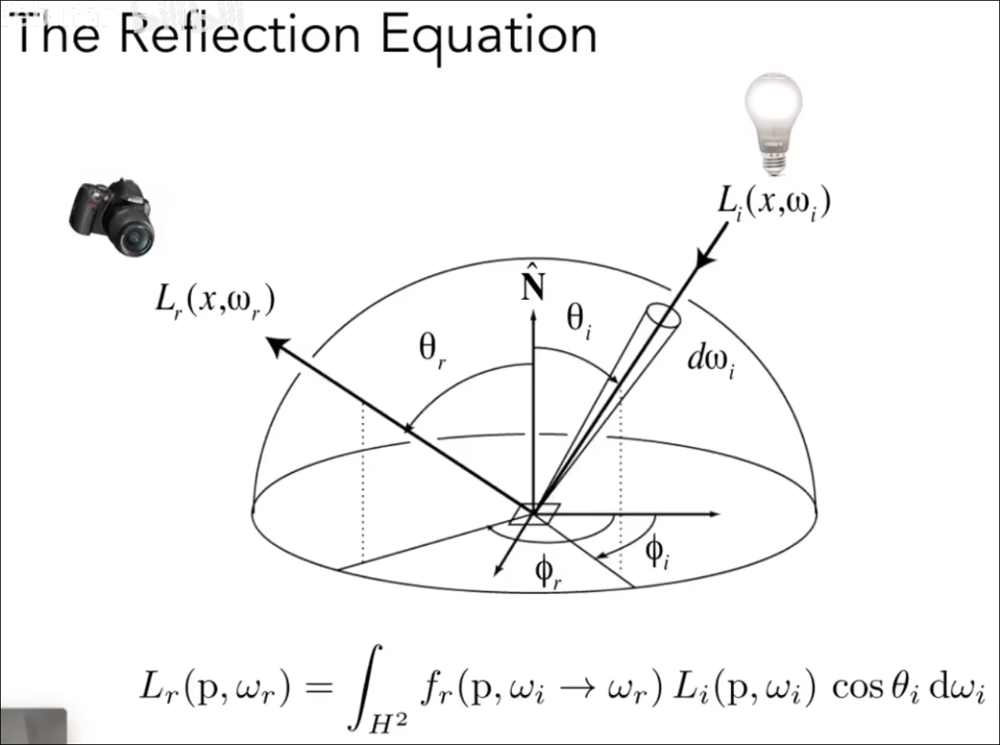
    - 问题：recursive equation 循环，递归, $ L_i $不只有光源的，还有其他物体反射来的，这就递归了起来
- rendering equation 渲染方程
  - 还有自发光的dA
  - 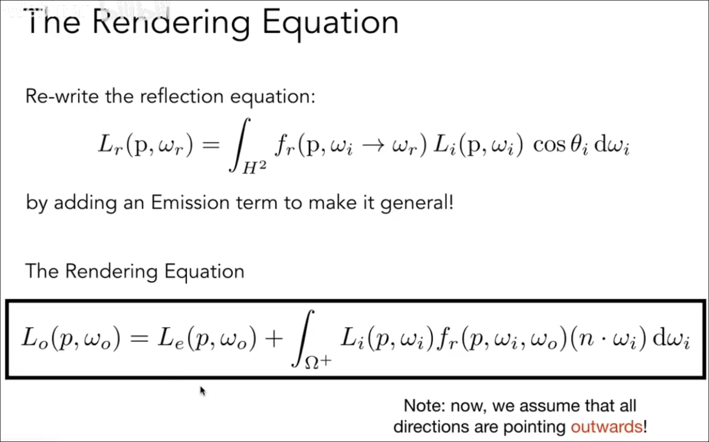
  - 只考虑半球：$ H^2 $ / $ \Omega^+ $
- 解渲染方程
  - 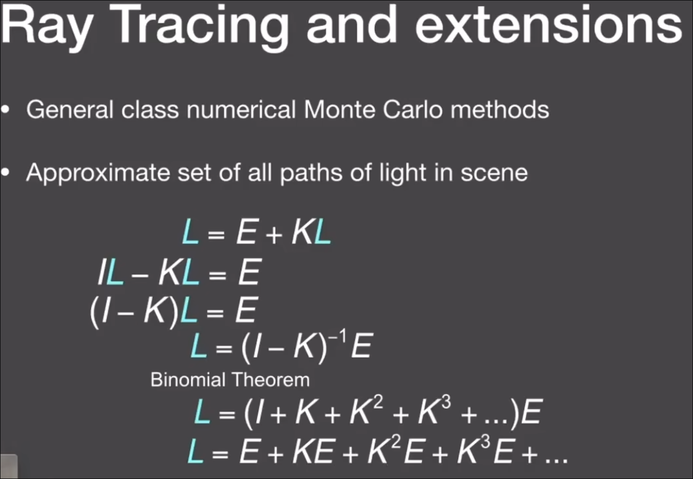
  - L,K,E都是算子
- 全局光照：直接光照和间接光照全部加起来就是全局光照
  - 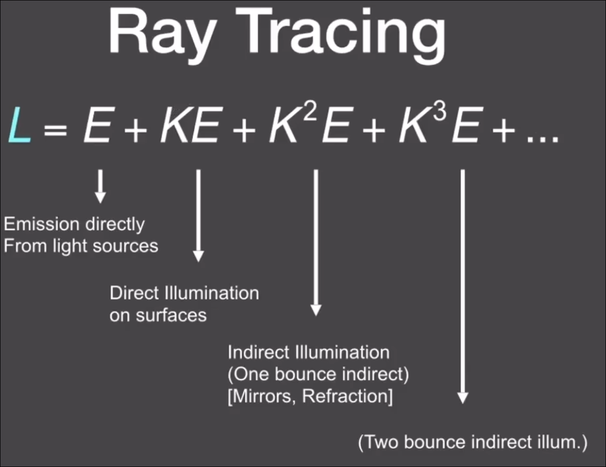
  - 光栅化shading的只有E和KE（自发光和直接光照）

#### Ray-Tracing(Monte Carlo Path Tracing)
- regarding 关于
- Monte Carlo Integration :解决定积分问题
- 求定积分：$ \int_a^b f(x) dx $, $ X_i \sim p(x) $, 蒙特卡洛求得：$ F_N = \frac{1}{N} \sum_{i=1}^N \frac{f(X_i)}{p(X_i)} $
- diffuse surface 漫反射表面
- whitted-style ray-tracing 弹射光线的特点
  - 达到光滑表面，则specular reflection镜面反射和refraction折射
  - 达到漫反射表面，则光线停止
- hemisphere 半球 
- integral 积分
- path-tracing 就是用蒙特卡洛方法求解渲染方程
- 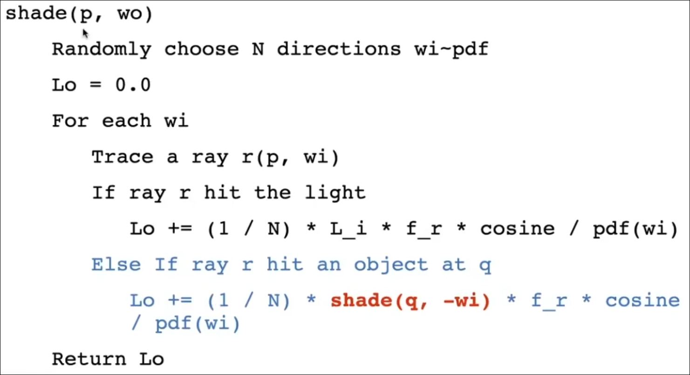
- 但是N会数量爆炸，所以让N=1来做蒙特卡洛积分，当N=1时，称为path-tracing.N=1时噪声很大，所以每个pixel穿过更多的path,再求平均
- 递归什么时候停止是个问题,使用俄罗斯轮盘赌（RR）
- 
- 为了解决光源过小，采样浪费的问题，不对半球采样，而是转换积分域，变成对光源采样 
- 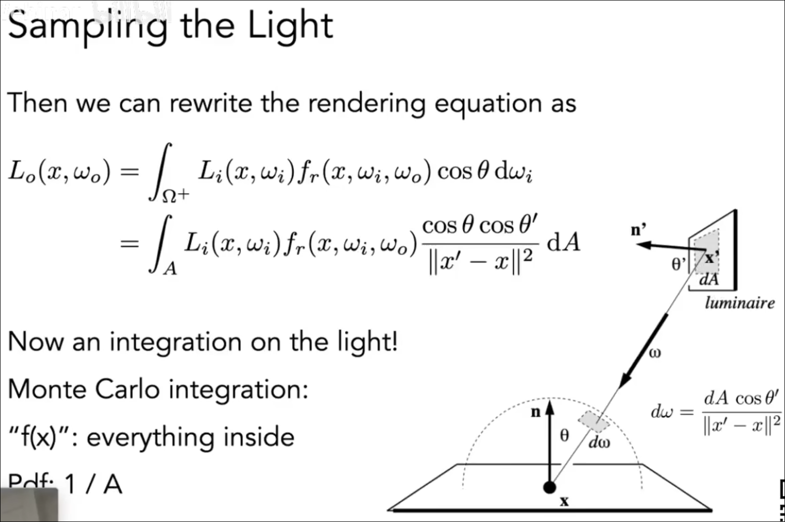

- ds( 删除括号
- dsf 删除包在外面的函数
