- namespace里的内容顶格写,在结尾}//end of namespace xx
- 匿名命名空间: 防止本文件里的只供内部使用的辅助函数,工具类,结构体或常量等等被其他文件调用,是static的现代替代
- 尽量用const常量代替宏定义常量
- **指向常量的指针**: const在*之前, `const int * ptr`, `int const * ptr`, 该常量不能变,其他随意.
- **常量指针**: const在*之后, `int * const ptr`, 该指针指向的地址不能变,其他随意
- 指向常量的指针才能指向常量
- 数组名arr退化成了数组第一个元素的地址, `int * ptr = arr`.
- arr 和 &arr的值是一样的,但是含义不同
- &arr没有退化,是对整个数组取地址, `int (*ptr)[5] = &arr`, ptr是一个**数组指针**, ptr是一个指向有5个int元素数组的指针
- 指针数组就是元素是指针的数组
- 用**函数指针**实现回调,`std::function`和`lambda`实现回调的底层实现就是函数指针, 函数名也是一个地址, `返回类型 (*ptr)(参数类型) = func; ptr(参数); ptr= func2; ptr(参数);`
- 完整形式是:`返回类型 (*ptr)(参数类型)= &func; (*ptr)(参数); ptr= &func2; (*ptr)(参数);`
- 便捷使用函数指针的写法: `typedef 返回类型(* Ptr)(参数类型);`, 使用`Ptr p1=func1; p1(参数)`
- [函数指针实现回调](./C&Cpp风格回调Callback写法.md)
- 函数指针可以很简单的赋值为普通函数,那如何指向一个类中的非静态成员函数呢: `返回类型 (ClassA::*ptr)(参数类型)= &ClassA::func;`,调用:`ClassA a; (a.*ptr)(参数);`(需要用完整形式的函数指针,需要加上类作用域.)
> [!NOTE]
> 现代cpp中推荐用**`using`**代替typedef: `using Ptr = 返回类型(*)(参数类型);`
- 函数指针: 一个存储函数在内存中地址的变量. 函数名虽然不是一个函数指针,但是在大多数表达式中会退化成函数指针.
- typedef 的核心作用是“给现有的数据类型起一个别名”.
- 指针函数就是返回值是指针的函数.
- 局部变量的地址,函数调用完会被销毁, 这个地址就是野指针.
> [!NOTE]
> c++中的栈上放的是编译器管理的内容,堆上放的就是程序员手动管理的内容.现代 C++ 的RAII,智能指针,stl容器等等,本质上都是在想办法“让编译器尽可能多地接管堆内存的管理权”，从而解放程序员。
- `int * ptr = new int(100); free(ptr)`
- `int * ptr = (int *)malloc(sizeof(int)); *ptr = 100; delete ptr; ptr = nullptr;(安全回收)`
- `int * ptr = new int[5](); delete[] ptr;`
- `int * ptr = new int[5]{1,2,3,4,5}; delete[] ptr;`
- 在c++中使用的c风格字符串是const常量, `const char * ptr = "hello";`
> [!NOTE]
> c++的输出流运算符对char *有默认重载效果,所以`std::cout<< ptr;` 没有输出指针的地址而是输出了hello.
- 引用本质就是一个受限制的指针(常量指针const pointer)
> [!NOTE]
> 只要参数没有带 &（引用）或 *（指针），C++ 就会在背后默默地为实参做一次完整的拷贝.
- 传参方式:当形参是内置类型(int,float, char等等)或者小型结构体(std::pair,std::optional等等),直接传值,使用引用反而开销更大;当参数是大型对象(std::vector,std::string等等)或者自定义复杂类,并且不需要修改,用const &; 当参数需要修改时用&; 当参数可是为空时用指针*.
- 引用作为函数返回值
> [!NOTE]
> 在现代 C++ 中，直接按值返回函数中创建的临时大对象（如std::string）即可. 编译器会通过 **RVO/NRVO 机制(解决"函数内部创建了新对象并返回，返回时避免拷贝"问题)** 和移动语义（Move Semantics）帮你消除拷贝开销(是的,没有优化时return会触发一次拷贝构造函数,但仅对于return局部变量才会优化)。只有当你明确**需要“修改原对象”或“链式调用”或返回自己或返回正常大变量时**，还是要使用返回引用.  (函数返回引用值一定不能是局部变量)
> [!NOTE]
> C++ 标准规定，**对引用取地址**，等价于对引用绑定的变量本体取地址 
- 类型转换: `static_cast`(基本数据类型的转化,父类和子类之间指针(或引用)类型的转化) `dynamic_cast`(父类和子类之间的转换) `const_cast`(常量转化成非常量,基本不用) `reinterpret_cast`(任意指针(或引用)类型的转换,万能转换)
- `static_cast`和`dynamic_cast`的区别: 
  - `static_cast`可以转换值、引用和指针，而 `dynamic_cast`只能用于指针和引用.
  - `static_cast` : 编译期静态检查,如果编译器认为类型之间有关联(如继承关系,基本类型转换),则允许转换;否则报错.它不会在运行时检查对象是否真的属于目标类型，因此需要程序员自己保证转换的安全性.
  - `dynamic_cast`: 运行期动态检查,程序跑起来,查内存里的对象的真实类型.如果转换合法则返回正确的指针；否则返回 `nullptr`(对于指针)或抛出 `std::bad_cast` 异常(对于引用).
  - `dynamic_cast`使用条件: 基类中必须有虚virtual函数.
  - 当基类指针没有指向目标子类对象时,用`static_cast`直接把这个基类指针转换为子类指针,但是用这个子类指针访问子类部分成员时就会奔溃.
  - 当基类指针没有指向目标子类对象时,用`dynamic_cast`在运行时检测到无法把这个基类指针转换为子类指针, 不进行转换.
  - 向下转换的成功与否，是由基类指针的实际指向决定的，而不是由用哪个转换语法决定的.
- 函数重载: c++中不允许通过返回值类型的不同来重载函数, 通过参数的类型,个数,顺序进行重载.
- `extern "C"{...}`, 在c++中的c代码按照c的方式编译.
> [!NOTE]
> 一个完整的linux操作系统 = linux内核 + linux环境/用户空间(user space)(系统配置文件,各种基础命令,系统包管理器,图形化界面等), 这个user space 即linux环境. 在已经有linux内核的安卓设备上运行的tiny container只需要把debain的linux环境打包搬到安卓设备上来,然后通过proot(pseudo root假根)技术欺骗linux环境的路径.    
- 函数默认参数要放到最后面, 默认参数的值要写到函数声明里,不要写在函数定义中.
- 当不想再头文件函数声明时暴露参数默认值,可以用函数重载.
- 函数重载时谨慎使用函数默认参数,可能会引起二义性.
- 任何数字和指针都可以隐式转换为bool值. 空指针就是false.
- 空指针: 指针的值是0(0=nullptr)(指针里存的地址是0x00000000特殊地址,访问这个指针指向的内容会中断),意思为这个指针还没有指向有意义的对象.
- nullptr是std::nullptr_t 类型的.
- 在Linux下编写并编译一个C/C++程序时,操作系统在加载这个程序到内存中运行时，会按照这套区域分布来为它分配内存空间。 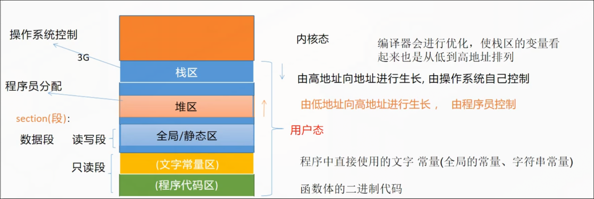
- c++程序内存布局:
高地址 ┌─────────────────┐
       │     栈区 (Stack) │ ← 向下增长 (向低地址)
       ├─────────────────┤
       │    空闲内存      │
       ├─────────────────┤
       │     堆区 (Heap)  │ ← 向上增长 (向高地址)
       ├─────────────────┤
       │  未初始化数据区   │
       │  (.bss)         │
       ├─────────────────┤
       │  已初始化数据区   │
       │  (.data)        │
       ├─────────────────┤
       │  文字常量区      │
       │  (.rodata)      │
       ├─────────────────┤
       │  程序代码区      │
       │  (.text)        │
低地址 └─────────────────┘
> [!NOTE]
> `void *` 一种特殊的指针类型,又称通用指针/无类型指针,可以指向任何类型的数据, 大多数类型的指针都能转换成void *.
- c++中c风格字符串写法: `char str[] = "hello"`, `const char * pstr = "hello"`
- 大驼峰,小驼峰,分词下划线,词首下划线.
- struct-public-inline, class-private-inline
- 构造函数可以重载.
- 构造函数列表初始化才是真正的初始化,而不是赋值(赋值无法面对const成员变量),`  Point(int x, int y) : _x(x), _y(y) {}`.
- 一个类所占空间大小 = 类中数据成员变量类型大小之和(但有时由于**内存对齐机制**的原因不等于)
- 为什么存在内存对齐:cpu对内存的读取不是连续的,是分块读取(块的大小只能是1,2,4,8,16...字节),如果成员类型大小之和超出块的大小,那么其中一些数据需要分多次读取再计算进行拼接, 所以内存对齐以浪费空间为代价来换取读取数据的便利性.64位系统默认读取的块大小为8字节.
- 内存对齐的规则: 类的大小是占空间最大的数据类型大小的整数倍; 类的大小还和数据成员的声明顺序有关, 建议:从大到小降序排列(编译器不会自动优化,会严格按照声明顺序在内存排列)
- `#pragma pack(push, n)`, `#pragma pack(pop)`,手动干预struct/class的内存对齐的大小:成员变量的对齐边界取 n 和成员自身大小中的较小值.
- 指针的大小是8字节.
> [!NOTE]
> 如果你发现自己必须手写析构函数，这其实是一个“设计警告”：说明你的代码可能不够现代。
> [!NOTE]
> 在现代 C++ 中，“五法则”是用来理解底层原理的，而“零法则”才是用来写代码的.尽量用智能指针把底层资源包装起来，让你的业务类永远停留在“什么都不写”的舒适区. 
> [!NOTE]
> 需要管理资源/需要指针时, 要么0个,要么5个,追求0个, 无奈5个(不得不写时就把5个写完追求极致性能).[05法则用法](./05法则.md)
> [!NOTE]
> 3法则是c++98的过时规矩, 05法则是现代c++的进化规矩.
- 析构函数清理成变量量申请的堆空间.
- **拷贝构造函数**: `类名(const 类名 &rhs){}`
- rhs: right head side; lhs: left head side.
- 不写拷贝构造函数的拷贝是浅拷贝, 浅拷贝只会把复制的指针和原指针指向同一块地址, 引发double free.
- 函数值传递时,会把实参的值拷贝给形参. 所以函数值传递类对象时会调用拷贝构造函数.
> [!WARNING]
> `类名(const 类名 &rhs)`, 如果不是&,就变成了值传递, 然后拷贝构造函数无限调用,程序崩溃; 如果不是const, 就只能接收左值,不能接收右值了.
- 能取地址的是左值, 不能取地址的是右值.
- 右值: 匿名变量(没有名字的变量),字面量. 右值的生命周期只在当前行.
- 非const引用只能绑定左值,不能绑定右值; const引用既可以接收右值也可以接受左值.
- const引用形参的优点: 不拷贝, 防修改, 左值右值都兼容.
- 区分调用的是拷贝构造函数还是拷贝赋值运算符函数:
  - 拷贝构造函数: 从无到有,创建新对象lhs.
  - 拷贝赋值运算符函数: 覆盖已有,lhs已经存在(所以就不存在对象的构造).
- **拷贝赋值运算符函数**: `类名 &operator=(const 类名& rhs)`, 本质是`p2.operator=(p1);`.
- `this`: 常量指针,`类名 *const ptr`,指向调用者本身.`return *this;`返回对象本身.
- this指针保存在寄存器中,不在内存中,所以无法取到this指针的地址.
- 对象调用成员函数时,编译器会把对象的地址传递给成员函数隐藏的this形参(第一个参数).
- 类成员变量的初始化顺序是声明的顺序.
> [!WARNING]
> 初始化列表中的书写顺序，永远与类中声明的顺序保持一致！
- c++类中有**4种特殊成员变量**💡💡:常量成员变量,引用成员变量,类对象成员变量,静态成员变量. 它们的初始化与普通成员变量有所不同.
  - 常量成员变量: `const int _a = 1;`这只是类内默认初始化,想改变默认初始化值必须在构造函数的列表初始化中完成. 一个含有const成员变量的类对象不能进行简单的赋值运算`p1=p2;`(编译器会自动删除该类的默认拷贝赋值运算符函数),必要时需要自己写出拷贝赋值运算符函数.
  - 引用成员变量: `int & _ref = num;`这也只是类内默认初始化, 想改变默认初始化值也必须在构造函数的列表初始化中完成.`(编译器会自动删除该类的默认拷贝赋值运算符函数),必要时需要自己写出拷贝赋值运算符函数
  - 类对象成员变量: 要么用花括号来类内默认初始化`Point _p1{1, 2};`,要么用拷贝构造函数`Point _p1=Point(1,2);`, 要么类构造函数初始化列表初始化`Line(): _p1(1,2){}`
  - static静态成员变量: 不属于任何一个类对象,被该类的所有对象共享, 存储在全局变量/静态变量区,并不占据对象的内存存储空间. 初始化必须放到**类外**:`int Computer::_static_price = 0;`, 语法上可以通过类对象调用,但是更推荐通过类名作用域限定符调用.
> [!WARNING]
> 类内默认初始化类对象用()是错误的:`Point _p1(1,2);`❌❌,要用{}.
- `=delete` :删除函数(可用于任何函数); `=default` :请编译器按照默认规则帮我生成这个函数(只能用于类中的6个特殊成员函数).
- c++类中有**2种特殊成员函数**💡💡: static静态成员函数,const常量成员函数.
  - static静态成员函数不属于任何一个类对象,语法上可以通过类对象调用,但是更推荐通过类名作用域限定符调用.
  - static静态成员函数因此没有this指针.因此**static静态成员函数不能直接调用非静态成员函数和非静态成员变量**,只能直接调用静态成员函数和静态成员变量.但是能触发类的6个特殊成员函数,能通过类对象传参间接调用非静态成员函数和非静态成员变量.
  - const常量成员函数: `xx func() const {}`,不能修改类的成员变量,不能返回成员变量的普通引用.编译器会自动给const常量成员函数的this指针变成双重const限定指针(因此可以重载).(不能修改类成员变量意味着还要防止类成员变量通过返回值被修改的可能)因此:**如果返回值是类成员变量的引用或指针，它必须携带 const 限定符**，以防止外部通过返回值修改对象内部状态。
- 类的const对象只能调用类的const成员函数; 类的非const对象可以调用const版本成员函数,但是优先调用非const版本成员函数(编译器会进行匹配).
- 变量初始化使用{}而不是()的优点(就是所谓的"统一初始化",一个花括号统一了c++98时期各种类型的各种初始化方式):
  - {}禁止数据隐式窄化转换
  - `T obj();` 有二义性,误解为函数声明.
- 一个自定义类能使用new delete创建回收堆对象,说明类内(默认)提供了operator new和operator delete运算符重载函数.
- 一个类只能生成堆对象,不能生成栈对象: 把析构函数设为private; 一个类只能生成栈对象,不能生成堆对象: 把operator new和operator delete函数设为private.
- 单例模式: 这个类只能有一个实例对象.
- static是怎么延长函数中临时变量生命周期的: 把临时变量的储存位置从栈上挪到全局/静态存储区(**地址永不变**). static变量只初始化一次,后续调用直接跳过初始化. 
> [!NOTE]
> `static auto stc_ptr = std::make_unique<Point>(1, 2);`这个stc_ptr是在全局/静态存储区,stc_ptr指向的对象在堆上.
- 现代c++单例模式规范写法及调用:
<details>
<summary>点击查看代码</summary>

```cpp
#include <iostream>
#include <string>

class Logger {
public:
    // 1. 获取单例实例的唯一入口
    static Logger& getInstance() {
        static Logger instance; // C++11 保证线程安全且只初始化一次
        return instance;
    }

    // 2. 业务方法
    void log(const std::string& message) {
        std::cout << "[LOG] " << message << std::endl;
    }

    // 3. 禁止拷贝和移动，确保全局唯一性
    Logger(const Logger&) = delete;
    Logger& operator=(const Logger&) = delete;
    Logger(Logger&&) = delete;
    Logger& operator=(Logger&&) = delete;

private:
    // 4. 私有构造函数，防止外部直接创建
    Logger() {
        std::cout << "Logger instance created." << std::endl;
    }

    // 5. 析构函数（可选，用于释放资源）(设为private,防止被程序员手动析构,private也不会影响编译器的调用)
    ~Logger() {
        std::cout << "Logger instance destroyed." << std::endl;
    }
};
//调用
    Logger& logger = Logger::getInstance();
    logger.log("Application started");
//或
    Logger::getInstance().log("Processing data...");
// 当单例实例需要灵活的配置时,不能在getInstance初始化,写一个init():
    void init(const std::string& logPath, int level) {
        logPath_ = logPath;
        level_ = level;
        std::cout << "Logger configured: path=" << logPath_
                  << ", level=" << level_ << std::endl;
    }
```
</details>

- 该Meyers单例模式写法是比c++98时期的饿汉式/懒汉式写法更进步的产物.

- `<string>`标准库提供了一个`basic_string`类模板,string类的本质其实是`basic_string`类模板关于char类型的实例化.
- `std::string::iterator it = str.begain();`
- 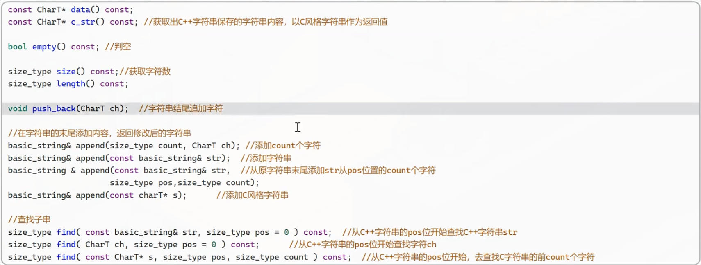
- basic_string还进行了运算符重载,支持使用==、>、< 等符号来比较两个字符串的内容.
- 迭代器可以看作是指针,迭代器可以像指针一样:`*it`,`++it`, `it1==it2`.....
- `std::vector`: 自动调整自身大小; 允许任意位置插入和删除元素; 有直接访问某个元素的能力.
> [!WARNING]
> 由于类在编译期进行内存对齐,所以成员变量声明时不能使用auto自动推导, 一般使用`std::vector<int> vec{1, 2};`进行声明, 只有成员函数内部局部变量和成员函数返回值可以用auto.

> [!NOTE]
> C++17 起，auto 配合列表初始化已成为标准实践, ` auto vec = std::vector<int>{1, 2, 3};`
- shrink 缩小
- `std::vector`有两个属性:`size`和`capacity`, `reserve`提前预留出capacity大小的空间, 适合已经清楚大小,较大的情况.
- `std::vector`对象管理的元素在堆上,`std::vector`对象由底层三个指针(迭代器)组成,所以一个vector对象的大小是`sizeof(vec)`=3*8: 
  - `_start`,指向堆内存块的起始地址.
  - `_finish`,指向当前最后一个有效元素的下一个位置.
  - `_end_of_storage`,指向已分配内存最后一个地址的下一个位置.
- 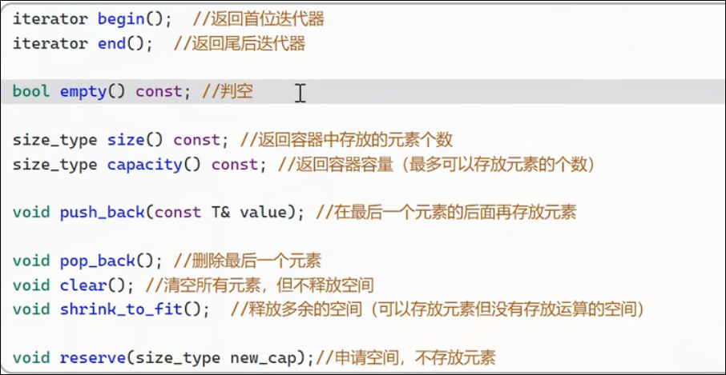
- 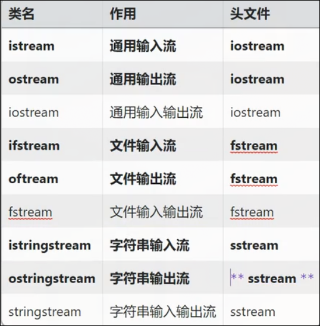
- 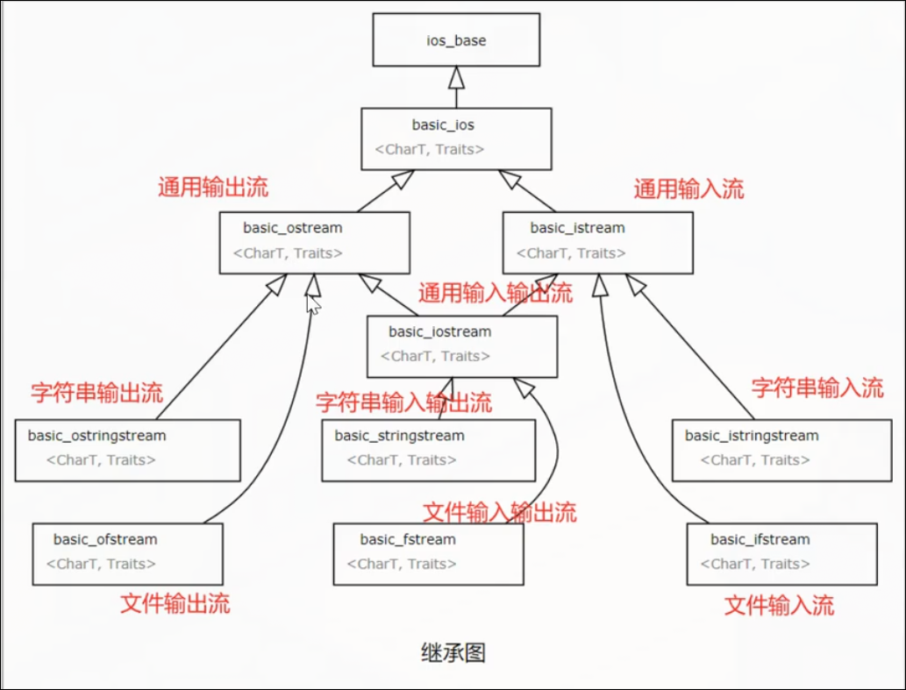
- stream分类: 标准i/o, 文件i/o, 串i/o(向/从字符串中写入/读取数据)
- stream的四种状态`googbit`(正常状态),`eofbit`(结束状态(提前按下ctrl+d或者文件结束)),`failbit`(可恢复错误状态),`badbit`(不可恢复错误状态):
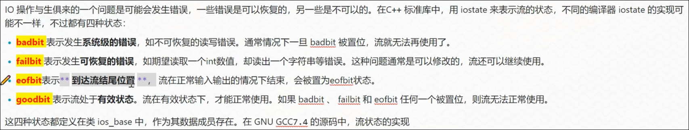
- stream流状态判断函数: `xxstream.good()`,`xxstream.eof()`,`xxstream.fail()`,`xxstream.bad()`,都是`bool xxx() const`形式.
- 标准i/o流的三个实例:`std::cin`,`std::cout`,`std::cerr`.(是唯一对象,所以可以取地址)
- `std::cin >>`输入流运算符以空白字符(空格,换行,制表等)为分隔符.
- 从failbit状态恢复做法:
<details>
<summary>点击查看代码</summary>

```cpp
  if (!std::cin.good()) {
  std::cin.clear(); //恢复流的状态
  std::cin.ignore(std::numeric_limits<std::streamsize>::max(),'\n'); //清除缓冲区的内容
  }
```
</details>

- **逗号表达式**:逗号表达式整体的返回值就是最后一个表达式的返回值, belike: `while(std::cin>>num, !std::cin.eof())`.
- `if(std::cin)`和`if(std::cin.good())`效果一样.
- 标准输入/输出流存在输入/输出缓冲区.
- 缓冲区存在三种缓冲机制:
  - 全缓冲: 缓冲区填满才执行io操作, 对磁盘文件的读写.
  - 行缓冲: 当遇到换行符enter后/强制刷新缓冲区后/行缓冲区(默认1024字节)满后/程序结束后,执行io操作, `std::cin`.
  - 不缓冲: 遇到数据就执行io操作, `std::cerr`.
- `std::cout`输出到终端时是行缓冲,输出到文件时是全缓冲.`std::endl`插入换行符,然后强制刷新缓冲区(`\n`+`std::flush`).
- `std::endl`和`std::flush`在任何模式下都强制刷新缓冲区; 换行符`\n`在行缓冲模式下自动刷新缓冲区.
- 用来自`<string>`头文件的`std::getline()`代替`ifs.getline()`.
- `ifs.tellg()`获取游标位置, `if.seekg(offset)`移动offset字节长度相对与文件开头, `ifs.read(data,length)`读取指定长度.
- 连续写入文件: `std::ofstream ofs("log.txt", std::ios::app);`,以追加模式打开文件,并自动定位到文件末尾.
- 已经使用std::getline从文件中获取行,怎么从行string中提取单词: 使用字符串io输入流将一个string拆分,`std::istringstream iss{str_line};`
- `iostream`,`fstream`, `sstream`.
- `std::to_string()`把基本类型安全转换成std::string类型.
- stringstream的作用:  串输入流:拆分string; 串输出流:合并string.
- 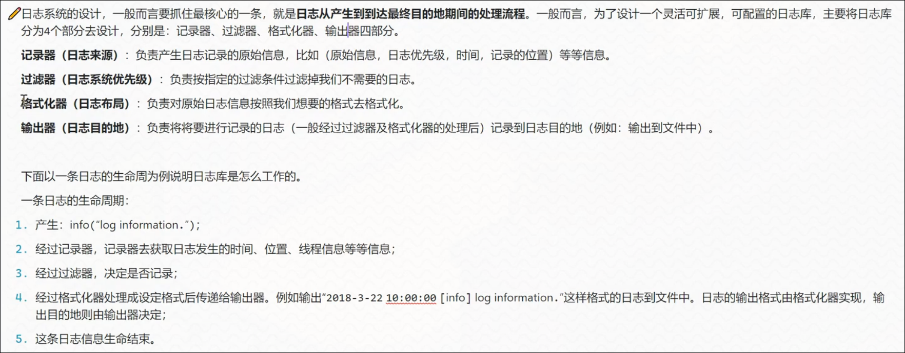
- 友元friend的使用:
  - 友元之普通函数形式(在类外使用函数访问类的私有成员变量):友元普通函数在类中使用friend声明` friend void showSecret(const MyClass& obj);`, 在类外定义`void showSecret(const MyClass& obj) {}`.
  - 友元之成员函数形式(另一个类B中的成员函数需要使用该类A中的私有成员变量):前置声明`class MyClassA;`,在类B中声明`void showSecret(const MyClassA & obj);`,在类A中进行带作用域限定符的友元声明`friend void MyClassB::showSecret(const MyClassA & obj);`,在类外进行带作用域限定符的定义`void MyClassB::showSecret(const MyClassA& obj) {}`
  - 友元之友元类形式(当友元之成员函数太多的时候写起来非常麻烦,直接写成友元类形式,类B所有的成员函数都能访问类A的私有成员变量):直接在类A中friend声明`friend class MyClassB;`
- 友元是单向的; 友元不能被继承.
- 运算符重载: 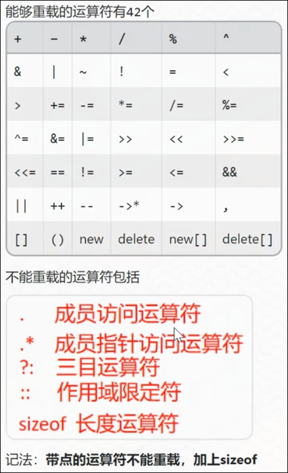(带点的和sizeof不能重载.)
- `sizeof`也是一个运算符,除了`sizeof(a);`还可以`sizeof a`.
- 运算符重载不能全是内置类型;重载时不能设置默认参数.
- 运算符重载的形式有三种:
  - 友元函数的重载形式
  - 成员函数的重载形式(第一个操作数由this指针指向的对象代替,所以参数列表只需要写出右操作数)
  - 普通函数的重载形式(不用)
- 运算符重载:`返回类型 operator运算符(参数){}`
- 自增运算符(前置++和后置++)重载(通过增加一个哑元参数区分):
<details>
<summary>点击查看代码</summary>

```cpp
    //前置 ++i：无参数，返回引用
    Counter& operator++() {
        ++value;          // 先自增
        return *this;     // 返回自增后的自身（引用）
    }

    //后置 i++：带 int 哑元参数，返回值(返回的是增加前的值)
    Counter operator++(int) {
        Counter temp = *this;  // 1. 保存当前状态的副本
        ++value;               // 2. 自增
        return temp;           // 3. 返回自增前的副本（值）
    }
```
</details>

- `std::size_t`无符号整数类型,底层是`unsigned int`4个字节,`size_t`是c风格的,不要用.
- 由于输出流运算符的左操作符必须是`std::ostream &`,所以不能写成成员函数形式重载,可写成友元函数形式重载.
- 当一个类B中有另一个类A的指针对象时`class B{private: A * a_ptr;};`,B的类外类对象b可以通过箭头运算符重载来调用a_ptr的成员,要不然调用不了private成员.
- 箭头运算符有递归性,`A * operator->(){return a_ptr;}`,`b->aPrint();`, 如果`class A{private: C * c_ptr;}`,`C * operator->(){return c_ptr;}`,那么需要`A & operator->(){return *a_ptr;}`,才能`b->cPrint();`运行.
- 因为`operator->`的递归只发生在返回类型是类类型（或类引用）时; 一旦返回原生指针，递归立即终止.
- `operator->`的递归只发生在有`operator->`运算符重载的类里.

<details>
<summary>点击查看代码</summary>

```cpp
  class C {
  public:
      void cPrint() const { std::cout << "C::cPrint()" << std::endl; }
  };

  class A {
  private:
      C* c_ptr = new C();
  public:
      C* operator->() { return c_ptr; }  // 返回 C*
  };

  class B {
  private:
      A* a_ptr = new A();
  public:
      A& operator->() { return *a_ptr; }  // 返回 A&
  };

  int main() {
      B b;
      b->cPrint();  // ✅ 可以运行
      // 过程：b-> → 调用 B::operator->() 返回 A& → 编译器自动取地址得到 A* → 调用 A::operator->() 返回 C* → 调用 cPrint()
      return 0;
  }
```
</details>

- 解引用运算符重载(*)功能类似,但只能解一次,没有递归性.`A & operator*(){return *a_ptr;}`
- 当一个类B中有另一个类A的指针对象,然后又箭头运算符重载,解引用运算符重载,这就是智能指针的雏形.
- 运算符重载函数本质就是一种 成员函数/友元函数,当然可以进行函数重载,比如说`int operator+(int a)`,`float operator+(float a)`
- 一般运算符重载函数进行函数重载参数个数不能改变,但是函数调用运算符()重载的函数重载的参数可以是任意的.
- 函数对象: 重载了函数调用运算符()的类的对象. 优点: 可以携带状态信息,比起单纯的函数重载.
- `typedef a A;`
- 函数指针可以很简单的赋值为普通函数,那如何指向一个类中的非静态成员函数呢: `返回类型 (ClassA::*ptr)(参数类型)= &ClassA::func;`,调用:`ClassA a; (a.*ptr)(参数);`(需要用完整形式的函数指针,需要加上类作用域.)
- 这里的`.*`视为一个运算符,叫做成员指针运算符的第一种形式.
- `返回类型 (ClassA::*ptr)(参数类型)= &ClassA::func;`,调用:`ClassA *a = new ClassA(); (a->*ptr)(参数);`
- 这里的`->*`视为一个运算符,叫做成员指针运算符的第二种形式.
- 类型转换函数:
  - 由其他类型转换为自定义类型: 转换构造函数(一个只接收单个参数（或其余参数均有默认值）的构造函数).
    - 禁止隐式调用构造转换函数: 前面加`explicit`关键词.
  - 由自定义类型转换为其他类型: `operator 转换目标类型(){}`, 没有返回值和参数; 或者写赋值运算符重载函数.
- 嵌套类在内存上并没有嵌套.
- 嵌套类内层类外层类访问权限规则:
  - 内部类可以访问外部类的所有成员，包括pivate和protected成员，并且可以直接访问外部类的私有静态成员而无需通过对象.(相当于是默认的友元类,住到家里来的是朋友)
  - 外部类不能直接访问内部类的私有成员,除非声明友元类.
- `class A;` 类的声明(和函数声明写法是一样的,要举一反三啊!!碰见少见的想想常见的).
> [!NOTE]
> 只有当类没有显式声明(主动写出了成员函数声明,不论后面是=delete,=defualt,还是函数体)的拷贝操作、移动操作、析构函数中的一个时，编译器才自动生成默认的移动操作,拷贝操作.
- 手动声明`= delete`,显式表达意图,防止后续改变,有备无患.
- eager 渴求的,深切的.
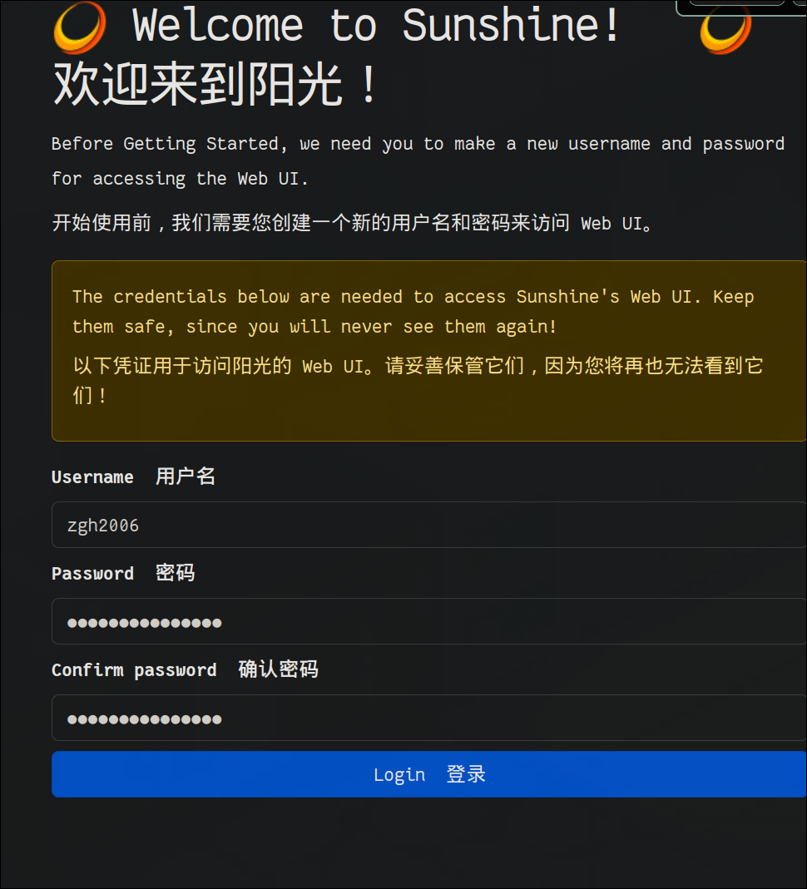
- `std::string`(当字符串长度变化如拼接,赋值时自动分配或释放内存)的底层实现演变:
  - eager copy 深拷贝
  - cow(copy on write) 写时复制(意为:写时深拷贝,读时浅拷贝,采用计数方式防止double free,用内部代理类方式区分下标读和下标写)
  - sso(short string optimization) 短字符串优化(现用) (意为: 短字符串(<15)(不连换行符)放在栈上,长字符串放在堆上)
- 要在堆和栈上切换,可以用`union`来使数组和指针共享一块内存.
- 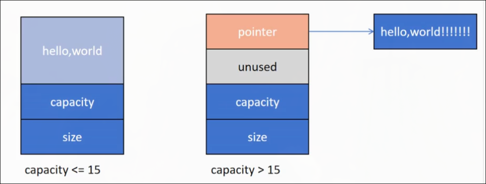
- `siezof(std::string)=32`: `union=16`,`size=8`,`capacity=8`
- `union`联合体/共用体,允许同一块内存空间中存储不同类型的数据,所有成员共用同一块内存,但是一次只能使用一个成员. 
- `union Buffer{char * _pointer; char _local[15];}; Buffer _buffer{};`
- 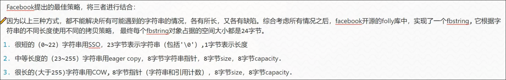
> [!NOTE]
> “类内成员默认有 inline”这条规则仅适用于成员函数，不适用于成员变量.
> [!NOTE]
> 非 const 且非 constexpr静态成员通常不能直接在类内初始化; 原因：静态成员属于类本身，其存储空间在程序启动时分配. 在类内声明时，编译器尚未为它分配实际的内存，因此无法进行初始化.
> [!NOTE]
> 整型（如 int、char、bool,枚举）的 const 静态成员和所有 constexpr 静态成员在类内直接赋予初始值.
> [!NOTE]
> C++17 引入了 inline static成员，允许直接在类内初始化任何类型的静态成员，无需类外定义.
- 初始化列表只有构造函数能使用,拷贝构造和移动构造也是构造函数.
- python中的set是无序不可重复可变, `std::set`是默认升序不可重复不可变的,想变要先把旧元素erase再把新元素insert(因为底层是红黑树).
- `std::set`查找操作:`count(key)`找到返回1,找不到返回0. `find(key)`找到返回迭代器,找不到返回`end()`.
- `std::set`插入操作: `insert(key`返回`std::pair<插入成功的位置的迭代器,是否成功bool>`; `void insert(it_first, it_end)` ; `void insert({初始化列表})`
- set不能下标访问,因为没有operator[]重载.
- `std::map`中的元素类型是`std::pair<const key, value)`
- map的下标是访问key获得value的操作,和普通下标访问不同,访问不存在的key会自动插入.
- 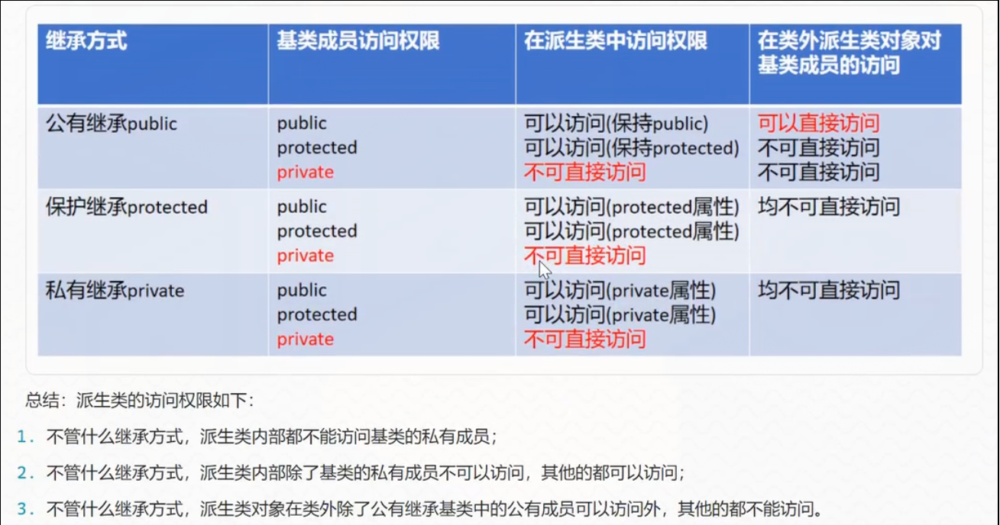
- 不管以什么方式继承,对于基类的private成员,派生类内部都不能访问; 对于基类的public/protected成员,派生类内部都能访问.
- 只有public继承方式的基类的public成员, 类外派生类对象才能访问; 其余继承方式的基类的所有成员,类外派生类对象都不能访问.
- private继承和protected继承的区别: private继承会切断本层下一层与本层往上的访问权限.
- 继承关系的局限性: 六大特殊成员函数,父类的友元, 在堆上开辟/删除空间operator new/operator delete,这些都不能被继承.
- `operator new` 在堆上开辟空间, 构造函数进行内部成员初始化. `new= operator new + 构造函数`.
- `operator delete` 在堆上释放空间, 析构函数进行内部成员清理. `delete= operator delete + 析构函数`.
- 如果你定义了有参构造函数，但又试图用无参的方式创建对象，编译器会直接报错.因为写了有参构造，默认无参构造函数就消失了,需要的话,需要再写一个= default构造函数.
> [!NOTE]
> 只要在类中手动定义了“任何一个”构造函数（无论它长什么样，无论有没有参数，无论函数体是不是空的），编译器就会立刻停止自动生成默认构造函数的行为.当然`Point(){xxx}`也属于无参构造函数.
- 但子类没有显式调用基类的构造函数时, 默认会调用基类的无参构造函数; 相反,r果基类没有无参构造函数,那么子类就就必须显式写出基类的有参构造函数
- 子类对象内存布局: 子类创建对象时,子类对象内存布局开始处会存放一个基类部分对象,然后再基类部分对象后存放子类部分对象. 
- 析构时会先析构子类部分对象,再析构基类部分对象.
- 类成员变量的初始化顺序与列表初始化中的顺序无关,只严格遵守类定义中的声明顺序.为了避免先后依赖问题, 初始化列表中的书写顺序，应永远与类中声明的顺序保持一致！
- 定义一个子类的的过程中发生了什么: 吸收基类成员; 添加新成员(非必须); 隐藏基类成员(非必须).
- 隐藏基类成员是什么意思: 当`boy._data`和`boy.Father::_data`同名成员同时存在时,会把father的隐藏起来,而不是覆盖起来.(只要同名,类型不同也能隐藏),(成员函数和成员变量同理,只要函数名相同)
- `strcpy`: 把源指针指向的内存地址开始的内容，逐个字节地拷贝到目标指针指向的内存地址中.
- `class`的默认继承是`private`,`struct`的默认继承是`public`.
- `class A : public B,public C{};`
- 多重继承可能产生的问题: 相同成员名访问的二义性; 存储二义性.
- 菱形继承是存储二义性,v型继承是成员名二义性.
- 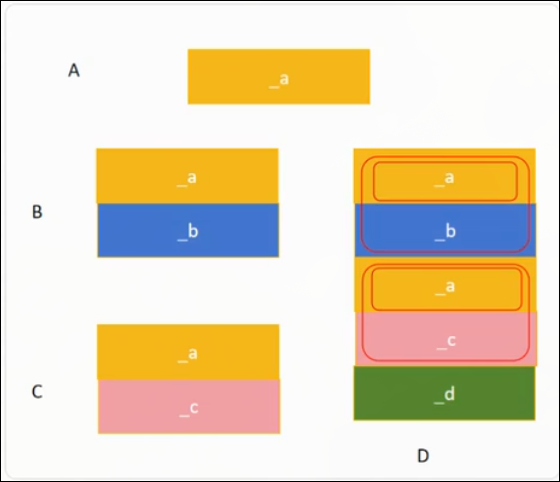
- 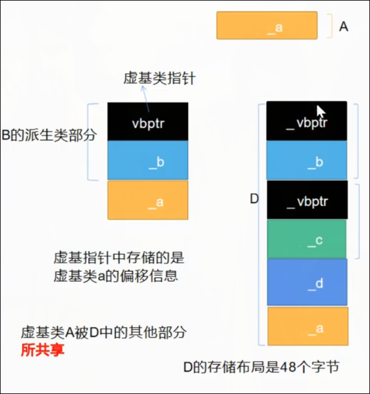
- `class A{}; class B: virtual public A{}; class C: virtual public A{}; class D: public B,public C{};`
- 每个虚继承的基类部分包含一个虚基类指针(vbptr),指向一个虚基类表(vbtable),vbtable 中存储了当前派生类对象中基类子对象(只有一个就不会存在二义性了)相对于该vbptr位置的偏移量.
- 基类对象与子类对象的相互转换: `Base base = derive;`, `Base * base = &derive;`, `Base & base = derive;`,向上转换直接可以(也支持隐式转换),反之不能直接转换,也不一定能转换成功.
- polymorphic 多态的
- c++两种多态:
  - 静态多态/编译时多态: 函数重载, 运算符重载.
  - 动态多态/运行时多态: 通过<u>**基类指针/引用**</u>调用虚函数时，能自动执行派生类的版本.
- 继承并不是多态,继承derive是多态polymorphism的基础. 基类虚函数virtual 是触发多态行为的开关.
- 子类对象之间进行拷贝构造和拷贝赋值时:
  - 当子类没有显式定义子类的拷贝构造函数和拷贝赋值运算符函数时,会自动完成基类子部分的拷贝.
  - 当子类显式定义子类的拷贝构造函数和拷贝赋值运算符函数时,不会自动完成基类子部分的拷贝,需要显式进行基类子部分的拷贝.
  - 所以当子类显式定义子类的拷贝构造函数/拷贝赋值运算符函数时, 需要显式的调用基类的拷贝构造函数/拷贝赋值运算符函数:`Derive(const Derive &rhs):Base(rhs),_derive(rhs._derive){}`,
  `Derive & operator=(const Derive &rhs){Base::operator=(rhs); _derive=rhs._derive; return *this;}`
- 基类指针指向子类对象,只能访问子类对象中的基类子部分. 但是基类成员加上virtual关键字后,竟然可以他那个过基类指针访问子类对象中的子类子部分成员,而且基类和子类的大小发生了改变.
- 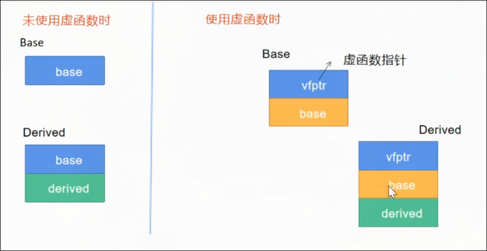
- 该虚函数指针virtual function pointer指向一个虚函数表,虚函数表存放的是虚函数的地址.
- 如果基类中的某个成员函数被声明为virtual，那么无论派生类中同名函数是否显式添加 virtual 关键字，它默认也是虚函数, 无论这个同名函数是否显式添加override关键字,它的地址默认也会覆盖虚函数表中基类的虚函数地址.
- 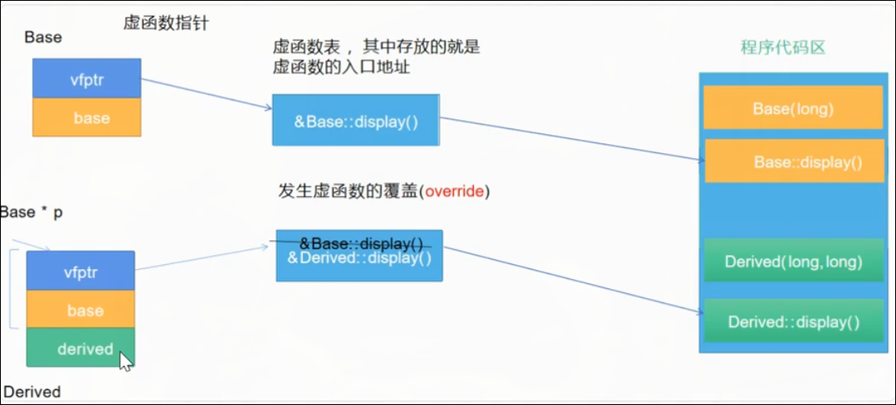
- 重载`overload`和隐藏`oversee`和覆盖`override`的区别:
  - 函数重载:函数名相同,但参数类型,个数,顺序任一不同.
  - 当派生类定义了一个与基类同名(不论参数相不相同)的函数时，基类中的同名函数（即使有多个重载版本）会被隐藏.
  - 覆盖的两个条件: 1.是虚函数; 2.函数签名完全相同(有时难免写错,为了警醒,多写一个override)
- 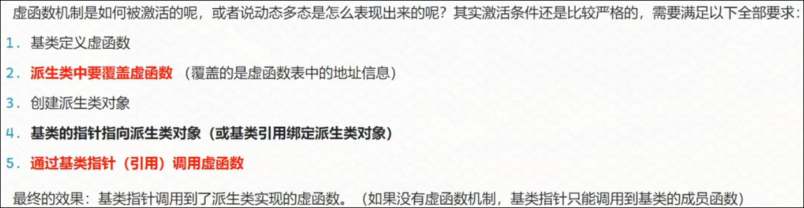
> [!NOTE]
> 面试问题:
> 虚函数表存放在哪里? : 编译完成时就应该存在,且运行时不应该被改变,所以应在只读段(文字常量区/程序代码区).
> 虚函数表就是一个函数指针数组.
> 一个类有几张虚函数表? : 可以没有虚函数表,没有虚函数就没有虚函数表; 可以有一张; 可以有多张(继承多个有虚函数的基类).
> 虚函数的底层实现? : 虚函数底层通过虚函数表实现,一个类定义了虚函数后,在内存起始部分存放一个虚函数指针,指针指向一个虚函数表,这个表里存放着类中虚函数的地址,子类的虚函数可以对基类的虚函数进行覆盖.
- 什么函数不能设置为虚函数
  - 构造函数
  - 静态成员函数,因为`this->vfptr->vftable->vf`,静态成员函数没有this指针.
- 类中隐式默认添加inline的成员: 1.在类中定义了(不是只声明)的成员函数; 2.inline是给函数用的,不是成员变量用的(除了`inline static int count = 0;`为了给全局共享的静态成员变量类内初始化)
> [!NOTE]
> 多态必须是基类指针/引用调用虚函数,不能是基类对象调用虚函数, 因为子类对象赋值给基类对象时子类子部分直接被舍弃了,哪里还能执行子类版本的成员函数; 当子类对象地址赋值给基类指针时,指针指向的还是那个完整的子类对象,还能通过vfptr-ftable访问到子类版本的成员函数.
- virtual只能写在类定义中.
- 基类指针调用虚函数,只看该虚函数在基类中的权限,不看该虚函数在子类中的权限.
- 抽象类有两种形式:
  - 声明了纯虚函数(不论其他的,只要有一个纯虚函数)的类.`虚函数=0;`
  - 只定义了protected权限的构造函数,没有定义public权限的构造函数.
- 没有全部override纯虚函数的子类也是一个抽象类abstract class.
- `const int count = 1;`与`constexpr int count = 1;`的区别: 都是不可改变的常量,但是const的值确定时期可以是编译器也可以是运行期,constexpr只能是编译期, `int count=1;`在运行期且可改变.  `const int count = getValue();`可行,但是`constexpr int count = getValue();`错误❌.
- 构造函数不能设置为虚函数, 因为虚函数的调用需要vfptr, 而vfptr又需要在构造函数里初始化,陷入死循环.
> [!NOTE]
> 调用子类对象的析构函数,会自动链式调用基类的析构函数.
- 只要存在通过基类指针析构派生类对象的可能, 析构函数就应该设置为虚函数.
- 子类的析构函数和基类的析构函数名字都不一样,为什么能实现虚函数覆盖? : 特殊设计.
> [!WARNING]
> 不调用类的析构函数,类中的智能指针也无法调用自身的析构函数,导致智能指针也会泄漏内存
> [!TIP]
>  g++ test1.cpp -fsanitize=address -g                     
> [!WARNING]
> 一个函数只声明,在编译期间是没有地址的. 编译期间,虚函数表需要存放虚函数的地址,所以虚函数必须有有效地址->必须有定义,除非是纯虚函数.
- `int *a = &b; `,`a[0],a[1]...`是合法的,因为编译器认为a是指向一段连续地址的首地址,而不仅仅是指向一个int类型.`a[i]`等同于`*(a+i)`
- 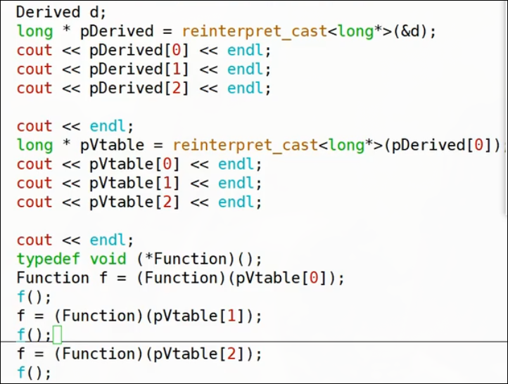
- 虚表中虚函数地址的顺序根据基类中虚函数定义的顺序来的.
- 朱泽兑,朱乾天,朱风巽,朱知临,朱鸣谦,朱鸿渐,朱履安,朱沛白.
- 朱含章,朱明芮,朱羽仪.
- 子类继承自多个有虚函数的基类, 不同的基类指针指向子类对象时, 各基类指针指向的地址实际上是子类对象中相应的基类子对象.  
> [!NOTE]
> 子类对象的内存布局中基类子部分的顺序严格按照继承列表中的顺序.
- 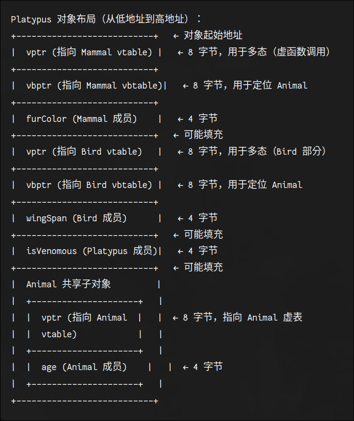
- 虚拟继承解决带有虚函数多态类的二义性的内存布局: 每个基类子部分的虚函数指针vfptr下面放置一个虚基类指针vbptr.
- 模板引入一种全新的编程思维:泛型编程/通用编程,本质上是一个代码生成器.
  - 函数模板 
  - 类模板
- 模板把类型参数化:把类型定义为参数.
- `template <template/class T1,template/class T1,....>` 里面的template和class任选其一; 模板形参列表中的模板参数包括类型参数和非类型参数.
- ```
- 函数模板示例:
  ~~~cpp
  template <class T>
  T add(T t1, T t2){
    return t1+t2;
  }
  ~~~
- 模板的发生时机是在编译期.
- 模板实例化:
  - 隐式实例化`add(1,2)`
  - 显式实例化`add<int>(1,2)`; 显式实例化可以参数类型转换`add<int>(1,2.2);`
- short只有int的一半大.
- 函数模板的重载包括:
  - 函数模板与函数模板重载(谨慎使用)
  - 函数模板与普通函数重载(当都能使用时**普通函数的优先级更高**,当然如果显式实例化了肯定使用函数模板)
- 当实例化时两个函数模板重载都能生成时,优先使用模板参数少的模板.
- 在源文件中函数模板和普通函数一样可以声明和定义分开,但是想简单的把模板函数的声明放到hpp文件中,把实现放到cpp文件中,就会报错函数未定义,因为函数.
> [!TIP]
> 编译器在处理一个 .cpp 文件（称为一个“翻译单元”）时，是独立编译的.它看不到其他 .cpp 文件里的内容. 编译器把每个cpp文件里的#include头文件展开插入然后编译.
- 普通函数编译: main.cpp 编译时：编译器看到 add 的声明（来自 utils.hpp），知道它是个函数，但不知道它的地址，因此生成一个未解析的符号引用（“我需要一个叫 add 的函数”）;
utils.cpp 编译时：编译器看到 add 的定义，生成对应的机器码，并将其函数名作为导出的符号（“我提供了一个叫 add 的函数”）;链接时：链接器将 main.o 中的未解析符号与 utils.o 中的导出符号匹配，成功完成链接，生成可执行文件.
- 函数模板编译时: main.cpp 中调用 add(1, 2.5)，编译器需要生成 add<int, double> 的实例化版本。但它看不到定义（因为定义在 utils.cpp 中），所以它只能生成一个未解析的符号引用，期待链接器提供; utils.cpp 编译时，虽然看到了模板定义，但没有实际调用，因此编译器不会生成任何实例化代码; 链接时，main.o 需要的 add<int, double> 符号在 utils.o 中不存在，导致未定义引用错误.
- 所以解决办法: 1.在cpp文件中调用一次(实例化一次)(但是要写一些和项目无关的调用代码); 2.定义写在在头文件中(与初衷相违背). 都不行.
- 标准委员会的解决办法: 声明写在头文件`utils.hpp`,定义写在源文件`utils.tpp`,然后头文件`#include "utils.tpp"`.
- 当通用函数模板无法被某个参数类型实例化使用时, 可以用普通函数重载/特化模板.
~~~cpp
  template <class T>
  T add(T t1, T t2){
    return t1+t2;
  }
  template <>
  const char* add<const char*>(const char* c1,const char* c2){xxxx}
~~~
- 特化模板不能脱离通用模板单独使用,因为特化模板要去匹配通用模板,形式与通用模板一致.
- extraneous 外来的,额外的,随机的
- `template <class T1, class T2,class T3> T3 add(T1 t1, T2 t2) { return t1 + t2; }`这样的模板必须显式实例化:`int result = add<int, double, double>(1.2, 2.5); `
- 尾置返回型函数模板:`template <class T1, class T2>  auto add(T1 t1, T2 t2) -> decltype(t1 + t2) { return t1 + t2;}`
- 模板参数列表中可以放:
  - 类型参数: 可以是任何类型
  - 非类型参数: 需要是整型: char/short/int/long/size_t; 不能是浮点型: float/double(c++20之后就可以了,因为浮点数的比较更准确了).
  ~~~cpp
  template <class T1, class T2, int ratio> T1 multiply(T1 t1, T2 t2) {
    return t1 * t2 * ratio;
  }
  std::cout << multiply<int, int, 2>(2, 2) << '\n';
  ~~~
- <>是模板参数列表,()是函数参数列表.
- 非类型参数可以有默认值: `template <class T1, class T2, int ratio=10> T1 multiply(T1 t1, T2 t2) {xxx}`
- 因为显式指定优先级>推导>默认值,所以无法推导的返回值类型参数可以有默认值: `template <class T1, class T2,class T3 = double> T3 add(T1 t1, T2 t2) { return t1 + t2; }`

