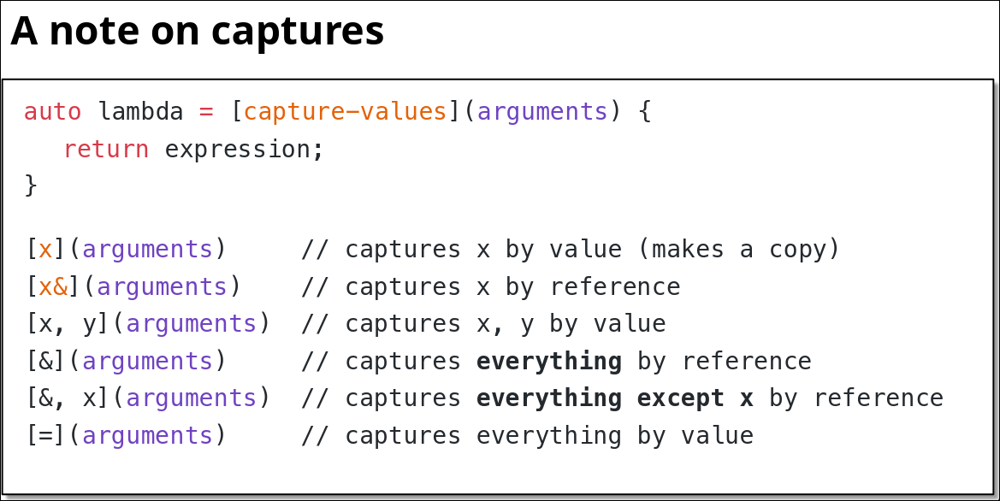
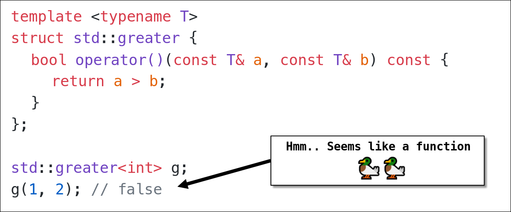
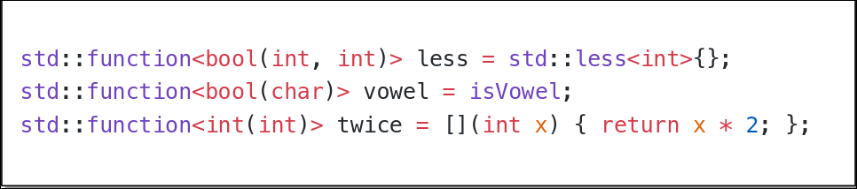
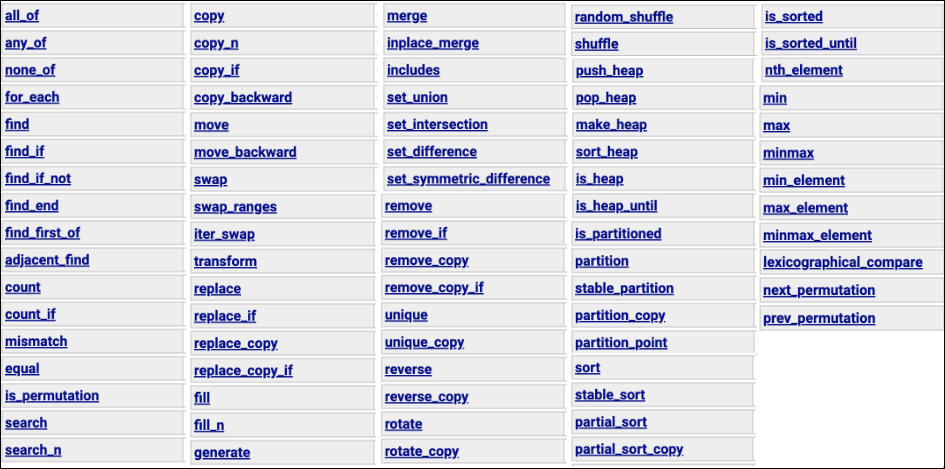
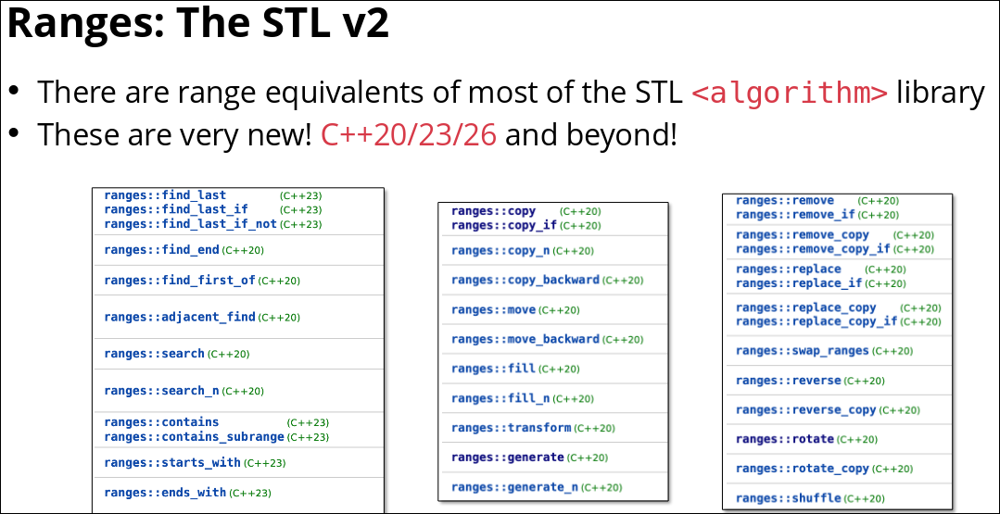
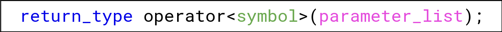
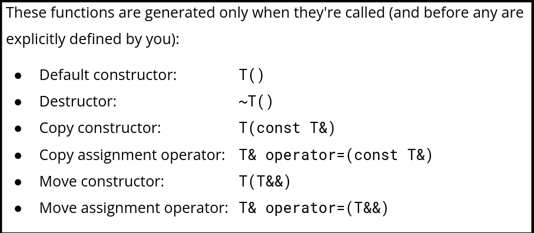
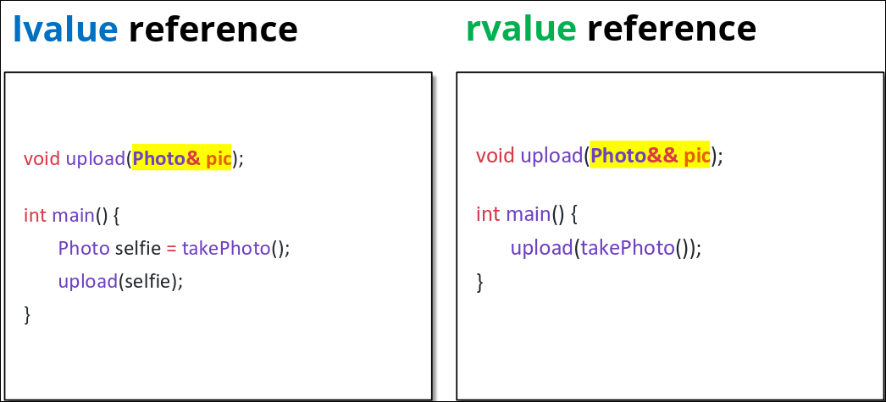
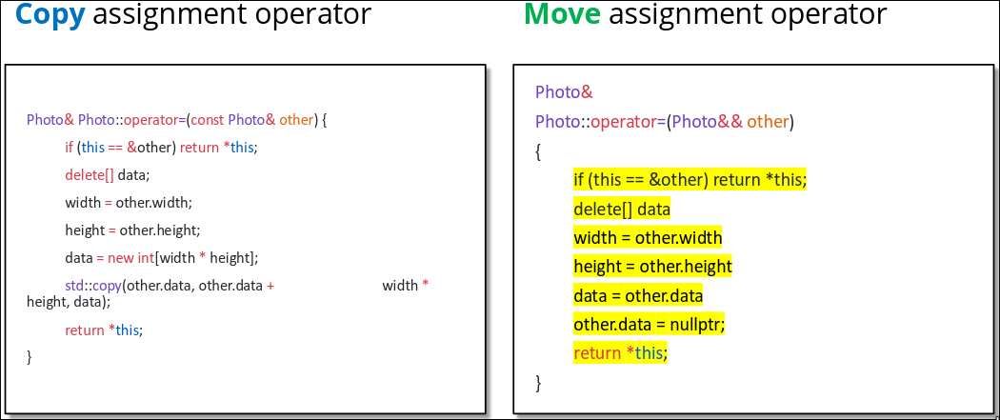
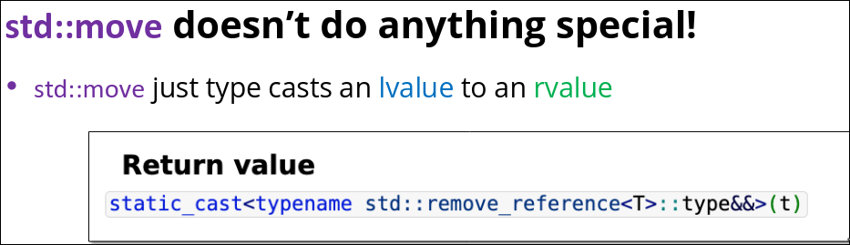

#### Type & Struct
- visible 可视的,有形的
- trade 交易
- compatiable 兼容的
- portable 可移植的
- tedious 冗长的，枯燥的
- messy 复杂的，混乱的
- move semantics 移动语义
- bare 基础的，裸露的
- heavy 大量的
- commit 提交，投入
- hygiene 准则，卫生
- modify 修改
- correctness 正确性
- restriction 限制
- derived 派生的
- recap 回顾
- assign 分配
- assignment 作业，赋值
- bundle 捆绑
- built-in 内置
- utility 翻译
- ambiguity 歧义
- coefficient 系数
- deduce 推导
- discretion 酌情处理
- annoying 烦人的
- verbose 冗长的
#### Initialization & Reference
- 初始化的方式：
  - direct initialization 直接初始化 `int a(1.0); / int a = 1.0;`
  - uniform initialization 统一初始化/列表初始化`int a{1};`
  - structured binding 结构化绑定 `Point p{10, 20}; auto [x, y] = p; std::get<0>(p);`, 只适合在编译期确定大小的对象，不适合像std::vector这样动态大小的类型.
  - 等号是传统的初始化
- curly braces 花括号
- 直接初始化会对不匹配的类型窄化转换，列表初始化会直接报错
- ubiquitous 无处不在的,常见的
- tldr: too long,don't read 长话短说
- qualifier 限定符
- masterpiece 杰作，代表作
- laugh out loud 哈哈
- grade 级别
- notoriously 众所周知地
- facility 设施，工具集
- abstraction 抽象 = 隐藏底层不必要的细节，只暴露出相关的接口
- consistent 一致的
- inherit 继承
- extract 提取
- intersection 交集
- treat 视为，处理
- consume 消耗
- explicit 显式的
- flush 刷新
- shoutout 特别提及
- clarification 澄清，说明
- caveat 注意事项，限制条件
- massive 巨大的
#### Streams 
- 交互式流（在终端/控制台，系统使用行缓冲，'\n'会立即刷新缓冲区；在文件/管道中，系统使用快缓冲，'\n'不会立即刷新
- 'std::endl' = '\n'+'std::flush' 强制刷新；
- io 
  - std::stringstream
  - std::cin 会把换行符\n残留在缓冲区
  - std::getline(...) 会把\n在缓冲区里清除掉
    - 不能把getline和std::cin 同时使用
  - std::ofstream/std::ifstream
  - cpp的空白字符包括：" ", '\n', '\t'
#### Containers
- prompt 提示
- alternative 代替的
- fishy 疑问
- due 截止，应得的
- tradeoff 权衡取舍
- associative 关联的
- disclaimer 免责声明
- stl：standard template library
- hold my beer 瞧好了，看我的
- stock 股票
- trap 陷阱
- trick 欺骗，花招
- hypothetical 假设的
- chunk 块
- separate 分离
- retrieve 获取，检索
- a collection of 一组
- std::map is a collection of std::pair
- std::map 平衡二叉搜索树（红黑）
- std::unordered_map hash_table(哈希表)
- std::set 是没有值的std::map, 也是平二搜（红黑）
- optimize 优化
- modulo 取模
- no. 第.,编号.
- lookup 查找
- loop through 遍历
- syntax 语法
- std::list 双向链表 doubly linked list
- std::array 静态固定大小数组
- duplicate 复制
#### Iterators & Pointters
- vec.end() 得到一个尾后迭代器
- ++i 避免不必要的复制
- iterator types
  - input iterator 单次读， Streams
  - output iterator 单次写, Streams
  - forword iterator 多次读写,只能++
  - bidirectional iterator 多次读写，++/--
  - random access iterator 多次读写，++/--, 随机访问
- fall here 归类于此
- matter 重要，有意义
#### Class
- inheritance 继承
- illustration 示例
- synonymous 同义的
- polymorphism 多态
- instance 例子，实例，instantiate 实例化
- 默认构造函数：调用无需传参的构造函数
- class B : virtual public A 虚继承：强制让简介继承基类的子类，在最终子类中共享一份基类的实例,从而解决访问歧义和数据冗余
- versatile 多功能的
#### inheritance
- closing thought 总结思考
- this 是当前类的一个指针
- python的类的成员函数和实例对象分开存储，所以你能看到：`p = Point(1,2) p_x = Point.getX(p)`  
- pain 痛苦，麻烦
- 默认的，类的继承是私有的
- slice 切片
- 把派生类对象赋值给基类对象，拷贝时会发生切片问题：派生类对象直接变成基类对象，新增的重写的全没了
- 所以解决对象切片问题的办法就是避免拷贝，使用指针
  - 

- dispatch 分发分配，调度
- 虚函数伴随着额外的内存消耗和性能开销，所以是否使用的条件是：是否存在基类指针/引用调用派生类方法。
- quant finance 量化金融
- cpp中，类的成员函数默认是非虚函数
- 纯虚函数 virtual void updata() = 0; 强制重写，使类抽象化
- concrete 实例化
#### Template Classes & Const
- 什么是模板类：创造通用类型类的蓝图
- clunky 笨拙的
- distinct 明显的，不同的
- 模板的不同类型实现之间不能转化
- non-typename template parameters 非类型模板参数，一个是类型模板，一个是参数模板,两者还可以一起用
- quirk 怪癖
- weird 奇怪，反常
- typename = class
- identical 完全一致
- const correctness 常量正确性
- const成员函数不能返回非const引用
- redundant 冗余的
- slight 稍微，简短
- const_cast<>() 去除/添加常量性
- mutable 可变的
- few and far between 少之又少
- entire 整个的，全部的
- fine-grain 细粒度的
- circuvment 绕过
- rare 稀有的
- sane 合理的
#### Template Functions
- 模板函数可以显式或者隐式指定类型
- ternary 三元的
- finicky 挑剔的
- C风格字符串（const char*）的比较、内存管理等都容易出错，C++推荐用 std::string（字符串类），它会重载 operator< 直接比较字符串内容，无需手动写比较函数
- 使用auto返回多种参数类型共同兼容的类型
- prominent 显著的,重要的
- all over the place 到处都是
- constraint 限制
- constant 常量
- unintuitive 不直观的,反直觉的
- hold 成立
- std::convertible_to<From, To> 是 C++20 标准库提供的「预定义概念」，定义在 <concepts> 头文件中，作用是「判断类型 From 是否能隐式转换为类型 To」。
- concept 约束（C++20），概念
- 定义一个模板约束：
```cpp
  template <typename T>
  concept Comparable = requires(T a, T b) {
  { a < b } -> std::convertible_to<bool>;
  };
  template <Comparable T>
  T min(const T& a, const T& b);
```
##### Variadic Templates 可变参数模板
- template + recursion
- wrapper 包装，包裹
- 
```cpp
  template <Comparable T>
  T min(const T& v) { return v; }
  template <Comparable T, Comparable... Args>
  T min(const T& v, const Args&... args) {
  auto m = min(args...);
  return v < m ? v : m;
  }
```
- intended 故意
- pun 双关
- unpack 拆解
- what's going on 怎么回事？发生了什么？
- 可变参数类型不必相同
##### Template Metaprogramming 模板元编程(TMP)
- 元编程：编写能生成代码的代码
- 在编译期运行
- enum 枚举值储存的是编译期常量, `enum {value = 1};`或者`enum ABC{value = 1};`
- enum class 强枚举类型，避免隐式转换，明确作用域
- arbitrary 任意的
- TMP is Turing complete 图灵完备
- constexpr 可编译期求值
- consteval 必须编译期求值
- constexpr,consteval等等是实现模板元编程的工具
- 想要个更好的模板错误消息，使用concept
- alternative 替换的,可选的
- std::distance计算两个迭代器之间的距离
#### Function and Lambda
- unary 一元
- binary 二元
- predicate 谓词：返回值是bool类型的判断逻辑(函数)
- 函数名在传参/赋值等时候，会退化成指针
- 函数名传参功能单一，不能使用外部变量（除非用全局变量），不能保存内部状态，所以提出了lambda函数
- enclosing scope 外围/包含作用域
- $\color{red}{lambda函数定义} ：是一类能在外围作用域捕捉状态的函数
- capture clause 捕捉子句
- 
- on the fly 临时地，快速地
  ```cpp
  auto lessThanN = [n](auto x) {
  return x < n;
  };
  ```

- $\color{red}{functor定义} : 函数对象是定义了`operator()` 的类的实例化对象
- 
- Time for a dark secret 重磅内幕揭晓时刻，来曝个冷门小秘密
- 当使用了lambda函数后，系统会生成一个对应的匿名函数对象类型,所以lambda就是一个函数对象, lambda的底层实现依赖于functor
- overarching 顶层的
- std::function是函数（指针）/函数对象/lambda函数的顶层类型，这些都能转化成std::function
- 
#### Algorithms
- <algorithm>是一些模板函数的集合,都是通过迭代器实现的,允许我们对数据进行检查和转换
- 
- coalesce 合并，融合 
- truncate 截断
- zero-pad 补零
- std::back_inserter,尾部插入迭代器，向其赋值时会将元素追加到容器尾部
- std::toupper 变大写
#### Ranges and Views
- std::ranges 是STL的新一代特性
- ranges 是任意具有begin和end迭代器的对象,(可以是stl容器，可以是有begin和end的自定义类型)
- 
- ranges algorithm 是有模板约束concept的，传入错误参数的时候不会像stl算法一样报冗长的错误
- view 视图可以组合，视图是惰性适配另一个视图的视图
- awkward 笨拙的，别扭的
- view is lazy : view会记录要对range做什么，当range被访问的时候才会执行
#### Operator Overloading
- 分为非成员函数运算符重载和成员函数运算符重载
- convey 传达
- 构造函数初始化列表不是列表初始化啊，Money(int c):cents(c){}，不是花括号
- abuse 滥用
- custom 自定义
- sizeof(),new,delete也是一个操作符
- scope 作用域
- resolution 解析
- 使用friend友元成员函数运算符重载的原因：非成员函数运算符重载需要get私有成员变量所以写成成员函数运算符重载，但是第一个参数变成了this,所以要加上friend变成友元函数（友元函数不是类的成员函数），最终变成了写在类里面的非成员函数运算符重载
- 
- 非成员函数重载,没有隐含的this指针，需要显式写出两个左右操作数（stl偏向)
- prefer 偏向 
- idiomatic 符合语言规范的，惯用的
- 非成员函数重载和成员函数重载不能同时写
- ambiguity 歧义
- philosophy 原则，理念
- obvious 明显的
- contrariety 对立，矛盾
#### Special member functions(6 SMFs)
- 当有代码调用某个smf函数并且你没有没有显式定义时，才会有编译器生成它
- 
- member-wise copy 逐成员拷贝
- 拷贝构造函数：逐成员拷贝另一个对象创建一个新对象
```cpp
  Widget wight_one;
  Widget wight_two = wight_one;
  Widget wight_two (wight_one);
  Widget wight_two {wight_one};
- 移动构造函数:
  Widget wight_two = std::move(wight_one);
```
- 拷贝赋值运算符：把一个已存在的对象赋值给另一个已存在的对象
  ```cpp
  Widget widgetOne;
  Widget widgetTwo;
  widgetOne = widgetTwo
- 移动赋值运算符
  wight_two = std::move(wight_one);
  ```
- 初始化列表：同时声明和初始化变量
- 类中的不可赋值类型变量（const成员变量，引用成员变量）初始化赋值的唯一方式就是构造函数初始化列表
- 三五法则的初衷：当类管理资源时，编译器默认的拷贝函数的浅拷贝会导致资源重复释放
- 所以需要拷贝对象的时候就自定义深拷贝(拷贝构造函数，拷贝赋值运算符)，不需要深拷贝(资源独占)时就delete掉拷贝构造函数，拷贝赋值运算符
- 深拷贝：创建一个副本
- 深拷贝：必须实现三个sfm（拷贝构造函数，拷贝赋值运算符，析构函数）（三法则）（只要自定义了这三个中的一个，就要实现另外两个）
- 深拷贝情况下，实现三法则后，编译器会默认禁用移动函数，为了避免不必要的拷贝，最好再实现移动构造函数、移动赋值操作符（最好、可选）（五法则）
- 尽量避免手动定义smf（零法则）
- 拷贝构造，拷贝赋值：编译器默认生成的是浅拷贝；手动编写的：取决于你可深可浅
- =delete 禁用（比如std::unique_ptr)
- sufficient 足够的
- prime 引入，启用，首要的
#### fzf
- ctrl+t 打开模糊搜索
- '完全匹配
- ^指定开头
- $指定结尾
#### Move semantics
- drain 流失，耗尽，排水
- pretend 假装，虚构的
- `Photo p();`是一个函数声明，不是一个初始化；` Photo p{};或者Photo p = Photo()` 推荐列表初始化
- RVO 返回值优化
- temporariness 临时性
- persistent 持久的
- complicate 复杂的
- viable 可行的
- 左值用左值引用来避免copy,右值用右值引用来避免copy
- 
- distinguish 分辨，区分，使杰出
- 
- 
- 通常条件下让编译器决定使用&还是&&，要使用强制移动语义的时候使用std::move
- be wary of 保持警惕，小心
- std::move把任意值(左值/右值)一律转化成右值引用
  
- potential 可能的，潜在的
#### std::optional & type safety
- odd 奇数 
- even 偶数 
- deterministic 确定的，决定的
- dereference 解引用
- 类型安全type safety ：函数签名(函数名称，函数参数，返回值类型)对函数行为的保障程度
- 可选类型 `std::optional<T> (std::nullopt or T)`模板类型(现在处于什么状态) std::bad_optional_access
- interchangeably 交替地
- extent 程度，范围
- terminate called 终止函数被调用（程序终止）（动词名词化）
- wield 使用，wieldy 易用的
- accidental 偶然的
- std::optional<T> T不能是左值引用，必须是有效对象,std::optional<T&>不允许
- pros 优点，cons 缺点
- program fragment 程序片段
- monadic 单子式编程模式，使用std::optional实现函数链式调用(`.and_then(f), .transform(f), .or_else(f)`)
- compartmentalization 模块化
- sacrifice 牺牲
- a last resort 最后一个方法，万不得已
- make sense 有意义，合适
- encourage 鼓励
- dune 沙丘
- dude 家伙,老兄
#### RAII，Smart Pointers 
- arise 出现，升起
- exception 异常
- expectation 期待
- exception 异常是处理代码运行中突发错误的一种方式
- try-catch
- resource acquisition is intialization 资源获取即初始化
  - 这个类用到的资源应该在构造函数里获取
  - 这个类用到的资源应该析构函数里释放
- lad 哥们，小伙
- emblematic 象征的，标志的
- abide by 遵守
- compliant 顺从的，服从的，合规的
- why tho 为什么啊
- neither is this 这个也不是
- critical 至关重要的，关键的，危急的
- critical section 临界区
- raii for lock -> lock_guard
- raii for memory -> smart pointer 
- wrapper 包装
- mitigate 缓解，消除
- underlying 底层的
- in a bit 过一会儿再说
- std::weak_ptr 是解决std::share_ptr指针相互依赖的问题，把其中一个换为std::weak_ptr，被使用不增加引用计数
- crash 碰撞，崩溃
- crash course 速成课
