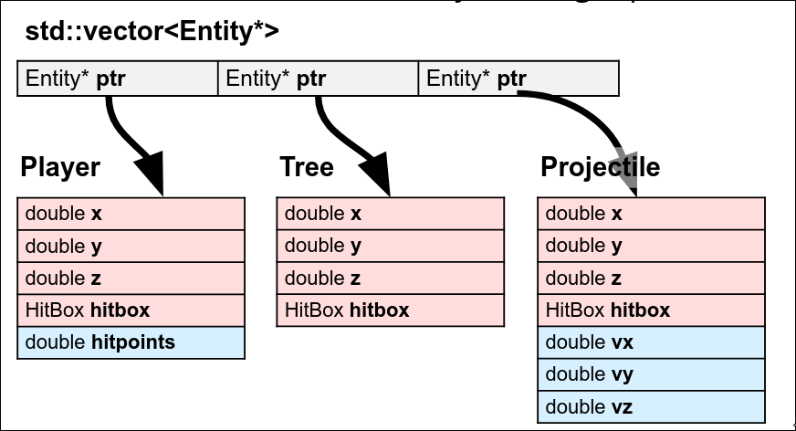

#### Type & Struct
- visible 可视的,有形的
- trade 交易
- compatiable 兼容的
- portable 可移植的
- tedious 冗长的，枯燥的
- messy 复杂的，混乱的
- move semantics 移动语义
- bare 基础的，裸露的
- heavy 大量的
- commit 提交，投入
- hygiene 准则，卫生
- modify 修改
- correctness 正确性
- restriction 限制
- derived 派生的
- recap 回顾
- assign 分配
- assignment 作业，赋值
- bundle 捆绑
- built-in 内置
- utility 翻译
- ambiguity 歧义
- coefficient 系数
- deduce 推导
- discretion 酌情处理
- annoying 烦人的
- verbose 冗长的
#### Initialization & Reference
- 初始化的方式：
  - direct initialization 直接初始化 `int a(1.0); / int a = 1.0;`
  - uniform initialization 统一初始化/列表初始化`int a{1};`
  - structured binding 结构化绑定 `Point p{10, 20}; auto [x, y] = p; std::get<0>(p);`, 只适合在编译期确定大小的对象，不适合像std::vector这样动态大小的类型.
  - 等号是传统的初始化
- curly braces 花括号
- 直接初始化会对不匹配的类型窄化转换，列表初始化会直接报错
- ubiquitous 无处不在的,常见的
- tldr: too long,don't read 长话短说
- qualifier 限定符
- masterpiece 杰作，代表作
- laugh out loud 哈哈
- grade 级别
- notoriously 众所周知地
- facility 设施，工具集
- abstraction 抽象 = 隐藏底层不必要的细节，只暴露出相关的接口
- consistent 一致的
- inherit 继承
- extract 提取
- intersection 交集
- treat 视为，处理
- consume 消耗
- explicit 显式的
- flush 刷新
- shoutout 特别提及
- clarification 澄清，说明
- caveat 注意事项，限制条件
- massive 巨大的
#### Streams 
- 交互式流（在终端/控制台，系统使用行缓冲，'\n'会立即刷新缓冲区；在文件/管道中，系统使用快缓冲，'\n'不会立即刷新
- 'std::endl' = '\n'+'std::flush' 强制刷新；
- io 
  - std::stringstream
  - std::cin 会把换行符\n残留在缓冲区
  - std::getline(...) 会把\n在缓冲区里清除掉
    - 不能把getline和std::cin 同时使用
  - std::ofstream/std::ifstream
  - cpp的空白字符包括：" ", '\n', '\t'
#### Containers
- prompt 提示
- alternative 代替的
- fishy 疑问
- due 截止，应得的
- tradeoff 权衡取舍
- associative 关联的
- disclaimer 免责声明
- stl：standard template library
- hold my beer 瞧好了，看我的
- stock 股票
- trap 陷阱
- trick 欺骗，花招
- hypothetical 假设的
- chunk 块
- separate 分离
- retrieve 获取，检索
- a collection of 一组
- std::map is a collection of std::pair
- std::map 二叉搜索树（红黑）
- std::unordered_map hash table
- std::set 是没有值的std::map, 也是二搜（红黑）
- optimize 优化
- modulo 取模
- no. 第.,编号.
- lookup 查找
- loop through 遍历
- syntax 语法
- std::list 双向链表 doubly linked list
- std::array 静态固定大小数组
- duplicate 复制
#### Iterators & Pointters
- vec.end() 得到一个尾后迭代器
- ++i 避免不必要的复制
- iterator types
  - input iterator 单次读， Streams
  - output iterator 单次写, Streams
  - forword iterator 多次读写,只能++
  - bidirectional iterator 多次读写，++/--
  - random access iterator 多次读写，++/--, 随机访问
- fall here 归类于此
- matter 重要，有意义
#### Class
- inheritance 继承
- illustration 示例
- synonymous 同义的
- polymorphism 多态
- instance 例子，实例，instantiate 实例化
- 默认构造函数：调用无需传参的构造函数
- class B : virtual public A 虚继承：强制让简介继承基类的子类，在最终子类中共享一份基类的实例,从而解决访问歧义和数据冗余
- versatile 多功能的
#### inheritance
- closing thought 总结思考
- this 是当前类的一个指针
- python的类的成员函数和实例对象分开存储，所以你能看到：`p = Point(1,2) p_x = Point.getX(p)`  
- pain 痛苦，麻烦
- 默认的，类的继承是私有的
- slice 切片
- 把派生类对象赋值给基类对象，拷贝时会发生切片问题：派生类对象直接变成基类对象，新增的重写的全没了
- 所以解决对象切片问题的办法就是避免拷贝，使用指针
  - 

- dispatch 分发分配，调度
- 虚函数伴随着额外的内存消耗和性能开销，所以是否使用的条件是：是否存在基类指针/引用调用派生类方法。
- quant finance 量化金融
- cpp中，类的成员函数默认是非虚函数
- 纯虚函数 virtual void updata() = 0; 强制重写，使类抽象化
- concrete 实例化
#### Template Classes
- 
