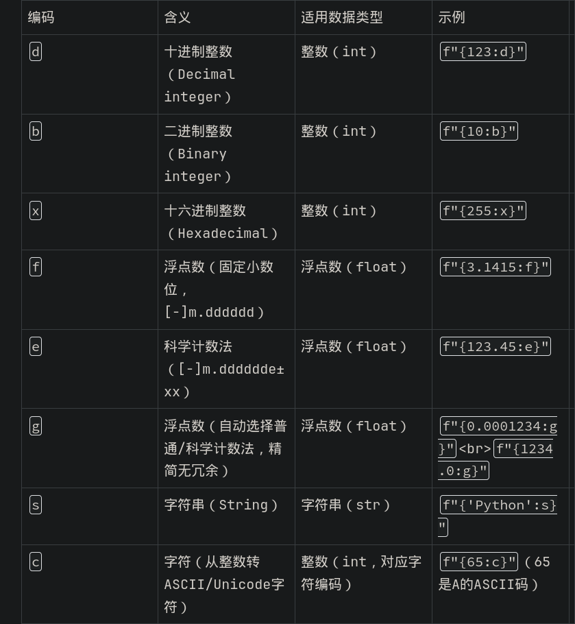
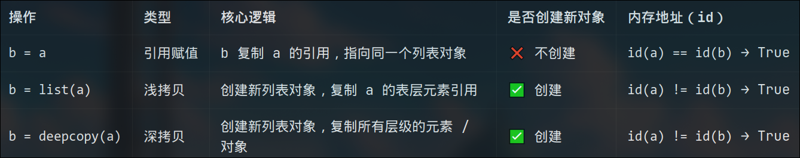
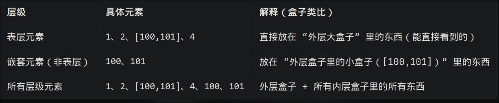

## python fundamental
- 缩进表示将语句分成代码块
- `if-elif-else `
- `print(f"{name} is {age} years old")`
- `print("asdf",end=xxx)`,
- 读取输入 name = input("enter name :")
- 不像c++,python的空语句会报错,用`pass`; 占位时`pass`和`...`功能相同,`...`除了占位的功能外还有空值语义/任意值/任意维度
- `...`是Ellipsis类的唯一实例,大多数是当临时占位用的
- python 无显式声明变量直接使用
- 三元运算: 结果1 if 条件 else 结果2
- del 删除变量/元素
- int 和 str 没法比较
#### Number
- `round()` 四舍五入
- `range()` 生成整数迭代对象
- python的数字类型: bool, int , double, 复数
- c++中的`true/false `是bool类型的值,但在python中`True/False`是数字1/0
- python的整数是动态长度,不会像c++一样有溢出的风险
- python里的双精度浮点数相当于c++里的double,python没有单精度和长双精度
- py中默认的`x/y`是返回浮点数,`x//y` 是返回整数(向下取整);c++的`x/y`返回值是整数还是浮点数取决于xy的类型
- `x**y` 阶乘
- py和cpp都用`& |`表示按位与/或,py用`and or not` 表示逻辑,c++用`&& ||`
- py的`abs`和cpp的`std::abs`适用于整数和浮点数,不要用c风格的abs和fabs
- int(a) 转换,失败会报错ValueError; c++的转换:抛弃c风格,用 static_cast<int>(a); const_cast<int>(a)仅适合去除指针/引用变量的const属性;dynamic_cast向下转换,继承转换
#### String
- python的字符串可以用单引号,双引号,三引号(单引号和双引号作用一样于不跨行的字符串,三引号可多行);
- cpp的单引号是char,双引号才是string
###### string idndex
- python在索引区间这方面特别喜欢左闭右开
- str[-2] 倒数第二个, str[-3:] 倒数第三个到最后,str[-3:0]返回空字符串
###### string operator
- 字符窜的连接: "hello"+s
- 字符串的长度: len(s)
- 字符串成员测试: `test = 'e' in s`, `test = "he" not in s`
- 字符串复制: `replication = s * 5`
###### string method
- 删除字符串前/后空格:`s.strip()` (只能)
- 大小写转换:`s.upper()`, `s.lower() ` (全部)
- 替换字符串内容: `s = "hello world" s.replace("hello","hallo") `
- s.endswith(suffix)     # 检查字符串是否以suffix结尾
- s.find(t)              # t在s中首次出现的位置（索引）
- s.index(t)             # t在s中首次出现的位置（索引）
- s.isalpha()            # 检查字符是否都是字母
- s.isdigit()            # 检查字符是否都是数字
- s.islower()            # 检查字符是否都是小写
- s.isupper()            # 检查字符是否都是大写
- s.join(slist)          # 使用s作为分隔符连接字符串列表slist
- s.rfind(t)             # 从字符串末尾开始搜索t的位置
- s.rindex(t)            # 从字符串末尾开始搜索t的位置
- s.split([delim])       # 使用分隔符delim将字符串拆分为子字符串列表
- s.startswith(prefix)   # 检查字符串是否以prefix开头
- 字符串一旦创建后是无法修改的,修改字符串都是新建的,`s[1]='o'` 是错的
- 将任何值转化成字符串:`str(3)`
- py查看变量类型:`print(type(s).__name__)`,`print(type(s))`,``
- `isinstance(a,(list,tuple)) `
- 字节串,引号前+b:`data = b"Hello World\r\n" `
- 原始字符串,引号前+r:`data = r"hello\nworld"`,作用是让反斜杠\仅作为普通字符生效,反斜杠\不再触发转译字符功能
- 格式化字符窜f-string: f'{变量:格式说明符}'
#### List
- `name = ["sd","fg","kl"]`
- 注明类型: `name: list[Any]`
###### list operator
- append
- insert
- + 连接两个list
- len(name)
- in /not in 
- 复制 name*4
- list 就不是为数学计算设计的,是为了通用数据储存和操作的
- `for na in name:`
- 返回第一个出现的索引:`name.index("sd") `
- remove/del, 删除元素
- reverse 反转
###### list sort 
- 就地排序
  - `name.sort() ` 原地修改, 仅list可用
  - `name.sort(reverse=True) ` 生成新的的, 可迭代对象均可使用
- na = sorted(name)
#### File manager
- `with open('input.txt', 'rt') as f_read, open('output.txt', 'wt') as f_write:`
- t文本模式,b二进制模式,r只读模式,r只写模式
- with是python中专门为资源管理设计的,自动可靠的释放资源,不用手动的`file.close()`
- with是python中的上下文管理器,自动管理资源,确保打开和关闭成对执行
- `read/write`
- 按行迭代:`for line in file:`
- `with open('outfile', 'wt') as out:
    print('Hello World', file=out)`, 使用print输出到文件中相较于`file.write("hello world\n") `的好处就是自动添加换行符\n
- `next(file)` 调用一次迭代一次
#### Function
- `def fuc(n): `
- 可校验参数类型: `def fuc(n:int|double):`
- 文档字符串必须放在函数/类/模块的第一行
- 参数:
  - `def read_prices(filename: str) -> dict:` 加上参数类型和返回值类型
  - 可以使用位置参数调用函数：`prices = read_prices('prices.csv', True) `
  - 或者可以使用关键字参数调用该函数：`prices = read_prices(filename='prices.csv', debug=True) `
  - 默认参数(必须末尾):`def read_prices(filename, debug=False):`
- `return q, r     # Return a tuple `  多个会组成一个元组
- 在函数内修改全局变量需要在修改前使用`global xxx`
- python的函数传参都是传递引用

## working with data && data struct
- 空值类型 :`name = None`, 为一个后续会赋值的变量提前占位
#### tuple
- `tup = ("sd",1,1.1,1)` ,元组,列表都是有序可重复的数据结构;但是list是可变数据结构,而tuple则是只读的不可修改,但是可以根据当前元组元素构造新的元组
- 既然都有了list,那tuple设计出来的目的是什么呢: 核心目的是"不可变的",不可变就防止数据篡改,可做字典键/集合元素(只有不可变元素才能被hash)
- 也可省略()
- `tup = ("sd",) `
- `t1,t2,t3,t4 = tup`,除了用索引外
- tuple是不可变的,所以就没有append
#### dictionary
- `dic = {"as": 1, "qw": "11", "qw": "12"} `
- 底层hash,与cpp的std::unordered_map实现一致,无序,可修改,重复的会覆盖
- list(dic),字典转化成列表,获得所有的键
- `for di in dic:` 迭代获取的是键,不能使用`for k,v in dic`
- dict的in/not in 都是对于键
- `dic.keys() `,获得实时自动跟随变化的键
- `dic.values()`,获得实时自动跟随的值
- 获得键值对:`for k,v in dic.items(): `
- item 项,物品,元素
- `dic.get("ass", None): `, 找不到有默认值
- 不可变的类型可做dictionary's key,如元组
- 无append,直接写键幅值即可
#### set
- 无序,不可重复(会自动去重)
- add
#### summary
1. list 有序可变可重复
  - append(x)
  - extend(iter) #批量增加
  - insert(idx, x)
  - pop(idx)
  - del lst\[idx\]
  - remove(x)
  - clear()
2. tuple 有序不可变可重复
  - 新建只能
3. dict 有序可变不可重复
  - d\[key\] = value
  - update({'a':1,'b'=2}) ; update(b=2)
  - dic.setdefault(11, 12) 如果存在11,那就返回11对应的value,dic不会改变;如果不存在11,那就返回12,改变dic
  - pop(key,default)
  - popitem(删除最后插入的键值对,返回键值对元组)
  - del dic\[key\]
  - clear()
4. set 无序可变不可重复
  - add(x)
  - update([1,2,3])
  - remove(x) 元素不存在则报错
  - discard(x) 元素不存在则无操作
  - pop() 随机删除一个元素,并返回
  - clear()
## format 格式化
- `f"{数据:[对齐符][占宽数字][整数格式编码]}" `
  - 占宽数字：指定数据在n个字符的固定区域内展示（不足补空格，超出则按实际长度显示）；
  - 对齐符：>（右对齐）、<（左对齐）、^（居中对齐），未指定时默认右对齐（数字）/左对齐（字符串）。
  - 
- `'{name:>10s} {shares:10d} {price:10.2f}'.format(name='IBM', shares=100, price=91.1)`
- ` s = {
      'name': 'IBM',
      'shares': 100,
      'price': 91.1
  }
  '{name:>10s} {shares:10d} {price:10.2f}'.format_map(s)`, 相当于是format的字典(映射)特供版
## sequence datatype 序列式数据类型
- string
- list
- tuple
- `a = [0,1,2,3,4,5,6,7,8]  a[2:4] = [10,11,12]  # [0,1,10,11,12,4,5,6,7,8]` ,重新分配的切片不必与原来长度相同
- `range(start,stop,step)`, `range(10,0,-1) ` 只能生成整数序列, `range(2)`生成0-2,单一参数时是stop,并且range(xx)是惰性对象,一般迭代访问/索引访问,想要得到实际数字,用list(xx)转化
- `for n,s in enumerate(se,start): ` 生成counter and iteration 
- `ts = zip(tup, se) ` 接收可迭代对象(如:list,string,tuple...)返回的是zip迭代器类型,只能迭代一次;如需多次使用,使用`list(ts),tuple(ts) `等
## collection module
- `Counter `是dict字典类的一个子类,访问到开始不存在的键的时候会赋值为零,从而不会报错
- `difaultdict`:一个字典的键对应多个值:`from collections import defaultdict`
- `deque`:固定长度限制,频繁头部操作的双向队列
## list comprehension 列表推导式
- `a = ["sd", 2, 3]
b = [2 * x for x in a]`.
- 过滤: `b = [2 * x for x in a if type(x) is int]`, [ <expression> for <variable_name> in <sequence> if <condition>]
## object
### object model; memory management; copy; type checking 
- 代码里的数字、列表、字典、函数等都是「对象」(object); 而「对象模型」(object model)是管理这些对象的 “底层规则手册”
- 赋值变量是地址拷贝`b=a`(修改一个值,所有的引用都会改变,但如果直接重新赋值数值,就变成了一个新的变量,和之前的引用就无关了),赋值数值是值拷贝`b=10`
- `is ` 比较是不是同一地址; `==` 比较的只是数值是否相等
- 和cpp不同,python的变量从不储存数据本身,而是储存数据的地址(引用)
- 赋值有三种: (和cpp的深浅拷贝不同)

- 深拷贝: `import copy`

#### everything is an object 一切皆对象
- python中的数字,字符,函数,异常,类,实例...都是对象,都能像数据一样被传递,放入容器,不存在特殊类型,这就是是所谓的"一等对象(first class)"

~~~python
items = [abs, math, ValueError ]
items[0](-45)       # abs
items[1].sqrt(2)    # math
except items[2]:    # ValueError
~~~

- python中绝大多数原地修改的方法都会返回`None`

#### error checking 错误检查
- propagate 传递
~~~
BaseException
├─ KeyboardInterrupt（用户中断）
└─ Exception（程序逻辑错误，也是你大部分需要处理的异常）
   ├─ ArithmeticError（算术错误）
   │  ├─ ZeroDivisionError（除零）
   │  └─ OverflowError（数值溢出）
   ├─ AssertionError（断言失败）
   ├─ EOFError（文件/输入提前结束）
   ├─ ImportError（导入失败）
   ├─ IndexError（索引越界）
   ├─ KeyError（字典键不存在）
   ├─ MemoryError（内存不足）
   ├─ NameError（变量未定义）
   ├─ ReferenceError（弱引用失效）
   ├─ RuntimeError（运行时通用错误）
   ├─ SyntaxError（语法错误）
   ├─ SystemError（解释器系统错误）
   ├─ TypeError（类型不匹配）
   └─ ValueError（值无效）
~~~

- 捕获并处理异常
```python
try:
  xxx
except xxx:
  xxx
```
- `except ` 除了,表示排除
- exception 异常情况,异常
- `except RuntimeError as e:` e是该异常的一个实例
- raise:抛出异常 `raise RuntimeError("关联值信息")`
- 异常可关联一个关联值,包含异常更详细的信息,这个关联值是异常的一部分
- `except Exception:` 捕获所有异常
- `except LookupError as e:
    ...
  except RuntimeError as e:` 捕获多个异常;或者`except (LookupError,RuntimeError) as e:`
- 重新抛出异常:`raise`
- 处理不了的异常就不要用try-except捕获
- `try-except-finally `,finally是一定会被执行的,可以用`try-with-except `的with语法糖代替

#### module
- `print(__name__)` 运行当前文件时,会输出`__main__`,不是文件名; 当被其他文件导入时则输出文件名, 用以区分此文件"当作模块导入"和"模块直接运行"
- 模块名不能以数字,'-'开头
- 模块是隔离的:`foo.x`和`foc.x`不同
- `import math as m` as关键字
- `from math import sin `, 降低臃肿,不用前缀
- `sys.modules`
- `sys.path` 导入模块的搜索路径
#### main module
- 最先运行的文件就是主模块__main__
- `if __name__ == "__main__":` 后面写仅需仅想直接运行时执行的代码,不需要被import后执行的代码
- python不强制是main函数,只是为了对齐其他语言习惯罢了
  ~~~ python
  def main():
    ...
  if __name__ == '__main__':
    main()
  ~~~
  
- basilk
###### 命令行参数
- 命令行参数列表: `sys.argv `
###### 标准输入输出
- 文件描述符,系统级的特殊文件,能像文件一样读写的特殊对象:
  - `sys.stdout`
  - `sys.stdin`
  - `sys.stderr`, 专门的错误输出通道,即使stdout被重定向了,error信息依旧会显示到终端上
- `print`就是在往`sys.stdout`写内容,是简化的`sys.stdout.write("hello world\n")`
- `input`就是简化的`sys.stdin.readline().strip()`
- 代码重定向:` sys.stdout = f   sys.stdout = sys.__stdout__`
- shell重定向符号`>`
- shell管道符号`|`, 将上一个命令的sys.stdout作为下一个命令的sys.stdin
###### 环境变量
- 设置不同的环境变量切换运行环境/传递信息/控制代码行为...
- zsh/bash 设置环境变量:`export learn="ing"`;查询:`    print(os.environ["learn"])`
###### 终止程序
- 任意位置直接整个程序.提供错误码,错误信息,`raise SystemExit`
- raise SystemExit          # 退出程序，默认退出码 0
- raise SystemExit(exitcode)# 带退出码退出（非0表示错误）
- raise SystemExit('提示信息') # 带提示信息退出
- 等同于:`sys.exit(exitcode)`,他的底层就是`raise SystemExit(exitcode)`
- `sys.exit(0)` 正常退出,非零异常
###### #! line
- 如何不用`python3 xx.py`,直接用文件名`xx.py`运行呢?:使用`#!/usr/bin/env python3`,自动查找python3解释器的路径
## class and object 类和对象
- `__init__`相当于cpp的构造函数,成员函数是写到`__init__`函数里的
- `self`就是调用这个方法的实例本身,不写这个参数的话,会找不到是哪个实例的成员/方法,所以在类中调用成员/方法时,都需要`self.x `,`self.do()`
- 在类的方法里调用同类的其他方法时，就不需要手动传 self 参数（Python 会自动帮你传）
#### inheritance 继承
- `class Animals:  class Dog(Animals):` 
- `super()`是父类的一个代理对象,不是普通的父类实例,只能调用父类的方法,无法调用父类的成员
- 在子类中调用父类的方法:`super().do()`
- 如果子类有新的成员需要初始化,需要重写__init__函数,用父类的init函数`super().__init__(xxxx)`
- `object`是最父的父类,class都继承自它
- 可多重继承:`class Child(Mother,Father):`
- python的 __访问控制约定__ :python里没有private,protected,public这一套访问控制,只能约定俗成._xx是protected, __xx是private
#### 特殊方法(类似于运算符重载)
- 直接写函数实现功能当然没问题,但是使用类中的特殊方法会更简便:
~~~python
    # 实现 __add__：让 + 运算符生效
    def __add__(self, other):
        return Vector(self.x + other.x, self.y + other.y) 
    # 实现 __str__：让 print() 输出友好
    def __str__(self):
        return f"Vector({self.x}, {self.y})"
    # 实现 __repr__：让交互式解释器输出详细信息
    def __repr__(self):
        return f"Vector({self.x}, {self.y})"
    # 实现 __len__：让 len() 能获取“长度”（这里约定为整数长度）
    def __len__(self):
        return int((self.x**2 + self.y**2)**0.5)
~~~
- [__特殊方法详细汇总__](./Python特殊方法_简化自定义类使用.md)
###### method invocation 方法调用
- `dog.do`不加括号只能返回方法对象;`dog.do()`加上括号才会执行方法
- c++这样来说也不报错`do;`,获取函数指针但不使用,不报错但没意义
###### attribute access 属性获取
- 可判断,可动态的,静态时等同于`.`的属性获取方法`getattr,setattr,hasattr,delattr`:
~~~python
getattr(obj, 'name')          # 等价于 obj.name
setattr(obj, 'name', value)   # 等价于 obj.name = value
delattr(obj, 'name')          # 等价于 del obj.name
hasattr(obj, 'name')          # 检查属性是否存在
~~~

#### 自定义异常
- 自定义异常通过类来实现,必须继承自Exception,类通常是空的,因为也用不到成员和方法:
~~~python
class NetworkError(Exception):
    pass
~~~

## python对象的内部工作原理
- 本节会讲解 Python 对象的一些底层实现逻辑。从其他编程语言转过来的开发者，常常觉得 Python 的类设计 “缺少某些特性”—— 比如：
  没有「访问控制」的概念（例如 private、protected 关键字）；
  self 参数的存在总让人觉得怪异；
  操作对象时有时感觉像 “无拘无束、毫无规则”。
  这些感受确实没错，让我们搞清楚这一切的运作原理，以及一些常用的编程范式 —— 这些范式能更好地封装对象的内部逻辑。
- 字典存放着module里的所有全局变量,函数,类 `xxx.__dict__`,`globals()`
- 自定义的对象（object）会把「实例数据」和「类本身」都存储在字典中。事实上Python整个对象系统本质上就是构建在字典之上的一层封装。当在`__init__`中给self.xxx赋值时，其实就是在填充这个 __dict__字典
- 每个类的实例的私有字典__dict__都是独立的,类实例的__dict__储存着成员变量,类的__dict__储存着成员函数,并且子类不会储存父类的成员函数
~~~python
    print(type(player))
    print(player.__class__) # 是一样的
~~~
- 查找类的父类:`xx.__base__`
- 成员函数的查找沿着子类->父类的顺序向上查找(方法解析顺序method resolution order(mro))
#### 属性装饰器 property
- `@property`,`@xx.setter` 使调用者可以像调用成员变量一样调用成员函数(不加括号),(相当于成员函数变成成员变量了):
~~~python
    @property
    def shares(self):
        return self._shares

    @shares.setter
    def shares(self, value):   # setter的装饰名必须和@property的函数名保持一致
        if not isinstance(value, int):
            raise TypeError('Expected int')
        self._shares = value
~~~
但我感觉不好,在调用时应该进行区分,像cpp一样写get/set函数
- `class Stock:
    __slots__ = ('name','_shares','price')  # 只允许这3个属性` , 用__slots__元组来代替占内存的__dict__字典,限制类的成员变量只是附带功能,主要用途是提高性能

## generators 生成器
- 迭代协议iteration protocol: `for x in obj:`的底层迭代协议为迭代器__iter__和with循环:
  ~~~python
  _iter = obj.__iter__()        # Get iterator object,获得迭代器
  while True:
      try:
          x = _iter.__next__()  # Get next item
          # statements ...
      except StopIteration:     # No more items
          break
  ~~~
#### 自定义迭代类
- `__iter__`是可迭代对象必须实现的方法, 所以自定义可迭代类要自己实现`def __iter__(self):`, 如果想要自定义可迭代器类实例本身还可以是迭代器,那么就需要实现`def __iter__(self):`,`def __next__(self):`
- `next(xx)` 参数是迭代器,不是可迭代对象
- 迭代器是一个可迭代对象,但是可迭代对象不一定是一个迭代器
- `_iter.__next__()`和`next(_iter)`是一样的
#### 自定义迭代器(代替__iter__()和__next__()的语法糖)
- 关键字yield:让普通的while循环函数变成生成器函数,没有return但是会返回一个生成器对象,在调用__next__()后会暂停while,只输出一个;
- 语法: `yield [表达式] `, `变量 = yield [表达式]`,可以用[生成器].send(xx)给变量传值
  ~~~python
  def generator(n: int):
      while n >= 0:
          yield n - 1
          n -= 1
  x = generator(10)
  for i in x:
      print(i)
  ~~~
#### 利用yield生成器generator的一次一个特性,管道(pipeline)模式--生产者,处理者,消费者
#### 生成器表达式(generator expression)
- 有列表推导式,字典推导式,集合推导式,没有元组表达式,因为括号被生成器表达式占用了
- 用的时候才会迭代生成元素,不会把所有元素都加载到内存中,仅保存生成规则,所以占用内存极低
- 列表表达式可以反复使用,生成器表达式只能使用一次
