# Chapter 1: introduction
- Reinforcement learning 或 RL 是一类用于解决各种顺序决策任务的方法.

| x | 顺序决策 | 非顺序决策 |
| --------------- | --------------- | --------------- |
| 决策间关系 | 当前决策影响未来决策 | 决策间相互独立|
| 是否考虑未来 | 考虑长期后果 | 只看当前收益 |
| 典型问题 | 下棋,机器人控制,对话 | 分类,推荐,赌博机 |

- pomdp: 通常假设环境也是一个马尔可夫过程，具有内部世界状态 w_t ，观测值 o_t 由此产生。（这称为部分可观测马尔可夫决策过程）.在 POMDP 中，智能体不知道真实状态 w_t，只知道观测 o_t 和信念 z_t
- mdp: 如果假设观测值o_t 完全揭示了隐藏的环境状态,在这种情况下，我们将智能体的内部状态和环境的外部状态用同一个符号表示，即 $s_t = o_t = w_t = z_t$ 。 （这称为马尔可夫决策过程)
- 用 POMDP 来精确描述现实世界的复杂性，但为了设计可行的算法，我们往往在数学上简化为 MDP

- 策略$pi$是随机策略, 比如(在 状态s0 时，以 60% 概率选 a0，40% 概率选 a1), 没有规定死s0必须选a0到达s1
- 环境的回报也是随机的, 比如(环境：执行 a0 后，50% 概率到 s1，50% 概率留在 s0)
- 这样的话一个随机策略$pi$,一个随机的环境,  从s0出发走的路经p(a0,s1,a1,…,aT,sT|s0,π)也是随机的,是很多条不同的路径,每条路径都有不同的奖励之和,这些奖励之和乘上路径的概率,结果就是当前(s0,$pi$)的奖励,最大化这个奖励的$pi$就是最佳策略$pi^*$
- 轨迹概率公式p(a0,s1,a1,…,aT,sT|s0,π):
$$
\begin{aligned}
p(a_0, s_1, a_1, \ldots, a_T, s_T \mid s_0, \pi) 
&= \pi(a_0 \mid s_0) \, p_{\text{env}}(o_1 \mid a_0) \, \delta\bigl(s_1 = U(s_0, a_0, o_1)\bigr) \\
&\quad \times \pi(a_1 \mid s_1) \, p_{\text{env}}(o_2 \mid a_1, o_1) \, \delta\bigl(s_2 = U(s_1, a_1, o_2)\bigr) \\
&\quad \times \pi(a_2 \mid s_2) \, p_{\text{env}}(o_3 \mid a_{1:2}, o_{1:2}) \, \delta\bigl(s_3 = U(s_2, a_2, o_3)\bigr) \cdots
\end{aligned}
$$
- $\delta( s_1 = U(s_0, a_0, o_1))$, 狄拉克函数,相等为1,不等为0
- 这里的$s_t$=智能体内部的信念状态$z_t$, st 是智能体用来做决策的状态。在 MDP 下它就是环境隐藏状态wt；在 POMDP 下它就是智能体的内部信念状态 zt。
- 智能体的内部信念状态$z_t$是个概率分布,是在过去的观测和动作下,对当前世界的内部隐藏状态w_t的信任程度: “给定我所有看到和做过的，我认为 wt 等于某个具体 w 的可能性有多大。”
- 传统 MDP 中状态转移概率 $$p(s_1 \mid s_0,a_0)$$，在这个公式里被等价替换为观测生成概率+ 状态更新函数 U + δ 筛选：
$p(s_1 \mid s_0,a_0) = \sum_{o_1} p_{\text{env}}(o_1 \mid a_0) \cdot \delta\bigl(s_1 = U(s_0,a_0,o_1)\bigr)$, 这个$o_1$一定是那个能让智能体获得信念状态$s_1$的观测
- 那观测生成概率$p_{\text{env}}(o_{t+1} \mid a_{0:t}, o_{0:t})$ 怎么计算呢:
- 最佳策略也会导致任务失败,在某次任务中也不一定是最佳的,但是它是做无数次任务中最佳的
- wrt(with respect to )是关于,相对于
- utility 效用,实用的
- , p(s0)是初始状态分布,求不同初始状态下的期望奖励的期望, 和大部分书中的公式不同点
- episode 插画,一段,片段,回合
- absorb 吸收
- finite 有限
- 剩余回报(reward to go):  $(G_t \triangleq r_t + \gamma r_{t+1} + \gamma^2 r_{t+2} + \cdots + \gamma^{T-t+1} r_{T-1})$
- Gt也是随机的,因此期望奖励=剩余回报的期望: $(V_\pi(s_t) = \mathbb{E}[G_t \mid \pi])$, __价值函数__ 的定义公式
- 折扣因子$\gamma$
- myopic 短视,近视
- 策略参数$\theta$ 是策略$pi$的参数（策略$pi$由$\theta$参数化）—— 比如神经网络的权重、线性模型的系数
- [rl通用模型](./rl_通用模型.md)
- perceptual aliasing 感知混淆
- 通常需要处理三个相互作用的随机过程：
  1. 环境的状态 wt （通常受智能体动作的影响）
  2. 智能体的内部状态 zt（反映其基于观测数据对环境的信念,因此叫做信念状态）
  3. 以及智能体的策略参数 θt（根据信念状态中存储的信息和外部观测进行更新）。

####  partially observable Markov decision process 或 POMDP(部分可观测马尔可夫决策过程)
- 随机转移函数是一个“概率规则”：它告诉你从当前状态 w 执行动作 a 后，下一个状态 w′ 的概率分布是什么,在连续状态空间中就是个概率密度函数
-   $w_{t+1} \sim M(w_t, a_t)$ ,这里的M 就是环境的动力学模型，也就是随机转移函数。
- 动态规划是一种通过把原问题分解为子问题，并利用子问题的最优解来构建原问题最优解的方法。
- 动态规划DP的本质是迭代求解子问题最优解，最终拼接出原问题最优解
在 MDP 中，动态规划利用贝尔曼方程的递归结构，通过迭代计算价值函数，最终得到最优策略
- z_t,w_t,o_t只是在pomdp中, 在mdp中等于s_t
- 环境和智能体的不同模型:
  - 目标导向的马尔可夫决策过程goal-conditional mdp: R(s,a|g)=I(s=g),只有完成目标才能获得奖励1,其他所有步都为0, 稀疏奖励的典型
  - 上下文马尔可夫决策过程contextual mdp: 每个回合游戏中上下文 c 决定了“环境的规则”——它改变了状态转移的概率和奖励的大小，但一旦给定，在回合内就不变。
  - 上下文老虎机contextual bandit, 上下文老虎机中智能体的动作 at 和过去状态 wt−1 无法影响下一个状态 wt；但在上下文 MDP 中，动作会影响状态转移。
  - 信念状态mpd: 信念状态mdp,通过b_t代替了不确定性z_t,w_t,o_t, 把pomdp转换成了可计算的mdp问题,但是又保留了podmdp的精髓信念状态, 环境是pomdp的,但是智能体的决策被建模到信念空间的mdp环境中, b_t就相当于mdp的s_t, 使用贝叶斯推理来计算信念状态，bt = p(wt|ht) 
- 当 __环境模型未知(R(s,a)和p(s'|s,a)未知)__ 时如何计算最优策略的方法,这正是强化学习所解决的核心问题。我们主要关注马尔可夫决策过程（MDP）情形
- $\textcolor{green}{on-policy}$: 只能用当前正在优化的策略与环境交互产生的数据跟新策略,数据只能用一次
- $\textcolor{green}{off-policy}$: 可以用旧策略的数据,人类示范数据等等更新策略, 数据可以重复使用
- 策略收敛: 策略不再改变
- 传统动态规划（DP）要求：
状态空间有限且小;已知完整模型（转移概率、奖励）;可以精确计算价值函数.当状态空间大或连续时，无法精确计算价值函数时，就用 函数近似 来估计价值函数，这就是 ADP。
#### value-based rl 基于价值的强化学习,也称ADP(approximate dynamic programming 近似动态规划)
- 最优策略的价值函数满足以下递归条件, 这个递归条件被称为贝尔曼最优方程: $V^*(s) = \max_a [R(s, a) + \gamma \mathbb{E}_{p(s' | s, a)} \left[ V^*(s') \right]]$, 
在当前状态 s 选择动作 a获得的即时奖励 R(s,a)+折现后的未来价值期望的和的最大值。
- 对于固定策略$\pi$,$贝尔曼方程 V(s) = E_{\pi(a|s)}[R(s, a) + \gamma \mathbb{E}_{p(s' | s, a)} \left[ V^*(s') \right]]$,但是不知道p{s'|s,a}, 也不能枚举出全部的s',所以可以用蒙特卡洛思想(用单个样本采样代替均值, 这里就体现了adp)和梯度下降, 求出该固定策略下的价值:$V_\pi(s) \leftarrow V_\pi(s) + \eta(r+ \gamma V_\pi(s') - V_\pi(s))$, 该求解固定策略的价值函数的方法也被称为$\textcolor{orange}{时序差分学习方法(Temproal Difference)(TD学习)}$
- 策略: 在每个状态选择最优的动作, 所以能获得(状态,动作)表就是找到了策略, 策略不是一个顺序执行的规则
- 已知价值函数,如何推导出策略:
  之前是状态价值函数V(s), 现在引入状态动作价值函数Q(s,a), 他们之间的关系是:  $V^∗(s′) = \max_{a′} Q^∗ (s′,a′)$, 

, 但是仅能用于动作空间较小的离散空间,对于连续空间,或者较大的需要用其他方法,因为q-learning本质上在"当前状态 s用策略选择动作a = argmax_a Q(s, a) "时,用的是枚举遍历
- $E_a B$ 就是 $\sum_a a*B$
- s,a->s', 有0.2的概率获得r1, 有0.8的概率获得r2
#### policy-based rl 基于策略的强化学习(policy search/policy gradient方法)
- 
- policy-based 相对于adp, 可证明可收敛到局部最优,不用遍历计算argmax,天然支持连续动作空间,可微性天然支持dl, 但是- policy-based 相对于adp, 可证明可收敛到局部最优,不用遍历计算argmax,天然支持连续动作空间,可微性天然支持dl, 但是策略梯度方差大,训练不稳定
#### model-based rl 基于模型的强化学习
- adp = dp + 采样近似 + 函数近似
- value-based rl使用了近似采样+神经网络函数近似, model-based rl首先学习到mdp的p和r,在学习到的模型上使用apd(神经网络函数近似)
- model-based rl的目的是解决value-based rl和policy-based rl的sample inefficient问题
#### pomdp难以计算(包括信念状态pomdp,psr等都难以计算)的解决方案
- 使用形如 a_t=π(h_t)的策略，其中 h_t=(a1,o1,…,at−1,ot) 是完整的观测和动作历史，加上当前观测。由于对于长期运行的智能体而言，依赖完整历史是不可行的，因此发展出了各种近似求解方法,如信念状态、RNN、记忆

- mdp, pomdp都是环境模型,value/policy/model-based 都是求解mdp/pomdp环境模型中最佳策略的算法种类,里面的算法比如a2c,ppo等等,都利用了马尔可夫性质,并且为了解决难以计算求解的问题,用了采样近似,函数近似, 神经网络泛化,rnn/栈堆叠压缩历史等方法
#### exploration-exploition tradeoff 探索-利用权衡(各种随机策略)
- $\epsilon-greedy$策略,次优, 有$\epsilon$的概率选择随机探索
- $\epsilon z-greedy$ (动作,该动作持续时间步)
- boltzmann exploration 玻尔兹曼探索策略, 类似与softmax操作, 更高奖励的动作有更高的选择概率
- intrinisc reward 内部奖励
- π(a∣s) 表示在状态 s 下选择动作 a 的概率。
#### 奖励函数
- reward hypothesis 奖励假说: 我们所需要的人和目标,都可视为期望奖励的最大值
- 通常, 奖励是非markov的
- sparse reward 稀疏奖励问题
- potential 潜在的
- s0=s : 初始状态时s
- residual 剩余
# Chapter 2: value-based rl 基于价值的强化学习
- 贝尔曼方程(评价给定策略): $V(s) = E_{\pi(a|s)}[R(s, a) + \gamma \mathbb{E}_{p(s' | s, a)} \left[ V^*(s') \right]]$,  一个在求期望求平均
- 贝尔曼最优方程(寻找最佳策略): $V^*(s) = \max_a [R(s, a) + \gamma \mathbb{E}_{p(s' | s, a)} \left[ V^*(s') \right]]$,  一个在求最大值
- 由最佳价值函数推导出最佳策略: 
$\begin{aligned}
\pi^*(s) &= \arg\max_a Q^*(s, a)  \\
&= \arg\max_a \left[ R(s, a) + \gamma \mathbb{E}_{p_S(s'|s,a)} \left[ V^*(s') \right] \right] 
\end{aligned}$
- 这种找max行为是greed action 
- bellman error/bellman residual
- bellman operator
### 在已知世界模型中求解最优策略
#### value iteration
~~~python
- 对于有限状态空间动作空间,可以列举全部的状态,进行值迭代
- value iteration 代码示例
  # 初始化 V 为全 0 或随机
  V = [0.0, 0.0, 0.0]  # 对应 s1, s2, s3
  gamma = 0.9

  for iteration in range(100):  # 迭代直到收敛
      V_new = []
      for s in [s1, s2, s3]:
          best_value = -inf
          for a in [a1, a2]:
              # 计算这个动作的期望未来价值
              expected = 0
              for s_next in [s1, s2, s3]:
                  prob = p(s_next | s, a)  # 已知转移概率
                  expected += prob * V[s_next]  # 用当前 V_k
              # 动作价值 = 即时奖励 + 折现期望
              q_value = R(s, a) + gamma * expected
              # 取最大值
              if q_value > best_value:
                  best_value = q_value
          V_new.append(best_value)
      V = V_new
~~~
- 前一次迭代的价值函数是V_k, 下一次迭代的价值函数是V_k+1, Vk(s)是所有状态的价值函数啊, 最后迭代出的最大的V(s)是每个状态(s0,s1,...sT)的最大价值啊
~~~python
  # 前面 V 已经收敛到 V*
  pi = {}  # 存储策略
  for s in [s1, s2, s3]:
      best_action = None
      best_value = -inf
      for a in [a1, a2]:
          # 计算这个动作的期望未来价值（和迭代时一样）
          expected = 0
          for s_next in [s1, s2, s3]:
              prob = p(s_next | s, a)  # 已知转移概率
              expected += prob * V[s_next]
          q_value = R(s, a) + gamma * expected
          if q_value > best_value:
              best_value = q_value
              best_action = a

      pi[s] = best_action  # 记录最优动作
~~~

- 普通值迭代每次迭代计算更新所有状态的价值,实时动态规划(RTDP)是沿着设计好的探索策略的状态进行更新
~~~python
# 输入：MDP模型 (S, A, p, R, γ), 起始状态 s0
# 输出：最优价值函数 V* (在可达状态上), 最优策略 π*
# 初始化
      V = [0.0 for _ in range(|S|)]  # 所有状态价值初始为0
      π = {}  # 策略字典
# 可选择：初始化策略为贪心（基于当前V）
      for s in S:
          best_action = None
          best_value = -inf
          for a in A:
              expected = sum(p(s_next|s,a) * V[s_next] for s_next in S)
              q_value = R(s, a) + γ * expected
              if q_value > best_value:
                  best_value = q_value
                  best_action = a
          π[s] = best_action
# RTDP 主循环（通常运行多个 episode）
      for episode in range(num_episodes):
          s = s0  # 重置到起始状态
          while not is_terminal(s):  # 直到到达终止状态
              # 1. 对当前状态 s 做贝尔曼备份
              best_value = -inf
              best_action = None
              for a in A:
                  expected = sum(p(s_next|s,a) * V[s_next] for s_next in S)
                  q_value = R(s, a) + γ * expected
                  if q_value > best_value:
                      best_value = q_value
                      best_action = a
              
              V[s] = best_value          # 更新当前状态的价值
              π[s] = best_action         # 更新当前状态的策略
              # 2. 选择动作（可用 ε-greedy 探索）
              a = π[s]                   # 贪心（或用 ε-greedy）
              # 3. 执行动作，到达下一个状态
              s = exploration_strategy(s, a, p)  # 从 p(s'|s,a) 采样
          # 可选：记录收敛情况，若变化很小可提前终止
      return V, π
~~~
- 确定性策略空间: 每个状态 s 只输出一个固定的动作 a=π(s), 比如π(s1)=a1,π(s2)=a2
- 随机策略空间: 每个状态s 输出动作的概率分布
- 一般训练时随机策略, 部署时确定性策略
#### policy iteration
- policy iteration 也是最优确定性/随机策略都有,但是pi只能在确定性策略空间中,求得确定性最优策略
- 迭代贝尔曼最优方程是value iteration; 迭代贝尔曼方程是policy evaluation
- policy improvement求下一个更好的策略的做法与value iteration用最佳价值函数求最佳策略的做法一致: 都是根据价值函数,使用贪心方法提取确定性特征
- diagram 图解,图表

- 当状态空间是多个有限集的笛卡尔积时, 列举每个状态是灾难性的(V = [v1, v2, v3, ..., v_100亿]), 因此，通常需要采用近似方法，例如使用价值函数或策略的参数化或非参数化表示，以实现计算上的易处理性,变成Vθ(s)=θTϕ(s)或Vθ(s)=NNθ(s), 比如(ϕ(s)=[x,y,vx,vy,x^2,y^2,1])变成特征, 用特征组合来代替状态的取值组合,迭代求得的θ就是最佳价值函数的参数,Vθ(s)=θTϕ(s)就是所有状态最佳价值函数,然后π(s)=argmax_a Q(s,a)求出最佳策略
- 关于从最佳价值函数求得最佳策略问题,答案是: 根据π(s)=argmax_a[R(s,a)+γEVθ(s′)]一定可以求得一个最佳确定性策略,但是不代表不存在一个随机策略不是最佳的, 因为存在一个定理: 
任何MDP环境都至少存在一个确定性最佳策略, 可能存在随机最佳策略

- TD学习每一步只做 4 件事：
    1. 看到状态 s
    2. 计算当前价值Vθ(s)=θ⊤ϕ(s)
    3. 计算贝尔曼目标target=r+γVθ(s′) ,(这里的r,s'是当前s单次采样近似选择动作a得到的r和s')
    4. 更新 θ: θ←θ+α⋅(target−Vθ(s))⋅ϕ(s)
    -                  动态规划 (DP)(value-based)
                      /           \
(value-based)价值迭代          策略迭代(value-based)
                ↓                 ↓
              ADP          广义策略迭代 (GPI)
            (近似)          /        \
                ↓            /          \
            RTDP等     TD学习     蒙特卡罗方法
                        ↓            ↓
                    Q-learning    策略梯度(policy-based)
                        ↓            ↓
                      DQN           PPO/SAC
TODO: 正确性待定
- adp是价值迭代的推广: adp是经过近似 / 采样 / 函数近似 / 异步更新的价值迭代, 典型 ADP 包括：RTDP（实时动态规划）,带函数近似的值迭代等等
- adp代码示例:
~~~python
    # ADP：已知模型，但用函数Vθ(s)=θTϕ(s)近似处理大规模状态空间
    for iteration in range(max_iter):
        # 采样一批状态（或所有状态，如果可枚举）
        for s in sampled_states:
            # 用当前 θ 计算贝尔曼目标
            best_value = -inf
            for a in actions:
                # 用模型计算期望（仍然需要模型！）
                expected = sum(p(s'|s,a) * Vθ(s') for s' in all_states)
                target = R(s,a) + gamma * expected
                best_value = max(best_value, target)
            # 用梯度下降更新 θ，使 V_theta(s) 接近 best_value
            loss = (V_theta(s) - best_value)^2
            θ = θ - α * ∇_θ loss
~~~
- 蒙特卡洛估计: (一次/多次)采样平均近似(代替)期望E
- 计算价值函数的两种方法: 
  - 贝尔曼方程迭代
  - 蒙特卡洛(MC)估计:
    - 批量更新形式: V(s)=1/N ∑Gt(i)
    - 增量更新形式: V (st ) ← V (st ) + η [Gt − V (st )]
- 把蒙特卡罗估计和策略迭代结合：
    策略评估：用蒙特卡罗采样估计当前策略的 Q; 
    策略改进：πk+1(s)=argmax_aQk(s,a). (策略是greedy)
    这就是 蒙特卡罗控制. 如果当前策略是确定性的，某些 (s,a) 可能永远不会被采样,解决方案：用 ϵ-greedy 策略（以 ϵ 概率随机探索）来收集数据. 但是这样是次优的(因为这不是当前策略的数据),让让 ϵ→0，最终策略退化为确定性最优策略
- MC估计的问题: 需要采样完整的轨迹回报,走一个完整的策略轨迹才能得到一个G(t),随机性的累加导致方差很大,于是就有了TD(时序差分更新)算法,采用单步采样更新:
                  V(st)←V(st)+η[rt+γV(st+1)−V(st)], 
这里是采样走了一步到s_t+1得到rt,然后用 __没更新的V__,计算/查表得到的V(s_t+1), \eta是学习率.
- 对于ω参数化的价值函数, TD估计价值函数的公式为: 
$w \leftarrow w + \eta \left[ r_t + \gamma V_w(s_{t+1}) - V_w(s_t) \right] \nabla_w V_w(s_t)$
- __MC算法和TD算法本身只是策略评估算法__,只能得到当前状态的价值,需要与策略改进结合起来才能求得最佳策略,比如MC+策略改进=MC控制,TD+策略改进=Q-learning/SARSA
- MC,方差 
- TD,偏差
- 右fn变成层3,这一层放esc~``
- TD和MC相结合的n-step return : $G_{t:t+n} = r_t + \gamma r_{t+1} + \dots + \gamma^{n-1} r_{t+n-1} + \gamma^n V(s_{t+n})$
- 加权平均多个长度n-step return的lambda return :  $G_t^\lambda \triangleq (1-\lambda)\sum_{n=1}^{\infty} \lambda^n G_{t:t+n}$
- 将$G_t^\lambda$用于TD估计,估计函数变成TD(λ):$w \leftarrow w + \eta \left[ G_t^\lambda - V_w(s_t) \right] \nabla_w V_w(s_t)$
- 请注意，如果在步骤 T 进入终止状态（回合式任务中会发生这种情况），那么所有后续的 n-step return 都等于传统的回报 Gt 。因此我们可以写成: 
$G_t^\lambda = (1 - \lambda) \sum_{n=1}^{T-t-1} \lambda^{n-1} G_{t:t+n} + \lambda^{T-t-1} G_t$
- 在线方式指的是：每与环境交互一步，就立即更新，而不需要等待一个完整的公式结束。
- eligibility 责任,资格
- 但是TD(λ)里面有这么多step, 无法以在线方式更新,所以TD(λ)以资格迹的方式进行TD估计更新: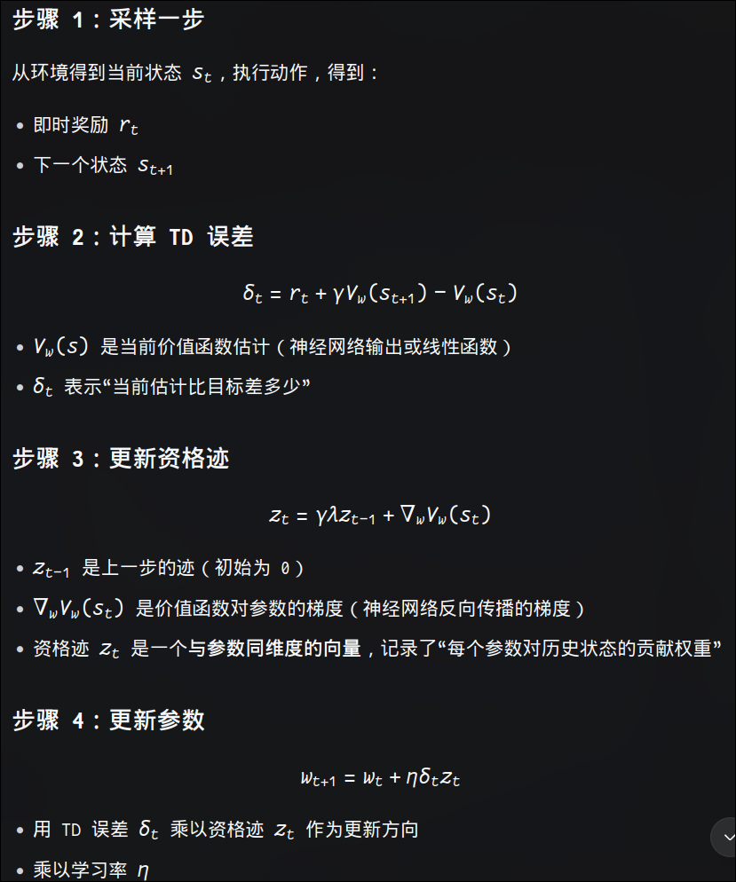
- TD(0)是标准TD估计, TD(1)是蒙特卡罗估计
- on-policy (同策略): 正在被优化的策略 = 生成采样数据的策略
- 同策略的算法有 SARRA, ppo等
- 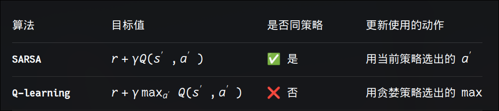
- SARSA的算法流程: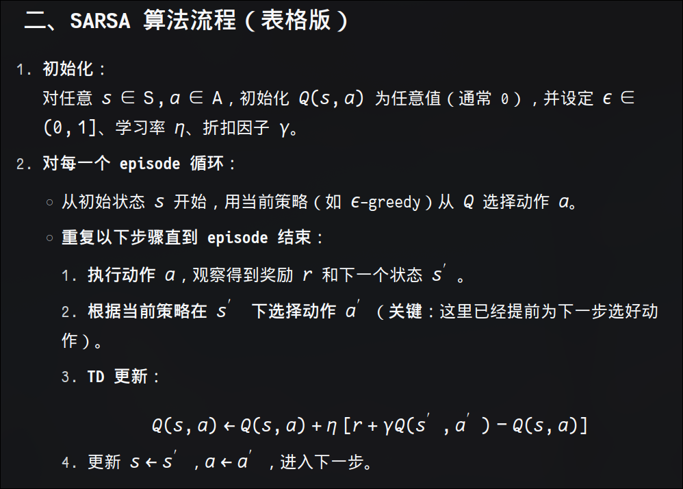:
  - 其中采样时利用现在的策略选择a到达s',更新时利用现在的策略π选择a', 所以是同策略的. 
  - 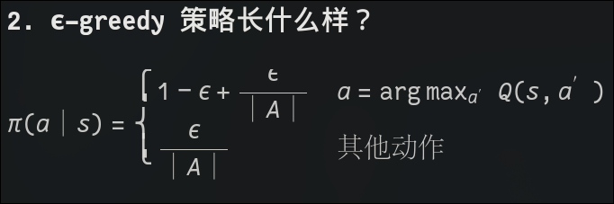, 你会想: ϵ-greedy不是没变吗,哪来的策略改进呢?策略选取的概略没变,但是策略选取的动作变了,所以策略变化了,策略改进已经隐含在这个随机策略里.
  - 这里的TD更新没有一次性求出当前Q(s,a)的收敛值, 而是更新一次后去求了Q(s',a'),但多次episode后,所有的Q(s,a)都会收敛
- SARSA的名字由来是(s,a,r,s',a')
- 还有sarsa(λ) TODO:todo
- __表格Q-learning算法__ 采样时使用的策略一般是ϵ-greedy策略, 更新时采用的是greedy策略(max_a'), 算法流程: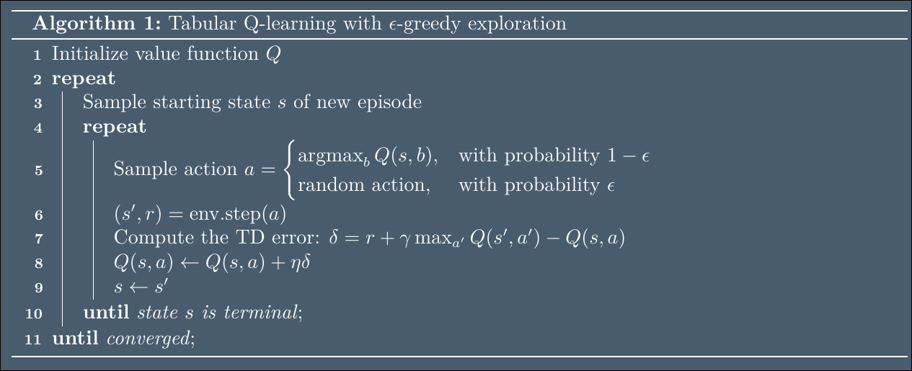
- 对于终止状态，s ∈ S + ，我们知道 Q(s, a) = 0 对所有动作 a 均成立。因此，对于最优价值函数，
我们有 V ∗(s) = maxa′ Q∗ (s, a) = 0 对所有终止状态成立。在进行在线学习时，我们通常不知道哪些状
态是终止状态。因此我们假设，每次在环境中采取一步时，我们都会获得下一个状态 s′ 和奖励 r，同
时还得到一个二元指示符 done(s′ )，用于告诉我们 s′ 是否为终止状态。在这种情况下，我们在 Q 学习
中将目标值设为 V ∗ (s′ ) = 0，从而得到修改后的更新规则：  $Q(s, a) \leftarrow Q(s, a) + \eta \left[ r + (1 - \text{done}(s')) \gamma \max_{a'} Q(s', a') - Q(s, a) \right]$, 
为简洁起见，我们在后续方程中通常会忽略这个因子，但在代码中必须加以实现。
- __函数近似的Q-learning算法__:
  - 为了防止单个损失函数梯度噪声过大,对随机抽取的多个采样元组的损失函数求平均(并且这些多个元组也是随机选的,因为用如果连续采样的元组会高度相关,导致nn过拟合)
  - 采样元组的损失函数公式: $\mathcal{L}(w|s, a, r, s') = \left( (r + \gamma \max_{a'} Q_w(s', a')) - Q_w(s, a) \right)^2$
  - 函数近似的Q-learning算法伪代码: 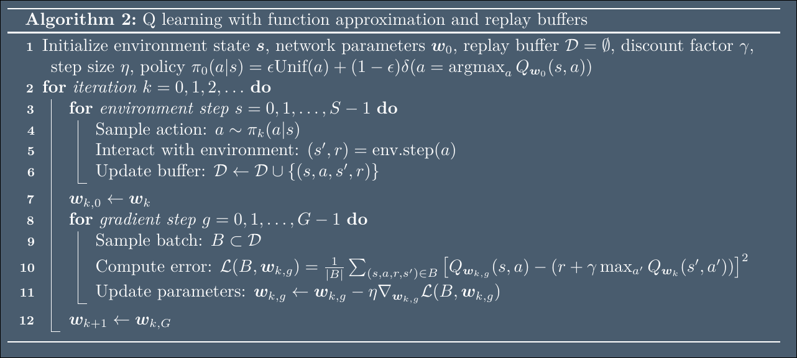
- 矩阵A的列空间: Ax=b, 所有b的集合/A的所有列向量线性组合的所有结果组成空间/A的列张成的子空间, 维度就是A的秩
- 矩阵A的零空间: Ax=0,所有的x组成的空间/经过变换A消失的向量空间, 维度=n-rank(A)
- DQN(用神经网络做函数近似的Q-learning算法)的设计
  - experience replay : 把采样的数据放到experience replay buffer
    - 优先经验回放prioritized experience replay: 一种反向传播的思想：当某个状态的价值发生变化时，所有能导致这个状态的前驱状态的价值也可能需要更新。
  - Q网络+目标网络
- the deadly triad(致命三元组): 一般来说，当强化学习算法同时具备以下三个要素时，可能会变得不稳定：函数逼近（例如神经
网络），自举价值函数估计（即使用类似 TD 的方法而非蒙特卡洛方法），以及异策略学习（其中动作是从与正在优化的策略不同的分布中采样的）
- 极大化偏差(maximization bias): max_a'Q(s',a') 由于随机奖励(奖励是概率分布的,比如奖励是正态分布),导致采样的max值会大于真正的max值,选择了这个次优的a',解决办法是double Q-learning
- double DQN(double q-learning与dqn的结合): $target = r + \gamma Q_{\bar{\omega}}(s', \arg\max_{a'} Q_{\omega}(s', a'))$
- clipped double DQN(两个q-net取最小值): $target = r + \gamma min_{i=1,2}Q_{\bar{\omega_i}}(s', \arg\max_{a'} Q_{\omega_i}(s', a'))$
- 多步DQN
- ensemble 集成
- 随机集成dqn(randomized ensembled dqn) :从 N 个 Q 网络中随机抽取 M 个，取它们估计的最小值作为目标估计值，以降低过估计偏差和方差: 
$target = r + \gamma max_{a'} min_{i \in M}Q_{\bar{\omega_i}}(s', a')$
- 凡是带有 argmax_a′ 或 max_a′这些只能枚举的目标值公式，都只能用于离散动作空间（或动作空间极小的特殊情况） 
- 所以DQN要想解决连续动作空间问题,需要解决argmax的求解问题 TODO:后面会讲
- q-net学习的是当前状态的所有动作, 以至于要得到需要用的Q(s,a)需要用gather函数到索引需要的动作: `q = self.q_net(s).gather(1, a).squeeze()`, 这样准确估计所有的价值很难,训练效率低,容易受噪声影响,其实大部分时候同一状态的不同动作的q值很接近,可以让q-net分头学习,输出头学习基础状态值, 优势头学习差异值,再相加,这就是 __Dueling DQN算法__:
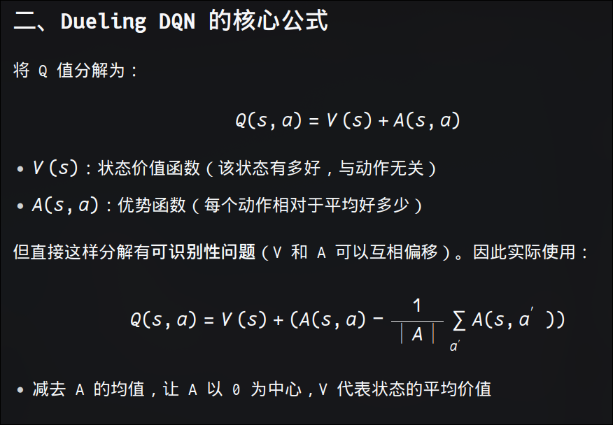
- HER 同时用多种目标（包括真实目标和伪目标）训练同一个策略，让智能体学会“如何向任意目标移动”的通用能力，从而最终能够到达真实目标。

# 基于策略的强化学习
#### 策略梯度方法
- 高斯输出层: 策略网络输出一个高斯分布(正态分布),而不是输出一个固定的动作. 只有训练阶段才输出分布（高斯 / 类别分布）用于探索；推理 / 部署阶段，直接取分布的均值作为控制指令。
- 从 Q(s, a) 估计动作价值函数从中推导出策略的缺点:
  - 难以应用于连续动作空间
  - 致命三元组问题:使用函数近似,自举,异策略,容易发散
  - 学习的是确定性策略,在随机/部分可观测环境中随机性策略证明是更优的
- 策略梯度方法policy gradient直接优化策略的参数, 以最大化期望回报, 参数化策略将表示为 πθ (a|s)，
- 似然比估计: 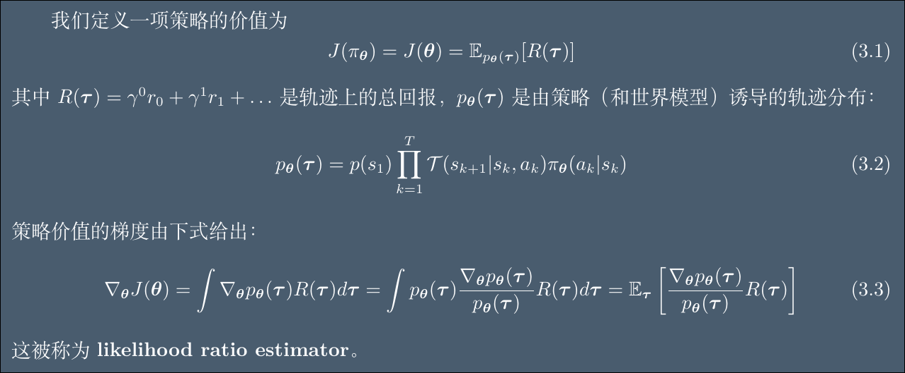
- 为什么要化成对数呢: 把轨迹的连乘换成轨迹的连加
- 参数化策略价值的梯度计算公式: $\nabla_\theta J(\theta) = \mathbb{E}_\tau \left[ \left( \sum_{k=1}^T \nabla_\theta \log \pi_\theta(a_k | s_k) \right) R(\tau) \right]$, 其中的期望可以通过mc采样估计, τ就是一条轨迹
- 在统计学中，∇θlogπθ(a|s) 这一项被称为（Fisher）得分函数(fisher score function)
- 奖励函数中折扣因子γ的作用: 调节智能体的远视与近视程度,保证收敛
- 任何概率分布的导数期望为零,任何概率分布的对数的导数的期望为零
- 从$\nabla_\theta J(\theta) = \mathbb{E}_\tau \left[ \left( \sum_{k=1}^T \nabla_\theta \log \pi_\theta(a_k | s_k) \right) R(\tau) \right]$到
$\nabla J(\theta) = \mathbb{E}_\tau \left[ \sum_{k=1}^T \gamma^{k-1} Q_\theta(s_k, a_k) \nabla_\theta \log \pi_\theta(a_k | s_k) \right]$
这样推导转变的目的是什么: 
减小策略梯度的方差, 第一个公式是两个和的乘,每个动作的梯度乘以从第一状态开始到结束的奖励,第二个公式是多个乘的和,每个动作的梯度乘以从当前状态开始到结束的奖励,第二个公式的方差小,符合当前动作只影响现在和未来不影响过去的因果关系, 实际上更有效的方式是引入基线和优势函数,就像dueling dqn算法一样
- 原始形式中，R(τ) 包含了过去和未来的所有奖励。但：
    动作 ak不能影响过去的奖励
    乘上过去奖励只会增加噪声，不会改变期望
改进形式只保留从当前步开始的未来奖励，消除了与过去奖励相关的方差。
- REINFORCE算法(策略价值梯度估计和sgd)的伪代码: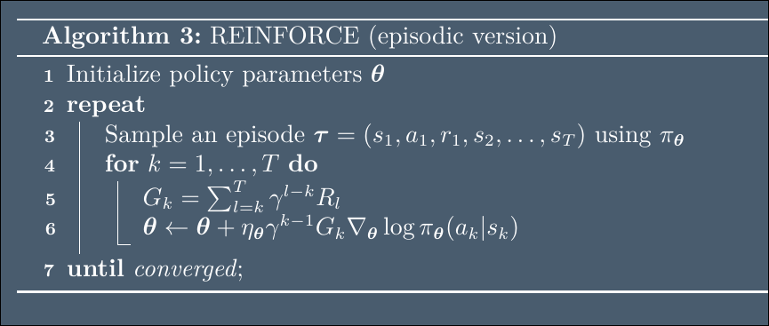,w为什么是回合式呢,因为reinforce算法只适合有终止状态的回合式空间
- 带基准的REINFORCE算法的伪代码: 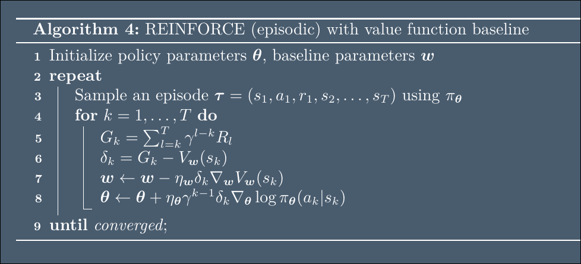
- 把轨迹的期望换成第k步状态的分布概率乘以策略该状态选取动作的分布概率再乘进去: [策略梯度函数从轨迹的期望转换成对状态-动作的期望的推导](./策略梯度定理推导.md)
- 提出折现状态访问分布 ρμ(s) 的核心目的是：将策略性能 J(θ) 的梯度，从依赖“完整轨迹回报”的形式，转化为只依赖“当前状态-动作的 Q 函数梯度”的形式
- 策略梯度公式由对轨迹求期望转换成对状态-动作求期望有什么用呢

| 形式 | 依赖 | 更新时机 | 方差 |
|------|------|----------|------|
| 轨迹期望形式 | 完整轨迹的回报 \(R(\tau)\) | 回合结束后 | 高 |
| 状态-动作期望形式(现代策略梯度算法的基础) | 当前步的 \(Q(s,a)\) | 每步都可更新 | 低 |
#### a2c
- 双网络的优势演员评论家算法advanced actor critor(a2c)伪代码: 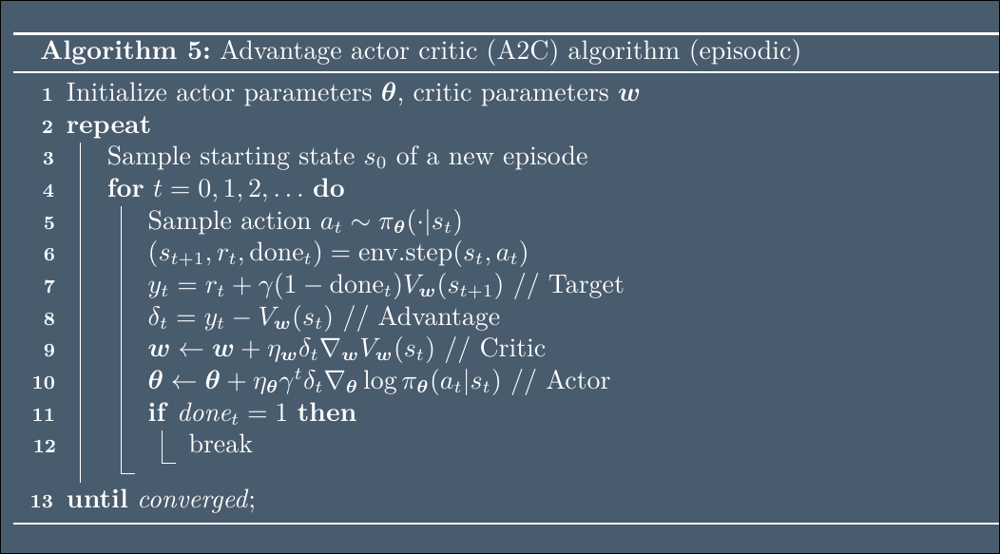, 
这里的ω就是为了计算引入的baseline,能在线更新,采样就是因为前面的状态动作期望的策略梯度算法
- a2c是同策略
- 训练阶段：最大化熵,策略输出高斯分布 N(μ(s),σ(s))，按分布采样动作;
  保存权重后得到部署模型;
  部署阶段：加载相同权重，最小化熵,仅输出分布均值 μ(s)，舍弃采样与方差，实现确定性控制.
- Q(s, a) − V (s) = A(s, a), A为优势函数。
- 在策略强化学习中，熵用于度量策略 πθ(a|s) 的不确定性与随机程度. 熵越高，策略在状态 s 下的动作分布越均匀，探索性越强；熵越低，策略越趋于确定性，动作选择越集中。
- 可以把a2c算法看作是同策略直接更新策略参数版本的dqn算法
- 批量更新方式的单网络的a2c算法用到了损失函数(包含TD误差,策略梯度,策略的熵), 用这一个损失函数更新所有的参数: [单网络的a2c算法的损失函数讲解](./单网络的a2c算法的损失函数讲解.md)
- n步优势公式迭代计算公式: 
  δt = rt + γvt+1 − vt ,
  At = δt + γλδt+1 + · · · + (γλ)T −(t+1) δT −1 = δt + γλAt+1
- 这里 λ ∈ [0, 1] 是一个控制偏差-方差权衡的参数：较大的值会减小偏差但增加方差. 这种迭代估计优势函数大小的方式被称为广义优势估计generalized advantage estimation(GAE)
-  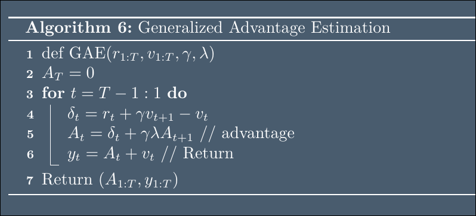, 这里的yt就是采样的回报值Gt的估计值
- 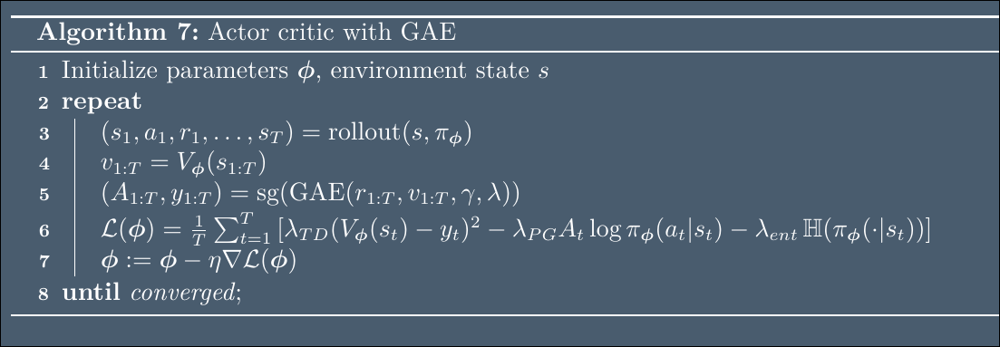

- 底盘运动学解算,六轴机械臂逆运动学解算, 低通滤波器, rgb图深度图, 相机视觉模型,为全机身运动控制创建独立 PID 控制器：
    驱动轮电机 PID（4 轴）
    转向轮 PID（4 轴）
    机械臂 PID（6 轴）
    灵巧手 PID（16 轴）

- 轨迹期望和单步期望, 单步和多次单步采样, 是不一样的 
$
\boldsymbol{e} = \text{angle_axis}\big(\boldsymbol{T}_e(\boldsymbol{q}),\,\boldsymbol{T}_{ep}\big) \quad \boldsymbol{e} \in \mathbb{R}^6$

$$\Sigma_i=
\begin{cases}
-\dfrac{(q_i-q_{min,i}-\pi_i)^2}{(p_s-\pi_i)^2} & q_i\to q_{min,i}\\[4pt]
+\dfrac{(q_{max,i}-q_i-\pi_i)^2}{(p_s-\pi_i)^2} & q_i\to q_{max,i}
\end{cases}$$

- 双-时间尺度-演员-评论员算法: 通过增大critic网络的学习率,或者增大critic网络的每步更新次数
- pθ(y|x): 在给定x和参数θ下,y的以θ为参数的概率分布
- 商法则: ∇(f/g)=(g∇f−f∇g)/g^2
- sgd随机梯度下降更新其实是等价于最小化欧氏距离约束; 引入ngd自然梯度下降,等价于最小化kl散度约束
- 自然梯度 = F−1× 普通梯度
- 自然梯度不仅给每个参数分配不同步长，更重要的是通过 Fisher 矩阵的逆旋转梯度方向，使更新在概率分布的流形上指向真正的“最陡”方向——这是普通梯度和对角预条件做不到的。
- 折现状态访问分布: 在所有时间步上,状态s的访问概率的折现之和 的分布
- a=μθ(s)是确定性策略, a~πθ(s)是随机策略
- 随机策略梯度定理: $\nabla_\theta J(\theta) = \mathbb{E}_{\rho_\gamma^\pi(s) \pi_\theta(a|s)} \left[ Q^{\pi_\theta}(s, a) \nabla_\theta \log \pi_\theta(a|s) \right]$
- (dpg)确定策略梯度定理: $\nabla_\theta J(\mu_\theta) = \mathbb{E}_{\rho_{\mu_\theta}(s)} \left[ \nabla_\theta Q_{\mu_\theta}(s, \mu_\theta(s)) \right] = \mathbb{E}_{\rho_{\mu_\theta}(s)} \left[ \nabla_\theta \mu_\theta(s) \nabla_a Q_{\mu_\theta}(s, a) |_{a=\mu_\theta(s)} \right]$
- 确定性策略训练时采样的数据要用随机策略来采集, 更新策略参数时的动作是确定策略给出的,所以确定性策略梯度算法是异策略的
-  DDPG 本质上就是 DQN 在连续动作空间的扩展。两者共享核心机制：经验回放、目标网络、TD 学习。唯一的本质区别是：DQN 处理离散动作（用 max 选动作），DDPG 处理连续动作（用 Actor 网络 μθ(s) 输出动作）。
- 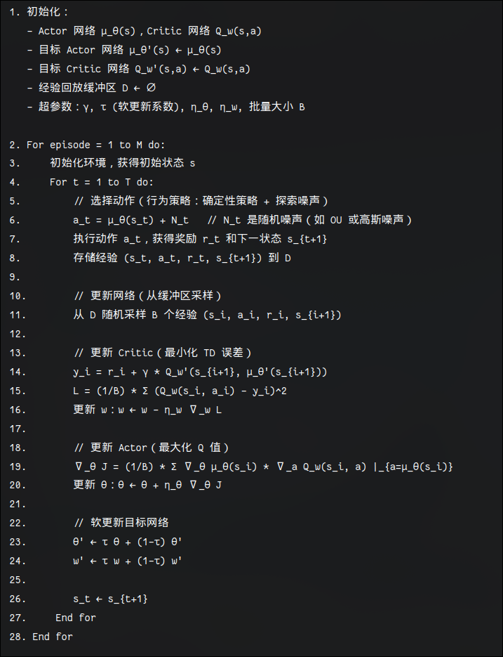
- TD3(twin delay deep deterministic policy gradient孪生延迟dpg): 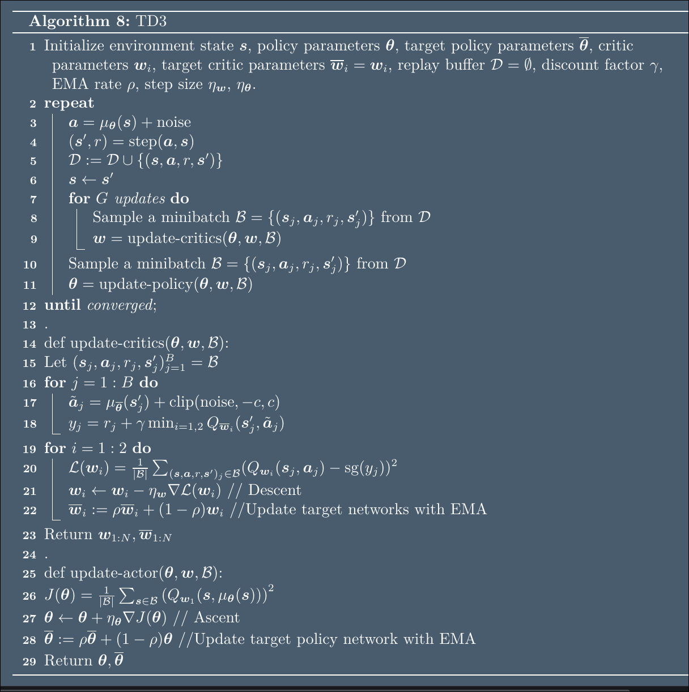
- Wasserstein Policy Optimization 的核心目标是：让随机策略也能利用 ∇aQ 的方向信息，从而获得 DPG 的低方差优势，同时保留随机策略的探索能力。
- 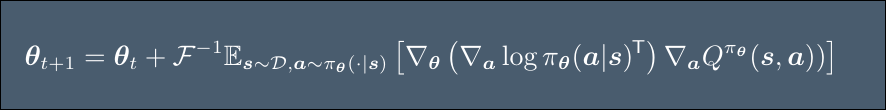
- 随机策略梯度只用到了Q的大小,确定策略梯度用到了Q的方向
#### 策略改进方法(policy improvement)
- 策略梯度方法不能每一步都保证提升策略性能, 由于梯度估计有噪声方差高,学习率(步长η难调容易越过最优解)的缘故.策略改进方法利用下界保证每一步性能即使不上升,下降也有界,不会暴跌
- 下界: L(π,πk)−惩罚项, J(π)−J(πk)>下界, 下界详细公式: 
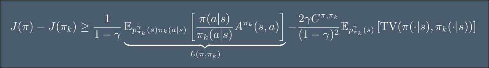
$J(\pi) - J(\pi_k) \geq \underbrace{\frac{1}{1-\gamma} \mathbb{E}_{p_{\pi_k}^\gamma(s) \pi_k(a|s)} \left[ \frac{\pi(a|s)}{\pi_k(a|s)} A^{\pi_k}(s, a) \right]}_{L(\pi, \pi_k)} - \frac{2\gamma C^{\pi, \pi_k}}{(1-\gamma)^2} \mathbb{E}_{p_{\pi_k}^\gamma(s)} \left[ \mathrm{TV}(\pi(\cdot|s), \pi_k(\cdot|s)) \right]$
- 优化下界就是找到一个策略π让下界最大, 带信任域约束的下界优化公式: 
$\pi_{k+1} = \operatorname*{argmax}_{\pi} L(\pi, \pi_k) \quad \text{s.t.} \quad \mathbb{E}_{p_{\pi_k}^\gamma(s)} \left[ \text{TV}(\pi, \pi_k)(s) \right] \leq \epsilon$
- trust region policy optimization算法伪代码: 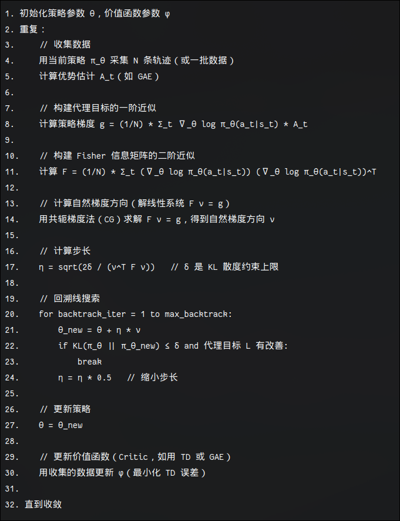, 把TV换成KL散度
- TRPO = 自然梯度方向 + 共轭梯度法求解 + 回溯线搜索保证 KL 约束，是信任域策略优化的经典实现。PPO 是其简化版，用 clipping 替代显式约束，更易实现和调参。
- proximal 最接近的,邻近的
