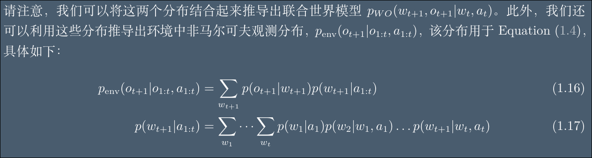
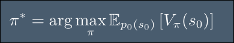
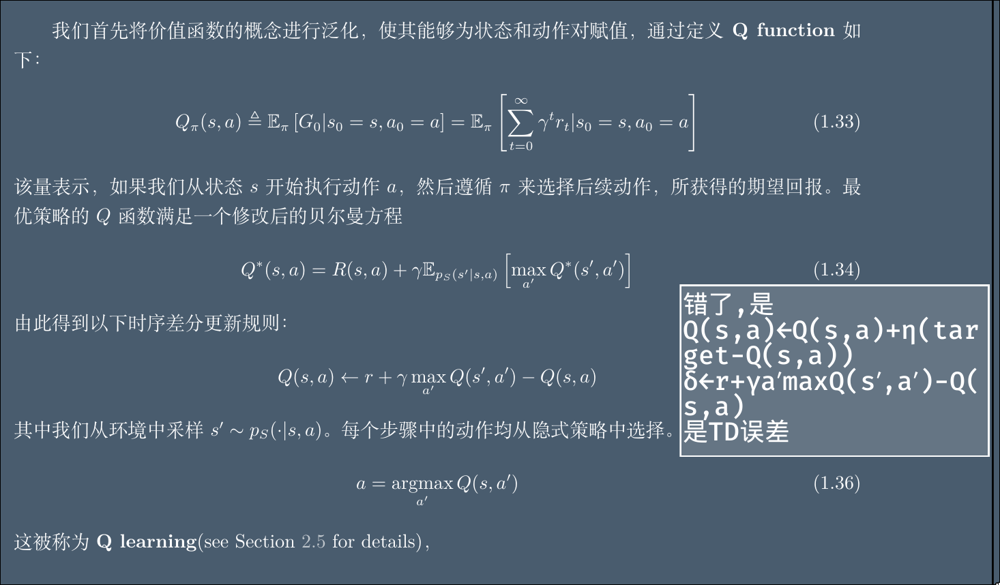
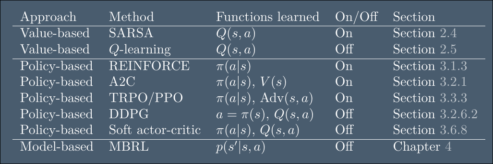

# introduction
- Reinforcement learning 或 RL 是一类用于解决各种顺序决策任务的方法.

| x | 顺序决策 | 非顺序决策 |
| --------------- | --------------- | --------------- |
| 决策间关系 | 当前决策影响未来决策 | 决策间相互独立|
| 是否考虑未来 | 考虑长期后果 | 只看当前收益 |
| 典型问题 | 下棋,机器人控制,对话 | 分类,推荐,赌博机 |

- pomdp: 通常假设环境也是一个马尔可夫过程，具有内部世界状态 w_t ，观测值 o_t 由此产生。（这称为部分可观测马尔可夫决策过程）.在 POMDP 中，智能体不知道真实状态 w_t，只知道观测 o_t 和信念 z_t
- mdp: 如果假设观测值o_t 完全揭示了隐藏的环境状态,在这种情况下，我们将智能体的内部状态和环境的外部状态用同一个符号表示，即 $s_t = o_t = w_t = z_t$ 。 （这称为马尔可夫决策过程)
- 用 POMDP 来精确描述现实世界的复杂性，但为了设计可行的算法，我们往往在数学上简化为 MDP

- 策略$pi$是随机策略, 比如(在 状态s0 时，以 60% 概率选 a0，40% 概率选 a1), 没有规定死s0必须选a0到达s1
- 环境的回报也是随机的, 比如(环境：执行 a0 后，50% 概率到 s1，50% 概率留在 s0)
- 这样的话一个随机策略$pi$,一个随机的环境,  从s0出发走的路经p(a0,s1,a1,…,aT,sT|s0,π)也是随机的,是很多条不同的路径,每条路径都有不同的奖励之和,这些奖励之和乘上路径的概率,结果就是当前(s0,$pi$)的奖励,最大化这个奖励的$pi$就是最佳策略$pi^*$
- 轨迹概率公式p(a0,s1,a1,…,aT,sT|s0,π):
$$
\begin{aligned}
p(a_0, s_1, a_1, \ldots, a_T, s_T \mid s_0, \pi) 
&= \pi(a_0 \mid s_0) \, p_{\text{env}}(o_1 \mid a_0) \, \delta\bigl(s_1 = U(s_0, a_0, o_1)\bigr) \\
&\quad \times \pi(a_1 \mid s_1) \, p_{\text{env}}(o_2 \mid a_1, o_1) \, \delta\bigl(s_2 = U(s_1, a_1, o_2)\bigr) \\
&\quad \times \pi(a_2 \mid s_2) \, p_{\text{env}}(o_3 \mid a_{1:2}, o_{1:2}) \, \delta\bigl(s_3 = U(s_2, a_2, o_3)\bigr) \cdots
\end{aligned}
$$
- $\delta( s_1 = U(s_0, a_0, o_1))$, 狄拉克函数,相等为1,不等为0
- 这里的$s_t$=智能体内部的信念状态$z_t$, st 是智能体用来做决策的状态。在 MDP 下它就是环境隐藏状态wt；在 POMDP 下它就是智能体的内部信念状态 zt。
- 智能体的内部信念状态$z_t$是个概率分布,是在过去的观测和动作下,对当前世界的内部隐藏状态w_t的信任程度: “给定我所有看到和做过的，我认为 wt 等于某个具体 w 的可能性有多大。”
- 传统 MDP 中状态转移概率 $$p(s_1 \mid s_0,a_0)$$，在这个公式里被等价替换为观测生成概率+ 状态更新函数 U + δ 筛选：
$p(s_1 \mid s_0,a_0) = \sum_{o_1} p_{\text{env}}(o_1 \mid a_0) \cdot \delta\bigl(s_1 = U(s_0,a_0,o_1)\bigr)$, 这个$o_1$一定是那个能让智能体获得信念状态$s_1$的观测
- 那观测生成概率$p_{\text{env}}(o_{t+1} \mid a_{0:t}, o_{0:t})$ 怎么计算呢:
- 最佳策略也会导致任务失败,在某次任务中也不一定是最佳的,但是它是做无数次任务中最佳的
- wrt(with respect to )是关于,相对于
- utility 效用,实用的
- , p(s0)是初始状态分布,求不同初始状态下的期望奖励的期望, 和大部分书中的公式不同点
- episode 插画,一段,片段
- absorb 吸收
- finite 有限
- 剩余回报(reward to go):  $(G_t \triangleq r_t + \gamma r_{t+1} + \gamma^2 r_{t+2} + \cdots + \gamma^{T-t+1} r_{T-1})$
- Gt也是随机的,因此期望奖励=剩余回报的期望: $(V_\pi(s_t) = \mathbb{E}[G_t \mid \pi])$, __价值函数__ 的定义公式
- 折扣因子$\gamma$
- myopic 短视,近视
- 策略参数$\theta$ 是策略$pi$的参数（策略$pi$由$\theta$参数化）—— 比如神经网络的权重、线性模型的系数
- [rl通用模型](./rl_通用模型.md)
- perceptual aliasing 感知混淆
- 通常需要处理三个相互作用的随机过程：
  1. 环境的状态 wt （通常受智能体动作的影响）
  2. 智能体的内部状态 zt（反映其基于观测数据对环境的信念,因此叫做信念状态）
  3. 以及智能体的策略参数 θt（根据信念状态中存储的信息和外部观测进行更新）。

####  partially observable Markov decision process 或 POMDP(部分可观测马尔可夫决策过程)
- 随机转移函数是一个“概率规则”：它告诉你从当前状态 w 执行动作 a 后，下一个状态 w′ 的概率分布是什么,在连续状态空间中就是个概率密度函数
-   $w_{t+1} \sim M(w_t, a_t)$ ,这里的M 就是环境的动力学模型，也就是随机转移函数。
- 动态规划是一种通过把原问题分解为子问题，并利用子问题的最优解来构建原问题最优解的方法。
- 动态规划DP的本质是迭代求解子问题最优解，最终拼接出原问题最优解
在 MDP 中，动态规划利用贝尔曼方程的递归结构，通过迭代计算价值函数，最终得到最优策略
- z_t,w_t,o_t只是在pomdp中, 在mdp中等于s_t
- 环境和智能体的不同模型:
  - 目标导向的马尔可夫决策过程goal-conditional mdp: R(s,a|g)=I(s=g),只有完成目标才能获得奖励1,其他所有步都为0, 稀疏奖励的典型
  - 上下文马尔可夫决策过程contextual mdp: 每个回合游戏中上下文 c 决定了“环境的规则”——它改变了状态转移的概率和奖励的大小，但一旦给定，在回合内就不变。
  - 上下文老虎机contextual bandit, 上下文老虎机中智能体的动作 at 和过去状态 wt−1 无法影响下一个状态 wt；但在上下文 MDP 中，动作会影响状态转移。
  - 信念状态mpd: 信念状态mdp,通过b_t代替了不确定性z_t,w_t,o_t, 把pomdp转换成了可计算的mdp问题,但是又保留了podmdp的精髓信念状态, 环境是pomdp的,但是智能体的决策被建模到信念空间的mdp环境中, b_t就相当于mdp的s_t, 使用贝叶斯推理来计算信念状态，bt = p(wt|ht) 
- 当 __环境模型未知(R(s,a)和p(s'|s,a)未知)__ 时如何计算最优策略的方法,这正是强化学习所解决的核心问题。我们主要关注马尔可夫决策过程（MDP）情形
- $\textcolor{green}{on-policy}$: 只能用当前正在优化的策略与环境交互产生的数据跟新策略,数据只能用一次
- $\textcolor{green}{off-policy}$: 可以用旧策略的数据,人类示范数据等等更新策略, 数据可以重复使用
- 策略收敛: 策略不再改变
- 传统动态规划（DP）要求：
状态空间有限且小;已知完整模型（转移概率、奖励）;可以精确计算价值函数.当状态空间大或连续时，无法精确计算价值函数时，就用 函数近似 来估计价值函数，这就是 ADP。
#### value-based rl 基于价值的强化学习,也称ADP(approximate dynamic programming 近似动态规划)
- 最优策略的价值函数满足以下递归条件, 这个递归条件被称为贝尔曼最优方程: $V^*(s) = \max_a [R(s, a) + \gamma \mathbb{E}_{p(s' | s, a)} \left[ V^*(s') \right]]$, 
在当前状态 s 选择动作 a获得的即时奖励 R(s,a)+折现后的未来价值期望的和的最大值。
- 对于固定策略$\pi$,$贝尔曼方程 V^(s) = R(s, a) + \gamma \mathbb{E}_{p(s' | s, a)} \left[ V^*(s') \right]$,但是不知道p{s'|s,a}, 也不能枚举出全部的s',所以可以用蒙特卡洛思想(用单个样本采样代替均值, 这里就体现了adp)和梯度下降, 求出该固定策略下的价值:$V_\pi(s) \leftarrow V_\pi(s) + \eta(r+ \gamma V_\pi(s') - V_\pi(s))$, 该求解固定策略的价值函数的方法也被称为$\textcolor{orange}{时序差分学习方法(Temproal Difference)(TD学习)}$
- 策略: 在每个状态选择最优的动作, 所以能获得(状态,动作)表就是找到了策略, 策略不是一个顺序执行的规则
- 已知价值函数,如何推导出策略:
  之前是状态价值函数V(s), 现在引入状态动作价值函数Q(s,a), 他们之间的关系是:  $V^∗(s′) = \max_{a′} Q^∗ (s′,a′)$, 

, 但是仅能用于动作空间较小的离散空间,对于连续空间,或者较大的需要用其他方法,因为q-learning本质上在"当前状态 s用策略选择动作a = argmax_a Q(s, a) "时,用的是枚举遍历
- $E_a B$ 就是 $\sum_a a*B$
- s,a->s', 有0.2的概率获得r1, 有0.8的概率获得r2
#### policy-based rl 基于策略的强化学习(policy search/policy gradient方法)
- 
- policy-based 相对于adp, 可证明可收敛到局部最优,不用遍历计算argmax,天然支持连续动作空间,可微性天然支持dl, 但是- policy-based 相对于adp, 可证明可收敛到局部最优,不用遍历计算argmax,天然支持连续动作空间,可微性天然支持dl, 但是策略梯度方差大,训练不稳定
#### model-based rl 基于模型的强化学习
- adp = dp + 采样近似 + 函数近似
- value-based rl使用了近似采样+神经网络函数近似, model-based rl首先学习到mdp的p和r,在学习到的模型上使用apd(神经网络函数近似)
- model-based rl的目的是解决value-based rl和policy-based rl的sample inefficient问题
#### pomdp难以计算(包括信念状态pomdp,psr等都难以计算)的解决方案
- 使用形如 a_t=π(h_t)的策略，其中 h_t=(a1,o1,…,at−1,ot) 是完整的观测和动作历史，加上当前观测。由于对于长期运行的智能体而言，依赖完整历史是不可行的，因此发展出了各种近似求解方法,如信念状态、RNN、记忆

- mdp, pomdp都是环境模型,value/policy/model-based 都是求解mdp/pomdp环境模型中最佳策略的算法种类,里面的算法比如a2c,ppo等等,都利用了马尔可夫性质,并且为了解决难以计算求解的问题,用了采样近似,函数近似, 神经网络泛化,rnn/栈堆叠压缩历史等方法
#### exploration-exploition tradeoff 探索-利用权衡
- $\epsilon-greedy$策略,次优, 有$\epsilon$的概率选择随机探索
- $\epsilon z-greedy$ (动作,该动作持续时间步)
- boltzmann exploration 玻尔兹曼探索策略, 类似与softmax操作, 更高奖励的动作有更高的选择概率
- intrinisc reward 内部奖励
- π(a∣s) 表示在状态 s 下选择动作 a 的概率。
#### 奖励函数
- reward hypothesis 奖励假说: 我们所需要的人和目标,都可视为期望奖励的最大值
- 通常, 奖励是非markov的
- sparse reward 稀疏奖励问题
- potential 潜在的
- s0=s : 初始状态时s
