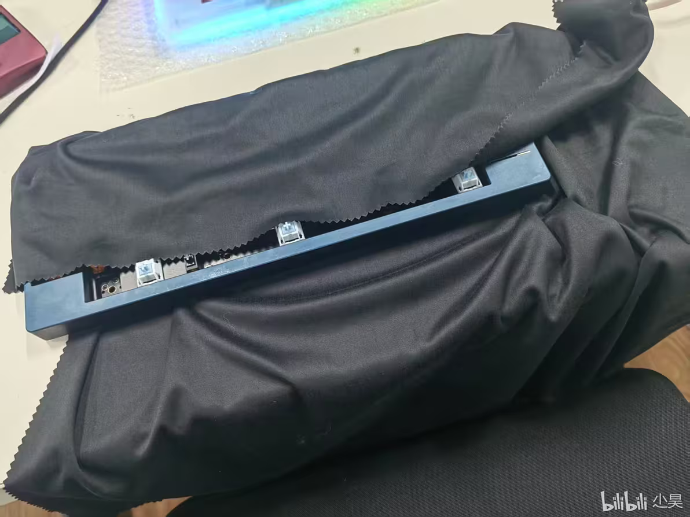
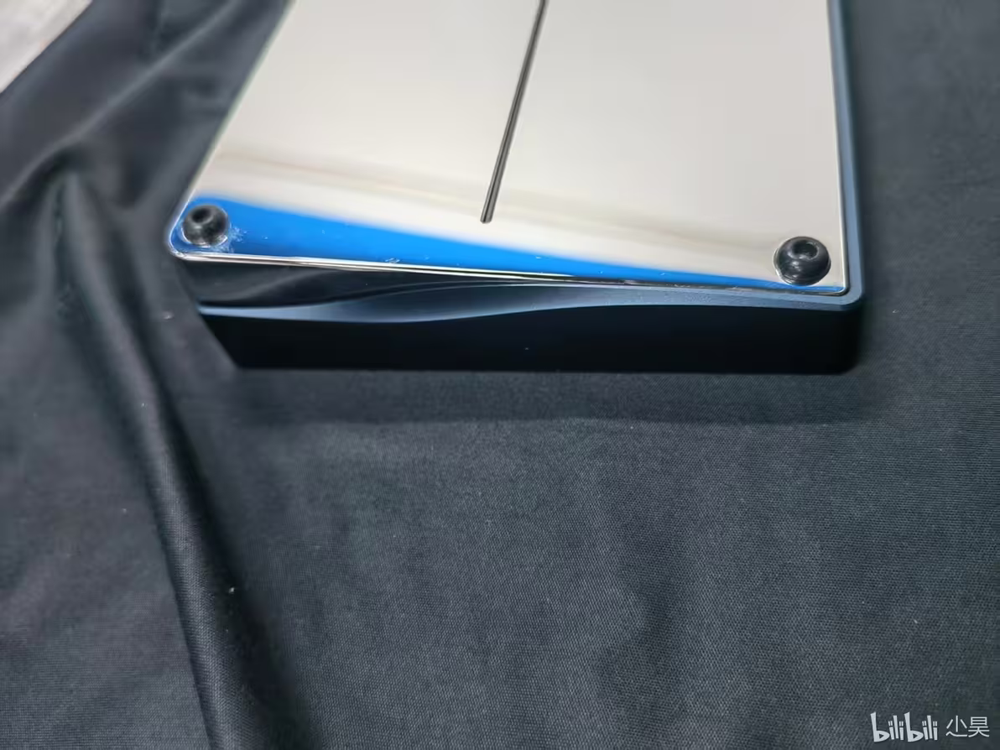
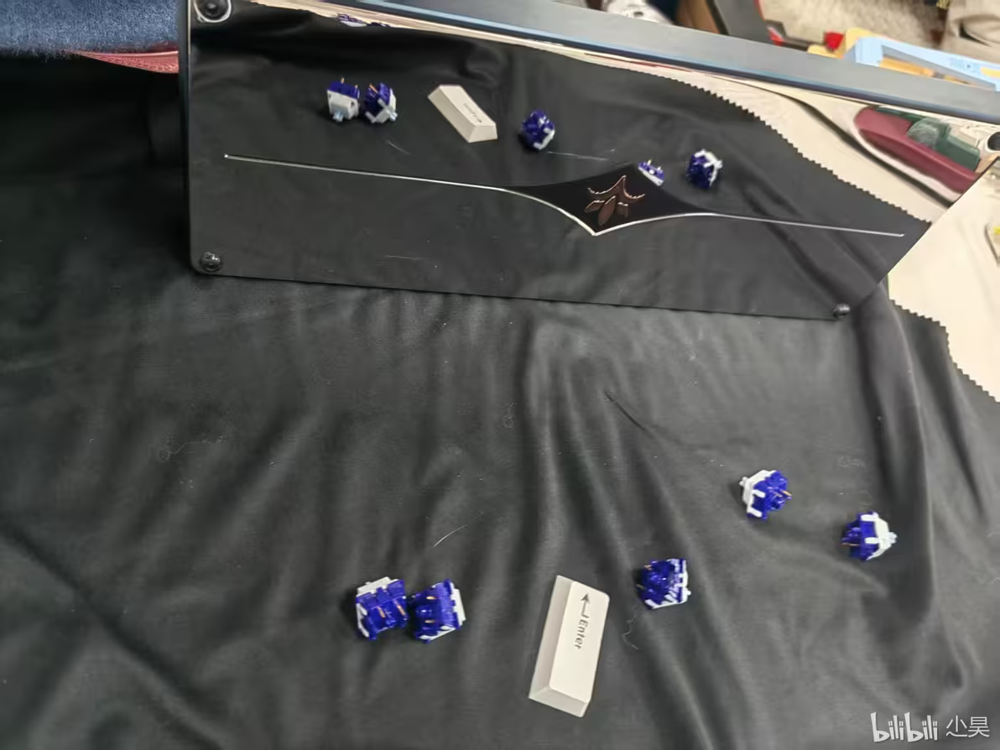
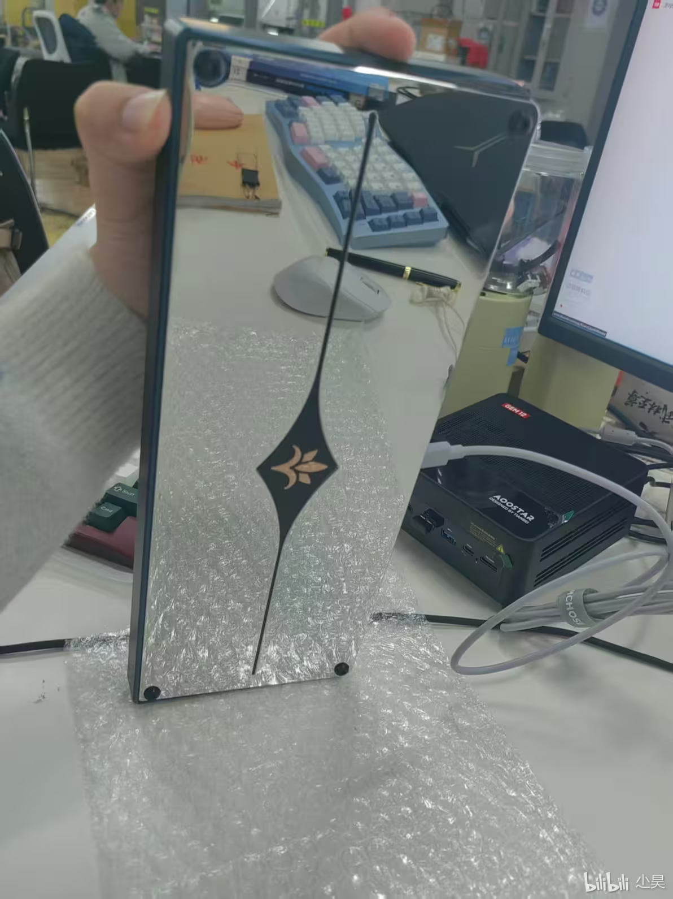
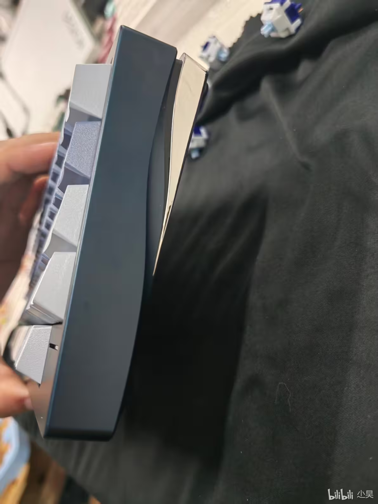
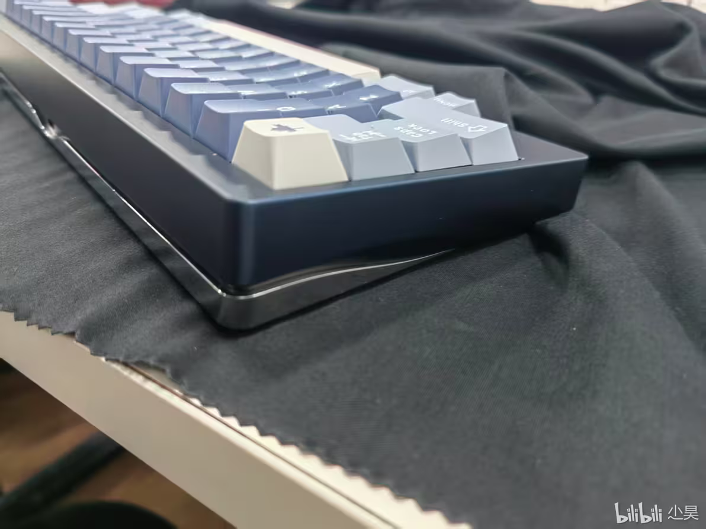
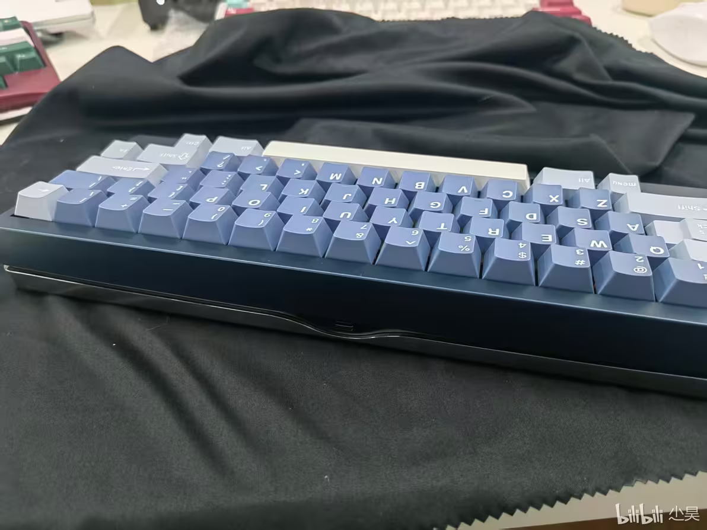

#### 没有时间悼念T600了,接下来出场的是来自大洋彼岸的lily60

22年来自大洋彼岸的设计师Gok神正式发布lily60的IC帖，惊叹于它优雅的腰线，美丽的背板，点睛的灯条；25年终于GB（gok神画图还是画的这么慢（笑）），又惊叹于它吓人的二手市场价格（炒到了4K）。
感谢蓝人，感谢闲鱼，让我体验到了25年度最优雅的lily花（相信也是很多人心目中25年度最优雅60），前人的评价已经太多太多，对gok的这把神作已经无需誉赞。可惜我没有专业的拍摄设备，手机摄像头过于落后，只能门锁直出了：
我拿到的这把是蓝灰镜面不锈钢底（但是更推荐喷砂不锈钢底，原因下图很明显了）

（一）：

（二）：
迷人的腰线啊

（三）：
可惜这把镜面不锈钢底的划痕过多，只能寻找特定角度稍稍遮瑕了

（四）：
这张图真的太掉分了，但是是唯一一个看不到划痕的角度了

（五）：

（六）： 

（七）：

