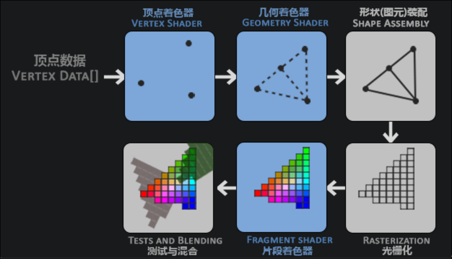
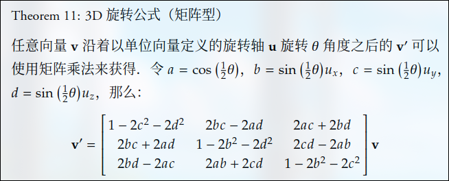

#### 进度
- 学了glad加载函数，glfw管理窗口，vbo，vao,ebo,着色器，

- 现代opengl是核心模式,废弃了立即渲染模式
- opengl就是一个巨大的状态机,各种状态变量规定了opengl接下来应该如何绘图渲染,此时的状态被称为opengl的上下文
  - 假设当我们想告诉OpenGL去画线段而不是三角形的时候，我们通过改变一些上下文变量来改变OpenGL状态，从而告诉OpenGL如何去绘图。一旦我们改变了OpenGL的状态为绘制线段，下一个绘制命令就会画出线段而不是三角形。
- opengl的对象(object),是各种状态的集合,隐藏在后台(内存)中,不能直接访问,需要用他的唯一ID来访问,所以直接创建objectId来创建对象
- compatibility 兼容性
- 由于glad.h里有是否已引入opengl头文件断言,所以写到上面,头文件引入顺序
- hint 暗示,提示
- clang-format off/on 
- major 主要的
- minor 次要的
- 引用是一种被隐藏的指针变量,指向原引用变量的地址,但是编译器会隐藏引用变量的地址
- proc 函数
- 帧缓冲里有:
  - 颜色缓冲
  - 深度缓冲
  - 模板缓冲 stencil 镂空模板
- 顶点缓冲对象vbo: 是储存在gpu显存里的数据
- 顶点数组对象vao :如何解析vbo里的数据
- 索引缓冲对象iao
- 图形渲染管线主要分为两个部分:
  - 将3D坐标转换成2D坐标
  - 将2D坐标转换成实际的有颜色的像素
- 渲染管线的不同阶段都有专门的gpu核心,运行专门的着色器程序(shader)
- 写shader的语言叫做glsl(opengl shading language)
- 指示将顶点数据渲染成什么形状的指令,叫做图元(`primitive`)
- 顶点(3D坐标和属性如颜色)
- 
  - 顶点着色器:传入顶点,将3D坐标转化成另一种3D坐标;对属性做一些处理
    - 开发者通过opengl的api在gpu创建内存来储存顶点数据,告诉gpu,顶点数据的内存布局,顶点数据如何对应顶点着色器的输入变量
  - 通过vbo管理这个内存(显存),
- 几何着色器(可选):可以产生新的顶点,形成新的或其他的图元
- 图元装配:将顶点着色器/几何着色器输出的顶点按照图元指令装配成图元
- 光栅化:将图元(3D坐标)投影为屏幕上的像素(2D坐标),生成供后续片段着色器使用的片段,片段会在进入片段着色器之前进行裁剪,裁剪掉超出视图之外的像素,提高执行效率
- 片段是渲染出一个像素所需要的所有数据
- 片段着色器:输出计算后的片段,计算一个像素的最终颜色等属性,这也是所有opengl高级效果产生的地方.片段着色器通常包含3D场景数据(光照,阴影,光的颜色等等),用来计算一个像素的最终颜色.
- alpha(透明度)测试和混合操作:对片段着色器输出的片段进行alpha测试和混合操作:检验像素的深度值,决定时候应该丢弃;检验alpha值,进行混合blending
- opengl只处理标准化设备坐标系的坐标([-1,1]),超出的不显示
- strip 线
- sizeof 是cpp的内置运算符
- std::array 的&arr[0]和arr.data()是arr的首元素地址
- gl_Position是glsl为顶点着色器保留的内置输出变量,所以不需要声明:专门用于顶点着色器输出裁剪空间坐标(齐次坐标)
- 把fn+caps大写锁定改了,右win
- win+shift+上下左右 调整大小
- std::string 加R"()" 分行字符串
- .c_str() 返回c风格字符串数组指针
- 现代cpp中,0就是0,空指针是nullptr,NULL是过时的
#### git操作
- git fetch origin main 拉取最新的origin main 但是不合并
- git reset --hard origin/main 强制用origin/main覆盖当前版本

- std::vector不能cout,但是vec.data()可以(数组的首元素的地址)
- 片段着色器的作用是计算像素的最终颜色输出
- speficial 指定
- GL_FLOAT是枚举类型,GLfloat是变量类型
- m+xx 标记,可以用'xx,来跳转,用:delmarks xx删除标记,:delmarks!删除全部
- ibo索引缓冲对象/ebo元素缓冲对象:记录opengl要绘制的顶点索引
- opengl只支持三角形图元
- integer 整数
- static_cast<int*>(0)可以,但是static_cast<int*>(1)就不可以,因为0可以是空指针nullptr也可以是int,应该用reinterpret_cast<int *>(3),适用于跟内存,指针有关的转换
- 引用不是指针,指针不能赋值给引用, 正常变量才能赋值给引用
- int &a = b;对a的任何操作本质上都是对b的操作,对a取地址就是对b取地址
- explicit 只能用于构造函数或转换函数

- 纹理texture
- wrap 包裹，包围
- 纹理环绕方式
- 纹理过滤：邻近过滤，线性过滤
- 多级渐变纹理mipmap,并过滤
- mipmap只适用于纹理缩小的情况,纹理放大直接用纹理过滤就行
- c++本来就是c的超集，完全可以混合编译，cmake甚至优先兼容c
- std 是standard标准的简称
- 断言 
  - static_assert() 编译期断言
  - assert() 运行时断言
- std::runtime_error 运行时异常,编译期压根就不会有异常
- uniform 任意着色器可以访问的全局变量,可以用`glGetUniformLocation`,`glUseProgram`,`glUniform5f`调用
  - in type in_variable_name;
  - out type out_variable_name;
  - uniform type uniform_name;
- 齐次坐标的第四个分量的作用:
  - 当 w = 1 时：表示空间中的点（比如 (1.0, 2.0, 3.0, 1.0) 对应 3D 点 (1,2,3)）；
  - 当 w = 0 时：表示方向向量（比如 (0.5, 0.0, 1.0, 0.0) 对应沿 Z 轴的方向）；
  - 当 w ≠ 0 时：需要通过透视除法（x/w, y/w, z/w）归一化，这是透视投影的核心。

#### 四元数
- 复数既可以代表一个向量,又可以代表一个矩阵(仅限于2D旋转,复数只是二维的,并且是一个正交矩阵),注意是"代表",而不是"是"
$$
a+bi = 
\begin{bmatrix}
a & -b \\
b & a
\end{bmatrix}
$$
- 复数乘相当于缩放与旋转组合的操作
$$
v' = \|z\|
\begin{bmatrix}
\cos\theta & -\sin\theta \\
\sin\theta & \cos\theta
\end{bmatrix}
v
$$
$$
v' = \|z \| (\cos\theta+i\sin\theta)v
$$
$$
v' = \|z\| e^{i\theta}v
$$
- '$$...$$' 是块级公式,单独成行,居中显示, '$...$'是行内公式
- 正交矩阵,又叫实数域中的酉矩阵, $M^T M = M M^T = I$
- 因为正交矩阵相乘满足交换律,所以$v' = z_2 z_1 v = z_1 z_2 v$, 但是普通旋转矩阵M是不满足交换律的
- perpendicular 垂直
- $v$绕单位方向向量$u$旋转角度$\theta$变成$v'$ 的$\colorbox{pink}{罗德里格斯公式}$的思路是将$v$转换成$v = v_{\parallel}+ v_{\perp}$  
$$
\boxed{
v' = \cos(\theta) v + (1-\cos(\theta))(u \cdot v)v + \sin(\theta)(u \times v)
}
$$
- 那四元数和复数有什么关系呢? 四元数有一个实部,三个虚部 $q = a + b\mathbf{i} + c\mathbf{j} + d\mathbf{k}, i^2 = j^2 = k^2 = ijk = -1$
- 还可以表示为向量形式: $q = \begin{bmatrix} a \\ b \\ c \\ d \end{bmatrix}$ 和 标量向量的的有序对形式$q = \begin{bmatrix} s, \mathbf{v} \end{bmatrix}$
- 四元数乘法不支持交换律
- 四元数乘法的$\colorbox{pink}{格拉斯曼积}$:
$$
\boxed{
对于任意的四元数q_1 = \begin{bmatrix} s, \mathbf{v} \end{bmatrix}, q_2 = \begin{bmatrix} t, \mathbf{u} \end{bmatrix},
q_1 q_2 = \begin{bmatrix} st- \mathbf{v}\cdot \mathbf{u}, s \mathbf{u}+ t \mathbf{v} + \mathbf{v} \times \mathbf{u} \end{bmatrix}
}
$$
- 可以将任意的3d向量转化为纯四元数$\begin{bmatrix} 0, \mathbf{v} \end{bmatrix}$
- 四元数的逆:$qq^{-1} = q^{-1}q = 1$
- 四元数的共轭:$\bar{q} = \begin{bmatrix} s, \mathbf{-v} \end{bmatrix}$ , $q\bar{q} = \bar{q}q = \begin{bmatrix} s^2 + \mathbf{v} \cdot \mathbf{v}, 0 \end{bmatrix}$
- $q^{-1} = \frac{\bar{q}}{\|q\|^2}$, 和复数一样
- 四元数的3D旋转公式(正交情况): 
$$
\boxed{
\begin{gathered}
一个向量\mathbf{v_{\perp}}绕正交于的旋转轴\mathbf{u}旋转\theta角度,\\那么旋转后的\mathbf{v_{\perp}'}可以用四元数乘法获取: \\
构造四元数v_{\perp}=\begin{bmatrix} 0, \mathbf{v_{\perp}} \end{bmatrix}, q = \begin{bmatrix}\cos\theta, \sin\theta\mathbf{u}\end{bmatrix}, \\
v_{\perp}'=qv_{\perp} \\
(q是个单位四元数,代表纯旋转没缩放)
\end{gathered}
}
$$
- 四元数的3D旋转公式(平行情况):
$$
\boxed{
v_{\parallel}'=v_{\parallel}
}
$$

- 四元数的3D旋转公式(一般情况):
$$
\boxed{
\begin{gathered}
一个向量\mathbf{v}绕任意单位方向旋转轴\mathbf{u}旋转\theta角度,\\那么旋转后的\mathbf{v'}可以用四元数乘法获取: \\
构造四元数v=\begin{bmatrix} 0, \mathbf{v} \end{bmatrix}, q = \begin{bmatrix}\cos\frac{\theta}{2}, \sin\frac{\theta}{2}\mathbf{u}\end{bmatrix}, \\
v'=qv\bar{q} = qvq^{-1} \\
(q是个单位四元数,代表纯旋转没缩放)
\end{gathered}
}
$$
- 这个公式等价于罗德里格斯公式: 
$$
qvq^{-1}=\cos(\theta)\mathbf{v} + (1-\cos(\theta))(\mathbf{u}\cdot \mathbf{v})\mathbf{v} + \sin(\theta)(\mathbf{u} \times \mathbf{v})
$$
- 四元数乘法对应的乘法分左乘右乘
- 左乘四元数q：
$$\mathbf{q} \otimes \mathbf{p} = \mathbf{L(q)} \cdot \mathbf{p}$$
$$\mathbf{L(q)} = \begin{bmatrix}
w & -x & -y & -z \\
x & w & -z & y \\
y & z & w & -x \\
z & -y & x & w
\end{bmatrix}$$
- 右乘四元数q:
$$\mathbf{p} \otimes \mathbf{q} = \mathbf{R(q)} \cdot \mathbf{p}$$
$$\mathbf{R(q)} = \begin{bmatrix}
w & -x & -y & -z \\
x & w & z & -y \\
y & -z & w & x \\
z & y & -x & w
\end{bmatrix}$$

- $v'=qv\bar{q} = qvq^{-1} =$ 

