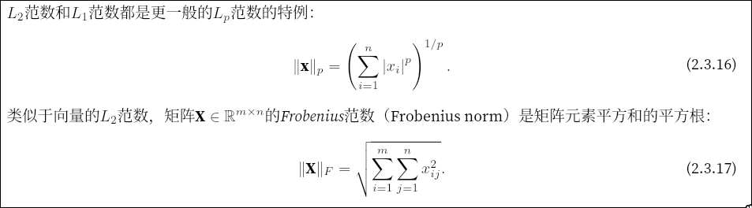
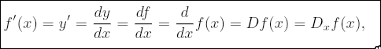
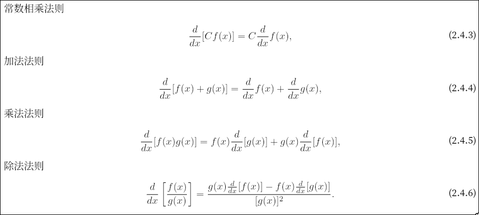
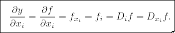

- tensor张量:任意维度的数组的统称
  - 零维张量:标量
  - 一维张量:向量
  - 二维张量:矩阵
  - 高维张量
- 指示函数:判断元素是否属于这个集合的函数,属于则返回1,不属于则返回0
- 卷积神经网络cnn:提取空间特征,网络结构数据
- 循环神经网络rnn:时间,文本等序列数据
- dl的关键组件:
  - 数据data
  - 模型model
  - 目标函数objective function,又被称为损失函数loss function
  - 调整模型参数,最小化损失函数的的优化算法algorithm(通常使用梯度下降算法gradient descent)
- 离线学习(不与环境交互):
  - 监督学习:
    - 回归
    - 分类
    - 标签
    - 搜索
    - 推荐
    - 序列
  - 无监督学习:
    - 聚类
    - 主成分分析
    - 因果关系和概率图模型
    - 生成对抗性网络

- cuda:并行计算平台和编程规范,`sudo pacman -S cuda`,安装实现了cuda规范的系统库
- cuda toolkit: 提供开发,编译cuda程序的工具库,其中提供的nvcc用于编译cuda程序
- cuDNN: cuda toolkit的一个扩展库,专门为深度神经网络
- pytorch安装的时候已经把这些依赖库附加了,会优先使用自己带的,所以只用安装pytorch就够了
- pip3 指定python3
- PyTorch 无法构建不规则多维数组
- `x = torch.tensor(标量/元组/列表等类型数组) `
- `x.dtype`:内部储存元素的数据类型
- 方差: $\sigma^2 = \frac{1}{N} \sum_{i=1}^N(x_i-\mu)^2$ 
- 标准差: $\sigma = \sqrt{\sigma^2}$
#### tensor
- tensor创建方法:

| 方法                | 描述                | 示例                  |
|---------------------|---------------------|-----------------------|
| `torch.tensor()`    | 从数据创建张量      | `torch.tensor([[1,2],[3,4]])` |
| `torch.zeros()`     | 全零张量            | `torch.zeros(3,3)`    |
| `torch.ones()`      | 全一张量            | `torch.ones(2,2)`     |
| `torch.eye()`       | 单位矩阵            | `torch.eye(3)`        |
| `torch.rand()`      | 均匀分布 [0,1)      | `torch.rand(3,3)`     |
| `torch.randn()`     | 标准正态分布        | `torch.randn(3,3)`    |
| `torch.arange()`    | 等差数列            | `torch.arange(0,10,2)`|
| `torch.linspace()`  | 线性间隔            | `torch.linspace(0,1,5)`|
| `torch.full()`      | 填充指定值          | `torch.full((3,3), 7)`|
| `torch.empty()`     | 未初始化空张量      | `torch.empty(3,3)`   |
- torch.Tensor 对象
  - .dtype: 元素数据类型 (float32, int64, etc.)
  - .shape: 张量形状 (torch.Size)
  - .device: 存储设备 (CPU/GPU)
  - .layout: 内存布局 (strided/sparse)
  - .data: 实际存储的数据缓冲区
  - .grad: 梯度信息（如果开启）
- [tensor操作](./torch_tensor.md)
- `x.squeeze()` 把1x的维度去掉,简化shape
- 高维tensor的shape只有后两位是行列数,前面的都是分组数
- `z = torch.Size([2,3])` 一个tensor形状对象,不是tensor
- `x.numel()` 元素个数
- `x.reshape(-1,4)`,通过-1来调用此自动计算出维度的功能

- 形状不同的tensor依靠广播机制(不足的进行复制行/列)进行按元素操作
- `索引是x[1,3],切片是x[1:3] `
- 和python数组索引一样,第一个元素的索引是0,最后一个元素的索引是-1,切片左闭右开
- `x[1:3,:], x[:]`其中:表示全部
- `torch.zeros(2, 3) `,创建全0元素tensor
- `x.zero_()` 将x就地元素变0
- `y = torch.zero_like(x)`, 创建与x的shape相同的全0元素tensor
- `X+=Y 或 X[:] = X + Y` 加等或者切片,就地运算,节省内存
- `A = X.numpy()  B = torch.tensor(A) a.item() float(a) int(a)` , 格式转化
- `os.mkdir(dir_path)`只能创建单层目录,`os.makedirs(dir_path, exist_ok=True)`, 创建多层目录,目录存在时不报错,不存在时创建
- pandas的Series一列数据,DataFrame多列数据
- 缺失值处理方式:插值法/删除法, pands的`pd.fillna(xx)`会识别数据中的`NaN`或者`NA`(本质是np.nan), 填写指定的内容
- dummy 假的,虚拟的,傀儡,哑巴
- `pd.get_dummies()` 对数据进行独热编码,进行分类后进行0/1编码
- `X = torch.tensor(inputs.to_numpy(dtype=float))` pandas读取的csv数据是Series/DateFrame表格类型的,不能直接转tensor
- 向量叉乘(仅三维):
  - 代数公式: $\vec{a} \times \vec{b} = (a_2b_3 - a_3b_2)\mathbf{i} + (a_3b_1 - a_1b_3)\mathbf{j} + (a_1b_2 - a_2b_1)\mathbf{k}$ (得到的是向量)
  - 几何公式: $|\vec{a} \times \vec{b}| = |\vec{a}| |\vec{b}| \sin\theta$
- 向量点乘(维度均可):
  - 代数公式: $\vec{a} \cdot \vec{b} = a_1b_1 + a_2b_2 + a_3b_3$（对应坐标相乘后相加）(得到是标量)
  - 几何公式: $\vec{a} \cdot \vec{b} = |\vec{a}| |\vec{b}| \cos\theta$
- `sum_A = A.sum(axis=1, keepdims=True)` 求和的时候保持轴数不便
- `A.cumsum(axis=0)` 沿着指定轴累积求和
- cummulate 累积
- 向量与向量按元素乘法: `x * y`
- 矩阵按元素乘法成为哈达玛积(不是点乘哈) :`A * B`
- 向量点积(点乘): `torch.dot(x,y)`
- 三维向量叉乘: `torch.cross(x,y)`
- 矩阵-向量积: `torch.mv(A,x) `
- 矩阵-矩阵乘法: `torch.mm(A,B)`
#### 范数norm
- 范数是一个函数，它给一个“东西”（可以是向量、矩阵、张量甚至函数）赋予一个非负的长度或大小。它必须满足三个基本条件：
  - 非负性：长度总是大于等于0，且只有零向量的长度为0。
  - 绝对齐次性：把“东西”放大 $\alpha$ 倍，它的长度也放大 $|\alpha|$ 倍。
  - 三角不等式：两个“东西”相加后的长度，不超过它们各自长度之和。
只要满足这三个条件，这个度量方式就可以被称为范数。
- 向量范数（Vector Norms）
  - L2范数（欧几里得范数）：就是我们通常说的向量模长。
    - 公式：$\|\vec{v}\|_2 = \sqrt{v_1^2 + v_2^2 + v_3^2}$
    - 几何意义：点到原点的直线距离。
    - `torch.norm(x)`
  - L1范数（曼哈顿范数）：各分量绝对值之和。
    - 公式：$\|\vec{v}\|_1 = |v_1| + |v_2| + |v_3|$
    - 几何意义：在网格状街道上行走的距离（只能横平竖直）。
    - `torch.abs(x).sum()`
  - L∞范数（无穷范数）：各分量绝对值的最大值。
    - 公式：$\|\vec{v}\|_\infty = \max(|v_1|， |v_2|， |v_3|)$
    - 几何意义：在一个无限大的棋盘上，国王从一点走到另一点所需的最少步数（切比雪夫距离）。
- 矩阵范数
  - 
  - `torch.norm(A)`
#### 导数 
- 
- 
- 
- 梯度:多元函数的所有变量的偏导数组成的向量
- 
- partial 偏导数
- dl中计算梯度的 是损失函数 $L$ 对权重 $w$ 的梯度，即 $\frac{\partial L}{\partial w}$。
- 求导链式法则用于损失函数求梯度
- pytorch会自动微分,构建一个模型的计算图,便于反向传播梯度
- 在反向传播时才会自动微分,正向计算时会保留每个节点的输出值存入缓存(gpu显存),便于反向传播自动微分的时候求微分用, 因此在`y.backward()`前,`x.grad`的值是None
- `x.requires_grad_(True) # 等价于x=torch.arange(4.0,requires_grad=True)`, 为变量分配内存储存梯度
- 默认情况下,torch会积累梯度(用于每个batch会累计batch_size次数的梯度(和正向计算中间值)),所以制约batch_size大小的是gpu显存大小, 所以每次更新参数后需要手动清零梯度:
  - `optimizer.zero_grad()`等价于`optimizer.zero_grad()`
  - `x.grad.zero_()`, 清除指定张量的梯度
- 为什么要积累batch_size次数(batch_size个数据)的梯度,再进行一次参数更新呢?: 数据是有噪声的,把噪声平均掉得到较真实的梯度
- 一个epoch(周期,时代): 训练完所有数据为一次epoch
- batch_size过小则震荡,过大则爆显存,学习到固定思维,泛化能力差
- 对于非标量输出y(向量),y的梯度是所有分量的梯度之和(`y.sum().backward()`,等价于`y.backward(torch.ones(len(x)))`), 要不然向量对向量的梯度(微分)的结果是一个雅可比矩阵:
$$
\frac{\partial y}{\partial x} = 
\begin{bmatrix}
\frac{\partial y_1}{\partial x_1} & \frac{\partial y_1}{\partial x_2} & \cdots & \frac{\partial y_1}{\partial x_n} \\
\frac{\partial y_2}{\partial x_1} & \frac{\partial y_2}{\partial x_2} & \cdots & \frac{\partial y_2}{\partial x_n} \\
\vdots & \vdots & \ddots & \vdots \\
\frac{\partial y_m}{\partial x_1} & \frac{\partial y_m}{\partial x_2} & \cdots & \frac{\partial y_m}{\partial x_n}
\end{bmatrix}
$$
- 分离计算`u = y.detach()`:截断梯度的反向传播
- multinomial 多项式
- `h = torch.distributions.multinomial.Multinomial(8, g).sample([2])`
