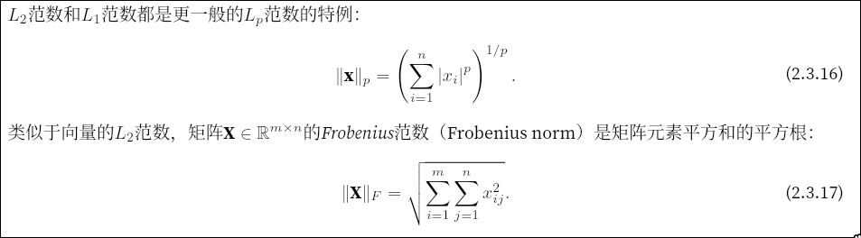
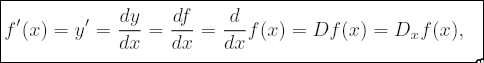
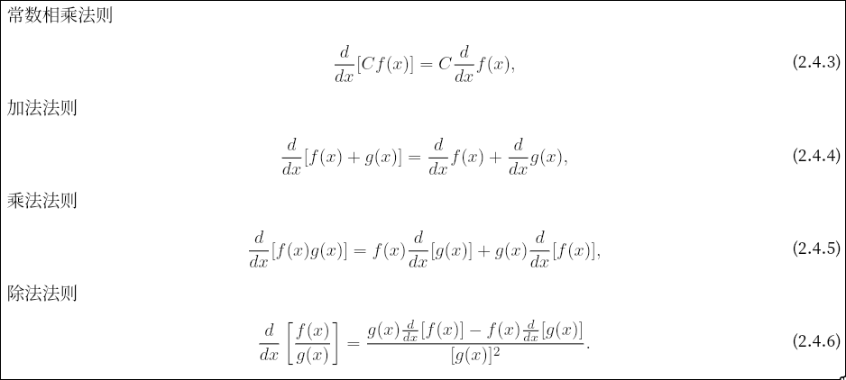
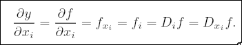
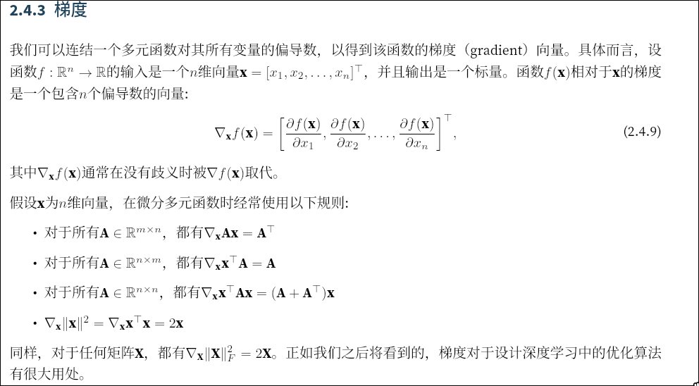
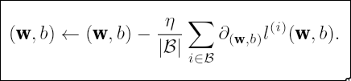
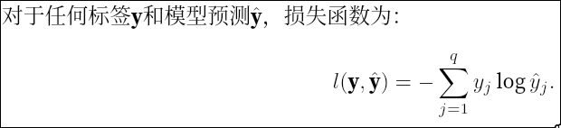
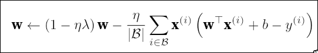
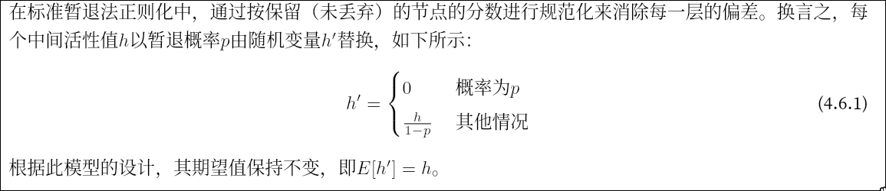
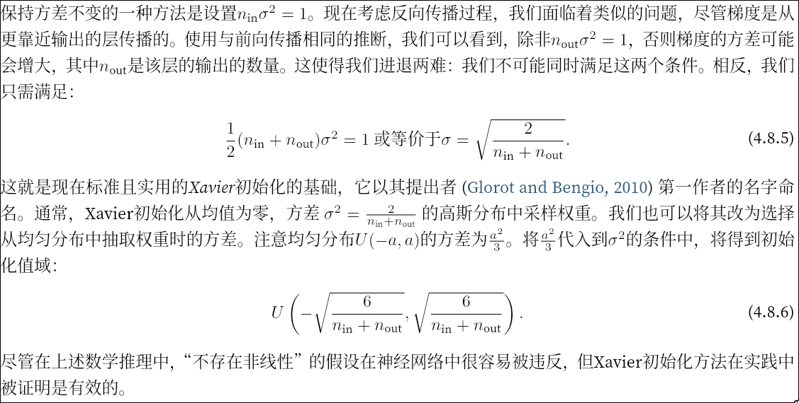

- tensor张量:任意维度的数组的统称
  - 零维张量:标量
  - 一维张量:向量
  - 二维张量:矩阵
  - 高维张量
- 指示函数:判断元素是否属于这个集合的函数,属于则返回1,不属于则返回0
- 卷积神经网络cnn:提取空间特征,网络结构数据
- 循环神经网络rnn:时间,文本等序列数据
- dl的关键组件:
  - 数据data
  - 模型model
  - 目标函数objective function,又被称为损失函数loss function
  - 调整模型参数,最小化损失函数的的优化算法algorithm(通常使用梯度下降算法gradient descent)
- 离线学习(不与环境交互):
  - 监督学习:
    - 回归
    - 分类
    - 标签
    - 搜索
    - 推荐
    - 序列
  - 无监督学习:
    - 聚类
    - 主成分分析
    - 因果关系和概率图模型
    - 生成对抗性网络

#### 工具
- cuda:并行计算平台和编程规范,`sudo pacman -S cuda`,安装实现了cuda规范的系统库
- cuda toolkit: 提供开发,编译cuda程序的工具库,其中提供的nvcc用于编译cuda程序
- cuDNN: cuda toolkit的一个扩展库,专门为深度神经网络
- pytorch安装的时候已经把这些依赖库附加了,会优先使用自己带的,所以只用安装pytorch就够了
- pip3 指定python3
- PyTorch 无法构建不规则多维数组
- `x = torch.tensor(标量/元组/列表等类型数组) `
- `x.dtype`:内部储存元素的数据类型
- 方差: $\sigma^2 = \frac{1}{N} \sum_{i=1}^N(x_i-\mu)^2$ 
- 标准差: $\sigma = \sqrt{\sigma^2}$
#### tensor
- tensor创建方法:

| 方法                | 描述                | 示例                  |
|---------------------|---------------------|-----------------------|
| `torch.tensor()`    | 从数据创建张量      | `torch.tensor([[1,2],[3,4]])` |
| `torch.zeros()`     | 全零张量            | `torch.zeros(3,3)`    |
| `torch.ones()`      | 全一张量            | `torch.ones(2,2)`     |
| `torch.eye()`       | 单位矩阵            | `torch.eye(3)`        |
| `torch.rand()`      | 均匀分布 [0,1)      | `torch.rand(3,3)`     |
| `torch.randn()`     | 标准正态分布        | `torch.randn(3,3)`    |
| `torch.arange()`    | 等差数列            | `torch.arange(0,10,2)`|
| `torch.linspace()`  | 线性间隔            | `torch.linspace(0,1,5)`|
| `torch.full()`      | 填充指定值          | `torch.full((3,3), 7)`|
| `torch.empty()`     | 未初始化空张量      | `torch.empty(3,3)`   |
- torch.Tensor 对象
  - .dtype: 元素数据类型 (float32, int64, etc.)
  - .shape: 张量形状 (torch.Size)
  - .device: 存储设备 (CPU/GPU)
  - .layout: 内存布局 (strided/sparse)
  - .data: 实际存储的数据缓冲区
  - .grad: 梯度信息（如果开启）
- [tensor操作](./torch_tensor.md)
- `x.squeeze()` 把1x的维度去掉,简化shape
- 高维tensor的shape只有后两位是行列数,前面的都是分组数
- `z = torch.Size([2,3])` 一个tensor形状对象,不是tensor
- `x.numel()` 元素个数
- `x.reshape(-1,4)`,通过-1来调用此自动计算出维度的功能
- `torch.zero_(torch.tensor([1, 1]))` 原地元素清零

- 形状不同的tensor依靠广播机制(不足的进行复制行/列)进行按元素操作, torch的广播机制就是为了对齐按元素操作的工具
- `索引是x[1,3],切片是x[1:3] `
- 和python数组索引一样,第一个元素的索引是0,最后一个元素的索引是-1,切片左闭右开
- `x[1:3,:], x[:]`其中:表示全部
- `torch.zeros(2, 3) `,创建全0元素tensor
- `x.zero_()` 将x就地元素变0
- `y = torch.zero_like(x)`, 创建与x的shape相同的全0元素tensor
- `X+=Y 或 X[:] = X + Y` 加等或者切片,就地运算,节省内存
- `A = X.numpy()  B = torch.tensor(A) a.item() float(a) int(a)` , 格式转化
- `os.mkdir(dir_path)`只能创建单层目录,`os.makedirs(dir_path, exist_ok=True)`, 创建多层目录,目录存在时不报错,不存在时创建
- pandas的Series一列数据,DataFrame多列数据
- 缺失值处理方式:插值法/删除法, pands的`pd.fillna(xx)`会识别数据中的`NaN`或者`NA`(本质是np.nan), 填写指定的内容
- dummy 假的,虚拟的,傀儡,哑巴
- `pd.get_dummies()` 对数据进行独热编码,进行分类后进行0/1编码
- `X = torch.tensor(inputs.to_numpy(dtype=float))` pandas读取的csv数据是Series/DateFrame表格类型的,不能直接转tensor
- 向量叉乘(仅三维):
  - 代数公式: $\vec{a} \times \vec{b} = (a_2b_3 - a_3b_2)\mathbf{i} + (a_3b_1 - a_1b_3)\mathbf{j} + (a_1b_2 - a_2b_1)\mathbf{k}$ (得到的是向量)
  - 几何公式: $|\vec{a} \times \vec{b}| = |\vec{a}| |\vec{b}| \sin\theta$
- 向量点乘(维度均可):
  - 代数公式: $\vec{a} \cdot \vec{b} = a_1b_1 + a_2b_2 + a_3b_3$（对应坐标相乘后相加）(得到是标量)
  - 几何公式: $\vec{a} \cdot \vec{b} = |\vec{a}| |\vec{b}| \cos\theta$
- `sum_A = A.sum(axis=1, keepdims=True)` 求和的时候保持轴数不便
- `A.cumsum(axis=0)` 沿着指定轴累积求和
- cummulate 累积
#### 乘法
- 向量与向量按元素乘法: `x * y`
- 矩阵按元素乘法成为哈达玛积(不是点乘哈) :`A * B`
- 向量点积(点乘): `torch.dot(x,y)`
- 三维向量叉乘: `torch.cross(x,y)`
- 矩阵-向量积: `torch.mv(A,x) `
- 矩阵-矩阵乘法: `torch.mm(A,B)`
#### 范数norm
- 范数是一个函数，它给一个“东西”（可以是向量、矩阵、张量甚至函数）赋予一个非负的长度或大小。它必须满足三个基本条件：
  - 非负性：长度总是大于等于0，且只有零向量的长度为0。
  - 绝对齐次性：把“东西”放大 $\alpha$ 倍，它的长度也放大 $|\alpha|$ 倍。
  - 三角不等式：两个“东西”相加后的长度，不超过它们各自长度之和。
只要满足这三个条件，这个度量方式就可以被称为范数。
- 向量范数（Vector Norms）
  - L2范数（欧几里得范数）：就是我们通常说的向量模长。
    - 公式：$\|\vec{v}\|_2 = \sqrt{v_1^2 + v_2^2 + v_3^2}$
    - 几何意义：点到原点的直线距离。
    - `torch.norm(x)`
  - L1范数（曼哈顿范数）：各分量绝对值之和。
    - 公式：$\|\vec{v}\|_1 = |v_1| + |v_2| + |v_3|$
    - 几何意义：在网格状街道上行走的距离（只能横平竖直）。
    - `torch.abs(x).sum()`
  - L∞范数（无穷范数）：各分量绝对值的最大值。
    - 公式：$\|\vec{v}\|_\infty = \max(|v_1|， |v_2|， |v_3|)$
    - 几何意义：在一个无限大的棋盘上，国王从一点走到另一点所需的最少步数（切比雪夫距离）。
- 矩阵范数(Frobenius范数)
  - 
  - `torch.norm(A)`
#### 导数 
- 
- 
- 
- 梯度:多元函数的所有变量的偏导数组成的向量
- 
- partial 偏导数
- dl中计算梯度的 是损失函数 $L$ 对权重 $w$ 的梯度，即 $\frac{\partial L}{\partial w}$。
- 求导链式法则用于损失函数求梯度
- pytorch会自动微分,构建一个模型的计算图,便于反向传播梯度
- 在反向传播时才会自动微分,正向计算时会保留每个节点的输出值存入缓存(gpu显存),便于反向传播自动微分的时候求微分用, 因此在`y.backward()`前,`x.grad`的值是None
- `x.requires_grad_(True) # 等价于x=torch.arange(4.0,requires_grad=True)`, 为变量分配内存储存梯度
- 默认情况下,torch会积累梯度(用于每个batch会累计batch_size次数的梯度(和正向计算中间值)),所以制约batch_size大小的是gpu显存大小, 所以每次更新参数后需要手动清零梯度:
  - `optimizer.zero_grad()`等价于`optimizer.zero_grad()`
  - `x.grad.zero_()`, 清除指定张量的梯度
- 为什么要积累batch_size次数(batch_size个数据)的梯度,再进行一次参数更新呢?: 数据是有噪声的,把噪声平均掉得到较真实的梯度
- 一个epoch(周期,时代): 训练完所有数据为一次epoch
- batch_size过小则震荡,过大则爆显存,学习到固定思维,泛化能力差
- 对于非标量输出y(向量),y的梯度是所有分量的梯度之和(`y.sum().backward()`,等价于`y.backward(torch.ones(len(x)))`), 要不然向量对向量的梯度(微分)的结果是一个雅可比矩阵:
$$
\frac{\partial y}{\partial x} = 
\begin{bmatrix}
\frac{\partial y_1}{\partial x_1} & \frac{\partial y_1}{\partial x_2} & \cdots & \frac{\partial y_1}{\partial x_n} \\
\frac{\partial y_2}{\partial x_1} & \frac{\partial y_2}{\partial x_2} & \cdots & \frac{\partial y_2}{\partial x_n} \\
\vdots & \vdots & \ddots & \vdots \\
\frac{\partial y_m}{\partial x_1} & \frac{\partial y_m}{\partial x_2} & \cdots & \frac{\partial y_m}{\partial x_n}
\end{bmatrix}
$$
- 分离计算`u = y.detach()`:截断梯度的反向传播
- multinomial 多项式,多项分布
- `h = torch.distributions.multinomial.Multinomial(8, g).sample([2])`
- 条件概率: `P(A|B)=P(AB)/P(B)`
- 边际概率: P(A)就等于所有A发生的条件概率相加
- accumulate 累积
- distribution 分布
- torch.distributions 是 PyTorch 中用于实现概率分布和随机采样的工具包
## 线性神经网络
- 预测:
  - 回归	预测连续值	一个具体的数值	房价多少？温度多少？ (为什么预测连续值叫做回归?历史上的孩子遗传身高回归到平均水平)
  - 分类	预测离散类别	一个类别标签	是猫还是狗？垃圾邮件吗？

- OpenMP,tbb, 编译器提示(likely,unlikely),编译器优化(-ox)

- 权重weight, 偏置bias/offset
- 仿射变换: 线性变换(不止旋转)+平移
- 损失函数:
  - (mean squared error)均方误差函数(L(w,b)): $L(\mathbf{w},b) = 1/n \sum_{i=1}^n l^{(i)}(\mathbf{w},b)$, (所有sample/instance的损失均值,但是梯度下降时一般随机抽取一小部分样本计算损失均值,称为小批量随机梯度下降)
- argmin: 求使函数值最小的自变量
- 随机梯度下降(SGD stochastic gradient descent): 随机抽取的小批量损失计算函数对模型参数w求偏导(称为梯度)
- 反向传播(back_propagation)就是:利用链式法则,求损失函数对各个参数的偏导(梯度). 
- 反向传播是随机梯度下降更新参数的工具
- propagate, 传播,繁殖
- 超参数: 学习率$\eta$, 批量大小$B$, 调参调的就是超参数
- 矢量化的计算比for循环更快
- 标准差$\sigma$, 方差$\sigma^2$, 均值$\mu$
- 满足y=xWT+b(线性变换),该层的神经元与上一层每一个神经元全都相连的层, 也叫线性层(torch.nn.Linear),稠密层
- 最小化损失函数就是在执行极大似然估计, 两者等价
- 极大似然估计MLE: 的核心思想是 —— 既然我们已经观测到了这组数据，那么能让这组数据出现概率最大的参数，就是最真实的参数.
- normal: 正态,正常,标准
- 一维张量不是行/列向量,他们属于二维张量,需要reshape或者隐式转换
#### 线性回归(y = X @ w.T + b, nn.Linear)
- scatter 散点图
- 读取数据:
  - `data_set = data.TensorDateset(*数据)`, 把特征和标签对齐配对,包装成一个可以索引的数据集
  - `data_iter = data.DataLoader(data_set, batch_size, shuffle = is_train)`, 把数据集包装成一个可迭代的数据加载器, 迭代一次取出batch_size个sample, 训练打乱,测试不需要
- sequence, 序列,次序,有关联的一串
- `nn.Sequential` # TODO:
- `net = nn.Linear(2,1)` 输入特征形状(特征的个数),输出特征形状
- internal 内部的
- 损失函数计算的值(标量)的梯度是反向传播的起点
- `net(X)` 实例调用,`__call__`里面调用了forward函数
- __call__ 魔法方法让类的实例可以像函数一样被调用, 但是我感觉这样封装的太厉害了,不看源码看不出来调用的类的哪个方法
- `optimer.step()` 更新参数: 
- K折交叉验证: 把数据分成K份,其中一份当验证集,训练,重复K次,K个训练结果求均值作为模型真正的性能
#### softmax回归(O = X @ W.T + b Y=softmax(O))
- 逻辑回归(二分类)的泛化版本(多分类)
- 层数 = 参数层 = 隐藏层(没参数的激活层除外) + 输出层
- softmax公式: $\sigma(\mathbf{z})_i = \frac{e^{z_i}}{\sum_j e^{z_j}}$
- Softmax 是一个 无参数的非线性函数，它：
  - 不改变特征空间的线性结构, 所以softmax回归还是一个线性nn
  - 不新增可训练参数
  - 只把线性输出归一化为概率
- Softmax 回归 = 线性层 + Softmax 归一化
- 一般说模型的梯度就是指损失函数的梯度
- 线性回归的梯度(mse的梯度) ——“真实值 y 与预测值 y_hat 的差”
- Softmax 回归的梯度 -- “模型预测的概率” 与 “真实标签（独热向量）” 的差。
- 交叉熵就是一段信息的整体令人惊异程度:
  - 模型预测越准 → 惊讶越小 → 交叉熵越小
  - 模型预测越离谱 → 惊讶越大 → 交叉熵越大
- 熵，就是你的模型完全猜对世界规律时，事情本身平均有多不确定
- 熵 = 真实世界自带的混乱度;交叉熵 = 你模型预测带来的惊讶度;只有模型完全正确时，交叉熵 = 熵
- 
- `y_hat.argmax(axis=1)` ,找到数值最大的那一列的索引
- `torch.nn.Moudle` 是所有网络层/模型的父类
- `@torch.no_grad()` 装饰的函数,调用时不会参与梯度
- `net.apply(func)` 会遍历net,net的所有子模块,执行func函数
- nan 非数字,无效值
- reduction 缩小,减少
- [softMax+crossEntroy](./softMax+crossEntroy合并计算.md)
- 输入层和输出层之间的所有可训练层（带参数的层）都被称为隐藏层
- 交叉熵损失函数适合分类,mse适合数值回归
## 多层感知机(MLP)
- MLP = 全连接层 + 非线性激活函数(要不然添加隐藏层没有任何好处)
- 单层感知机就是一个全连接层(线性层)+一个激活层
- relu激活函数:` max(x,0)`
- 参数化relu激活函数: ` max(x,0) + a*min(0,x) `
- sigmoid激活函数: $sigmoid(x) = \frac{1}{1+e^{-x}}$
- tanh激活函数
- `nn.Flatten()` 展平层
- 对抗过拟合(overfitting)的方法是正则化(regularization)
- 几个倾向于影响模型泛化的因素。
  1. 可调整参数的数量。当可调整参数的数量（有时称为自由度）很大时，模型往往更容易过拟合。
  2. 参数采用的值。当权重的取值范围较大时，模型可能更容易过拟合。
  3. 训练样本的数量。即使模型很简单，也很容易过拟合只包含一两个样本的数据集。而过拟合一个有数百万个样本的数据集则需要一个极其灵活的模型。
- 实际上是在使用应该被正确地称为训练数据和验证数据的数据集，并没有真正的测试数据集。
- 权重衰减是应用最广泛的正则化技术之一,权重衰减也被称为L2正则化, 这项技术通过函数与零的距离来衡量函数的复杂度, 最简单的距离就是范数
- L2正则化,损失函数加上一个惩罚项: $L(\mathbf{w},b) + \lambda /2 \|\mathbf{w}\|^2$
- 参数的范数代表了一种有用的简单性度量。L2权重衰减适度降低参数的范数,是在降低模型的复杂度,适度降低模型复杂度可以提高泛化能力
- 对于mse,更新参数公式为:, $(1-\eta\lambda)$被称为权重衰减
- decay 腐烂,衰减
- cuda mode
- 不带_的函数(如`nn.init.normal()`),非原地操作：创建新张量，不修改原参数,在初始化参数是是无效的,带_的函数(如:`nn.init.normal_()`)才是原地操作,修改原参数
- `nn.MSELoss(reduction="mean")` 参数:
  - none: 逐元素相减平方,不求和,不求平均
  - sum: 不求平均
  - mean: 求和,求平均
- `trainer = torch.optim.SGD([{"params":net[0].weight,'weight_decay': wd},{"params":net[0].bias}], lr=lr)` 字典指定参数配置
- 注入噪声,让模型变得更平滑(更平滑更简单),减轻过拟合
- __暂退法(dropout)__: 在计算每一内部层的时候,注入噪声(二进制掩码噪声0/xx),之所以叫dropout法,是因为从表面上看训练的时候丢弃(dropout)了一些神经元
- 
- 高斯噪声: 服从正态分布的随机数据
- 暂退层一般添加到激活层的后面,` nn.Relu() nn.Dropout(mmm) `
- prod累乗
- `l.backward(torch.ones_like(x))` 中传入的参数是梯度的 “初始值”（也叫梯度种子), 指定非标量张量l的初始梯度(向量求不出来梯度)
- 当sigmoid函数的输入很小或者很大时,它的梯度会消失
- 暂退法还正则化能打破隐藏层参数的对称性
- 高斯(分布)的==正态(正态)的
- 梯度的方差不能过大,否则会训练不稳定
- “零均值 + 方差 != 正态分布” , 只要二阶矩$E[X^2]$存在的分布都有方差,都可以实现这样0均值,$\sigma$的方差的分布,但不是正态分布
- xvaier初始化:  
## 深度学习计算
  - 块block:可以由很多block/layer组成
  - 支持原地操作,能不改变形状的逐元素处理的函数/类实例化,都可以指定`inplace=True`
  - `nn.Sequential`类是严格顺序块类
  - `nn.Sequential` 维护了一个保存各个模块的OrderedDict有序列表`_modules`
  - 层的参数访问: `net[2].state_dict()`
  - 每个参数都是`nn.parameter.Parameter`的一个实例
  - `net = nn.Sequential(nn.Linear(2, 1))` 不指定时参数会默认He均匀初始化
  - `print([(name, param.data) for name, param in net[0].named_parameters()])` ,一次性访问一层/一个net的参数, 基本等于`net[0].state_dict()`
  - `net[0].weight.data`, 访问指定参数
  - `net[0][1][0].bias.data` 索引
  - `net.add_module()`
  - `nn.init.` 提供多种初始化方式
  - 参数共享的目的是: 让模型在不同层级学习「一致且通用的特征变换规则」, 例如`net = nn.Sequential(nn.Linear(4, 8), nn.ReLU(),shared, nn.ReLU(),shared, nn.ReLU(),nn.Linear(8, 1))`,利用"python变量是对象的引用(内存地址)"实现
  - `out32 = model(x32)` net类没有实现__call__函数,为什么能类实例函数用呢,因为`nn.Module`这个父类已经实现了__call__,调用forward(),参数传入forward并执行
  - 延后初始化, 直到数据第一次通过模型传递时，框架才会动态地推断出每个层的大小,参数的形状
  - `nn.Parameter()` 是 PyTorch 中用于定义可学习模型参数的类，它本质是 torch.Tensor 的子类，但让张量能被 PyTorch 的 nn.Module 框架识别并自动管理（求导、更新、保存等）。
    - 标记为「可学习参数」，被 nn.Module 自动追踪
    - 默认开启自动求导（requires_grad=True）
    - 当你调用 model.to(device)（比如移到 GPU）时，nn.Parameter 包装的张量会自动同步到目标设备；普通 Tensor 则需要手动移设备。
  - `nn.parameter.Parameter()` 和`nn.Parameter()` 一样的
  - `torch.any(x)` 返回bool, 是否至少存在一个非零元素
  - python 的语法特性，允许在函数调用时在最后一个参数后面加逗号，完全不改变参数的含义。
