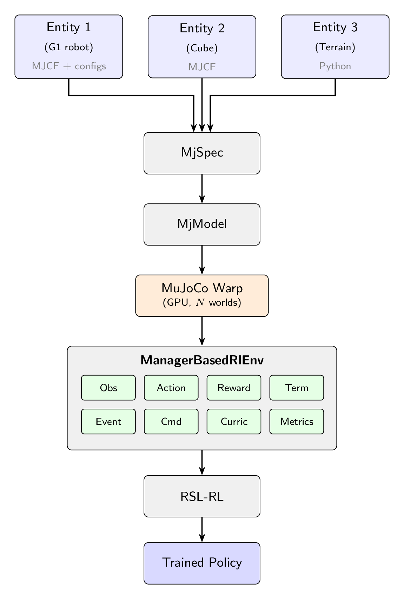

- mjlab: Isaac Lab的API架构 + MuJoCo的物理引擎 + GPU加速
- 仿真用的就是MuJoCo，mjlab只是在上面加了一层轻量级的强化学习任务管理框架.
- 
- mjlab两层结构: 1.仿真层,2.管理层
  - mjlab的仿真层本质上就是在MuJoCo仿真之上做了一层封装和重新组织.有四个core component:
    - entity 实体
    - actuator 执行器
    - sensor 传感器
    - scene 场景
~~~text
MjModel (CPU, 1个模型)
    ↓ 复制到GPU
warp_model (GPU)
    ↓ 实例化 N 份
MjData × N (GPU, N个并行world)
~~~
- MjSpec是模型的"编辑态",包含多种实体,编译输出的MjModel是一个只读的,已编译的物理模型,包含仿真所需的所有常量参数．
- 管理层中的组件term是mjlab中的最小功能单元,每个term负责一个可独立配置的功能,可以是普通函数,也可以是继承了ManagerTermBase类的类本身(注意:不是类对象).
- ManagerBasedRlEnvCfg对象里存放的是各个term的配置对象cfg.
- ObservationManager,ActionManager,RewardManager,TerminationManager,EventManager,CommandManager,CurriculumManager,MetricsManager.,只需要传入ManagerBasedRlEnvCfg对象就行了,这些管理器在ManagerBasedRlEnv对象创建时的构造函数中根据cfg自动创建.
