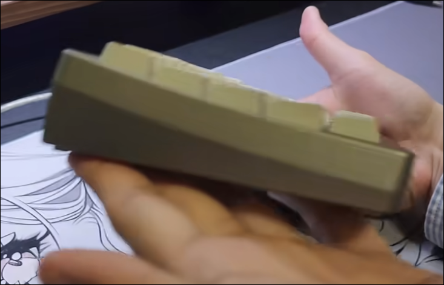
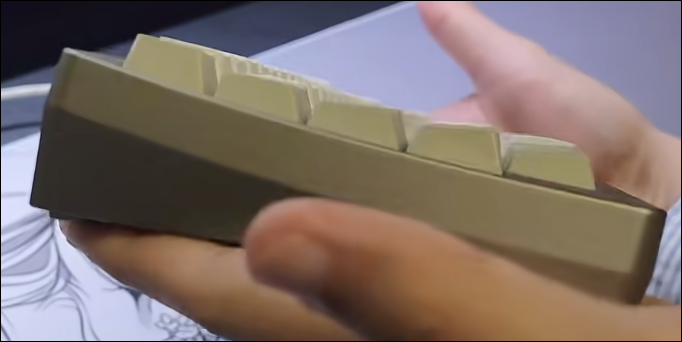
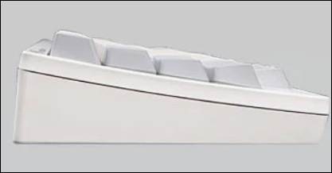

## 键盘合集见bilibili图文专栏(https://space.bilibili.com/500931512/upload/opus)
- 轴座（导轨润滑非必需）
- 推杆
- （静音胶圈非必需）,越厚静音效果越好
- 胶碗
- 锥簧（干膜油润滑非必需）
- 
- 
- 
- 建模kily60(深菊有pcb), neson t600(收pcb), cloud nine machina(腰线太好看了,后唇)
- 不要三明治式的结构gasket, 要pcb与底壳接触的pcb poron, pcb snap, 硅胶豆
